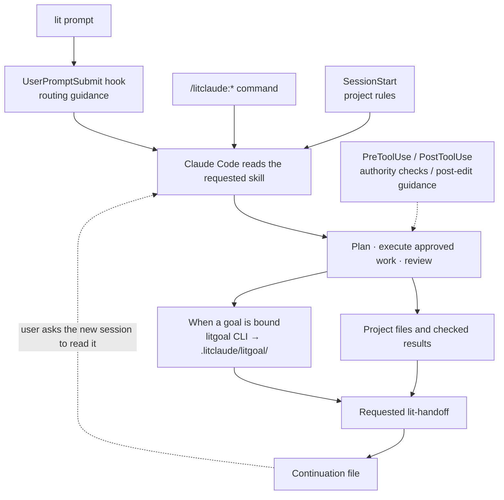
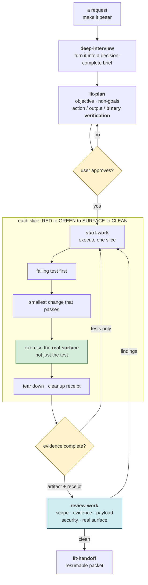
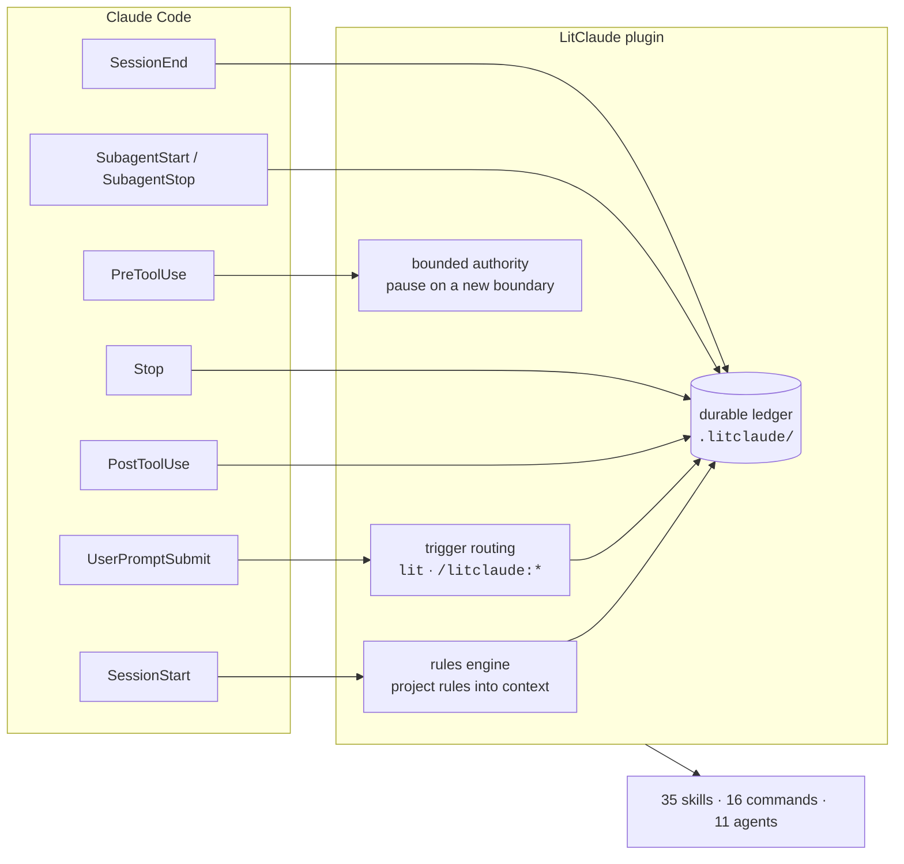
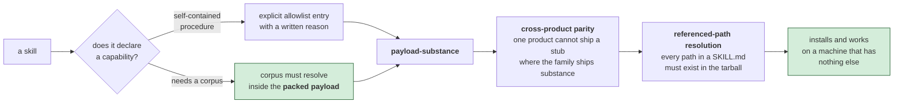

<p align="center"><picture><source media="(prefers-reduced-motion: reduce)" srcset="https://cdn.jsdelivr.net/npm/@litfamily/litclaude@1.0.12/docs/assets/cover-motion-still.webp" /></picture></p>

<h1 align="center">LitClaude</h1>
<p align="center"><strong>Keep the work lit.</strong></p>
<p align="center">Plan, build, and check your work in Claude Code. Leave the next session a place to begin.</p>
<p align="center">
  <a href="#install">Install</a> · <a href="#quick-start">Quick start</a> · <a href="#core-routes">Core routes</a> · <a href="#skills-at-a-glance">Skills</a> · <a href="#links">Links</a> · <a href="https://cdn.jsdelivr.net/npm/@litfamily/litclaude@1.0.12/README_ko-KR.md">한국어</a>
</p>

<p align="center"></p>

<details>
<summary>Copy ASCII logo</summary>

```text
                             ▄▄▄▄
                   ▗███▌   ▗██████▖
 ▗▄▄▄▄▄          ▗▟████▌   ▝██████▘
 ▐█████        ▗▟██████▌    ▝▀▜█▀▘
 ▐█████      ▗▟███████▄▄▄▄▄▄▄▄▄▄▄▄▄▄▄▄▄▄▄▄
 ▐█████    ▗▟█████████████████████████ ▐█▀
 ▐█████    ████████████████████████████▀
 ▐█████    ██▛▘   ▄ ▄▄▄▄▖▄▄▄▄▄▄▄▄▄▄▄▄▄▖
 ▐█████    ▀    ▄██ ████▌█████████████▌
 ▐█████       ▄████ ████▌█████████████▌
 ▐█████     ▄█████▛                                 claude
 ▐█████  ▗▟█████▀▘       ▄▄▄▄▄     ▗▖               ──────────────
 ▐█████ ▐█████▀          █████     ▐▛▀              hermes · codex
 ▐█████ ▐███▀            █████                      opencode · grok
 ▐█████ ▐█▀              █████
 ▐█████ ▝                █████
 ▐█████▄▄▄▄▄▄▄▖          █████
 ▐███████████▛           █████
 ▐██████████▀            █████

```

</details>

<p align="center"></p>
<p align="center"></p>

<p align="center">
  
  <a href="https://cdn.jsdelivr.net/npm/@litfamily/litclaude@1.0.12/LICENSE"></a>
</p>

<p align="center">
  <a href="#deeper-docs"> Docs</a> · <a href="https://cdn.jsdelivr.net/npm/@litfamily/litclaude@1.0.12/docs/assets/readme/ignition-film.mp4"> Ignition</a> · <a href="https://cdn.jsdelivr.net/npm/@litfamily/litclaude@1.0.12/LICENSE"> MIT</a>
</p>

## Install

`@litfamily/litclaude` is the scoped package. You need Node.js/npm and Claude Code.
For local validation, start with the
[separate trial profile](https://cdn.jsdelivr.net/npm/@litfamily/litclaude@1.0.12/docs/migration.md#separate-trial-profile).

The default safe installation command is:

```bash
npm exec --yes --package @litfamily/litclaude@latest -- litclaude install --yes
```

`--yes` skips install questions. Existing unrelated Claude settings are preserved;
choose permissions, HUD accents or output styles explicitly when needed.
See [installation reference](#installation-reference) for those options and a version pin.

## Quick start

Start Claude Code normally:

```bash
claude
```

In Claude Code, begin with:

```text
lit
```

After the activation notice, try one small task:

```text
Build a to-do list in a single HTML file with no external dependencies.
Implement add, complete, and delete. Record what you checked and the next step.
```

Open the HTML yourself and check all three actions. A created file is not proof of
working interactions. If no browser is available, ask for the visual and interaction
checks to remain unverified. The logo marks activation, not task completion.

Then use a core route from the table below. Bare prompt routes are handled by
the hook; namespaced slash commands use Claude Code's native command surface and
do not double-activate the hook. For an explicit skill invocation, use a route
such as `/litclaude:lit-loop`.

## Key features

A spark has been placed in your hands. Give it somewhere to stay.

A bug you want fixed. A screen you want built. A project you want to finish.

Starting takes a sentence. Then the conversation grows, the session ends, and you
have to work out where you left off: what you decided, what you checked, what comes next.

**LIT leaves that spark with the work.** A goal, a plan, the results you checked,
and the next step stay in the project for the next session to read.

**Leave something the next session can pick up.**

LitClaude adds evidence-first execution, planning, research and review to Claude Code.
Install its plugin and managed HUD once, then work in ordinary `claude` sessions.

## A/B results

Each prompt is one casual Korean line, typed as is. The LitClaude side adds ` lit` to the end of the same line and nothing else. Both sides ran in Claude Code 2.1.283 with Opus 5.5 (`opus[1m]`) at high effort on 2026-09-26, one trial per side; the baseline is Claude Code without LitClaude, and the LitClaude side used a local pre-release build.

A blind judge (Claude Opus 5.5 without LitClaude) saw the two outputs only as A and B, with words that could name the tool removed, and was asked twice with the order swapped; a side wins only when both orders agree. The maintainer then looked at both outputs side by side and made the final call. Where the maintainer did not review a pair, the judge's verdict stands and the row says so.

S3 and S4 come from a UI round that re-ran them after the interface update and added S11. S5 comes from an office round that re-ran it with `lit-pptx` and `lit-docx` and added S8 and S9. Some LitClaude runs were repeated after fixes, and runs whose fix copied a judge's reasons were thrown out; each row compares the latest kept LitClaude run with the one baseline run.

| Task | Prompt | Final verdict | Blind judge (same round) |
| --- | --- | --- | --- |
| S1 · Terminal to-do CLI | `터미널에서 쓰는 할 일 관리 CLI 만들어줘` | LitClaude won | Tie |
| S2 · API server bugs | `이 API 서버 가끔 이상하게 동작하는데 고쳐줘` | LitClaude won (blind judge; not reviewed by eye) | LitClaude won |
| S3 · Personal budget dashboard (UI round) | `개인 가계부 대시보드 웹페이지 만들어줘` | LitClaude won | Baseline won |
| S4 · Neighbourhood café landing page (UI round) | `동네 카페 브랜드 랜딩페이지 만들어줘` | LitClaude won | LitClaude won |
| S5 · Report and slides from sources (office round) | `sources 폴더 자료로 보고서랑 발표자료 만들어줘` | LitClaude won | Baseline won |
| S6 · Node 22 to 24 research | `Node 22에서 24로 올릴 때 달라지는 거 조사해줘` | LitClaude won | Tie |
| S7 · Order, payment and shipping diagram | `주문-결제-배송 서비스 구조도 그려줘` | LitClaude won (blind judge; not reviewed by eye) | LitClaude won |
| S8 · Quarterly results deck (office round) | `분기 실적 발표자료 만들어줘` | LitClaude won | Baseline won |
| S9 · New product plan (office round) | `신제품 기획서 써줘` | LitClaude won | LitClaude won |
| S11 · Meeting-room booking web app (UI round) | `회의실 예약 웹앱 만들어줘` | LitClaude won | LitClaude won |
| Total | | LitClaude 10 won | LitClaude 5 won, 2 ties, 3 lost |

The motion skill, `lit-typographic-motion`, was rebuilt after its first A/B and has no A/B result yet. The cover at the top of this page was made with it.

### S1 · Terminal to-do CLI

The baseline built more features (due dates, tags, filters, stats) but wrote no tests; LitClaude kept to priorities and shipped 12 passing tests and a pip-installable package. The blind judge called it a tie. The maintainer gave it to LitClaude because its own tests ran and passed.

### S2 · API server bugs

LitClaude fixed all six hidden bugs (the baseline fixed five), added a regression test for every fix, and also fixed a startup failure on symlinked paths and a wrong start command in the README. The baseline added no tests. The maintainer did not review this pair, so the blind judge's verdict stands.

### S3 · Personal budget dashboard

The blind judge preferred the baseline: a fuller dashboard (six-month bars, a running-total chart, top-5 expenses) on a balanced grid, where LitClaude left an empty column beside its long transaction list. LitClaude tried every action in a real browser and checked 320 to 1440 px, dark mode and 200% zoom; the automatic checks were mixed, with 6 accessibility violations against the baseline's 730 but more clipped text (51 against 30). The maintainer looked at both screens and chose LitClaude.

| Baseline | LitClaude |
| --- | --- |
| <a href="https://cdn.jsdelivr.net/npm/@litfamily/litclaude@1.0.12/docs/ab/S3-baseline-desktop.webp"></a> | <a href="https://cdn.jsdelivr.net/npm/@litfamily/litclaude@1.0.12/docs/ab/S3-litclaude-desktop.webp"></a> |

<details>
<summary>Phone view</summary>

| Baseline | LitClaude |
| --- | --- |
| <a href="https://cdn.jsdelivr.net/npm/@litfamily/litclaude@1.0.12/docs/ab/S3-baseline-phone.webp"></a> | <a href="https://cdn.jsdelivr.net/npm/@litfamily/litclaude@1.0.12/docs/ab/S3-litclaude-phone.webp"></a> |

</details>

### S4 · Neighbourhood café landing page

LitClaude's page has a restrained design with hand-drawn pixel art and a dark mode, and its reply lists what it checked (opening-hours logic, keyboard tabs, four widths, dark mode). The baseline leans on emoji, made-up five-star reviews and a scrolling banner, and its full-page capture shows blank sections below the banner. The blind judge and the maintainer both chose LitClaude.

| Baseline | LitClaude |
| --- | --- |
| <a href="https://cdn.jsdelivr.net/npm/@litfamily/litclaude@1.0.12/docs/ab/S4-baseline-desktop.webp"></a> | <a href="https://cdn.jsdelivr.net/npm/@litfamily/litclaude@1.0.12/docs/ab/S4-litclaude-desktop.webp"></a> |

<details>
<summary>Phone view</summary>

| Baseline | LitClaude |
| --- | --- |
| <a href="https://cdn.jsdelivr.net/npm/@litfamily/litclaude@1.0.12/docs/ab/S4-baseline-phone.webp"></a> | <a href="https://cdn.jsdelivr.net/npm/@litfamily/litclaude@1.0.12/docs/ab/S4-litclaude-phone.webp"></a> |

</details>

### S5 · Report and slides from sources

The blind judge preferred the baseline: it added its own clearly labelled analysis (a Monday and weekend service gap, different data cut-off dates) and kept its 11-slide deck restrained, while LitClaude's 9-slide deck used decorative gradient circles, numbered badges and a closing thank-you slide. Both were accurate and checked; LitClaude's deck and 5-page Word report read their numbers from one data file, and the deck shows the budget as a doughnut chart. The maintainer judged LitClaude's files far more usable for real work.

Baseline slides:

<a href="https://cdn.jsdelivr.net/npm/@litfamily/litclaude@1.0.12/docs/ab/S5-baseline-slides.webp"></a>

LitClaude slides:

<a href="https://cdn.jsdelivr.net/npm/@litfamily/litclaude@1.0.12/docs/ab/S5-litclaude-slides.webp"></a>

<details>
<summary>Report pages</summary>

Baseline:

<a href="https://cdn.jsdelivr.net/npm/@litfamily/litclaude@1.0.12/docs/ab/S5-baseline-pages.webp"></a>

LitClaude:

<a href="https://cdn.jsdelivr.net/npm/@litfamily/litclaude@1.0.12/docs/ab/S5-litclaude-pages.webp"></a>

</details>

### S6 · Node 22 to 24 research

LitClaude marked SlowBuffer correctly as runtime-deprecated where the baseline listed it as removed, and added the Node 24.11.0 `Buffer.allocUnsafe` issue, build toolchain requirements and a full LTS table. The baseline matched more of the reference facts (4 of 10 against 2) and gave a fuller codemod list, and the blind judge called it a tie. The maintainer gave it to LitClaude because far more of its links were official sources (86% against 43%).

### S7 · Order, payment and shipping diagram

LitClaude drew a real diagram and saved it as HTML/SVG and PNG, with a boundary box, a legend, solid lines for calls and dashed lines for events; it checked the export and listed what it left out. The baseline gave ASCII art in chat and saved no file. The maintainer did not review this pair, so the blind judge's verdict stands.

<a href="https://cdn.jsdelivr.net/npm/@litfamily/litclaude@1.0.12/docs/ab/S7-litclaude-diagram.webp"></a>

### S8 · Quarterly results deck

Both sides invented sample figures and marked them as samples on every slide. The blind judge preferred the baseline: its 9 slides follow the usual Korean earnings-deck order (a legal notice, year-on-year and quarter-on-quarter comparisons, Q&A), while LitClaude's 8-slide deck has decorative gradient circles on the cover and no notice slide; the layout check found 16 overlapping text pairs in the baseline deck and none in LitClaude's, which had one overflowing text box. The maintainer found LitClaude's deck clearly better.

Baseline slides:

<a href="https://cdn.jsdelivr.net/npm/@litfamily/litclaude@1.0.12/docs/ab/S8-baseline-slides.webp"></a>

LitClaude slides:

<a href="https://cdn.jsdelivr.net/npm/@litfamily/litclaude@1.0.12/docs/ab/S8-litclaude-slides.webp"></a>

### S9 · New product plan

LitClaude wrote a 5-page Word plan for an example product it labels as one, with financials that add up; the baseline wrote only a Markdown file, with no financials and blank market-size figures. The maintainer found the first LitClaude run in this round weak (it returned a template of bracketed blanks) and the later runs a clear win. The blind judge also chose LitClaude.

LitClaude pages (the baseline made no Word file):

<a href="https://cdn.jsdelivr.net/npm/@litfamily/litclaude@1.0.12/docs/ab/S9-litclaude-pages.webp"></a>

### S11 · Meeting-room booking web app

LitClaude shipped unit and API tests and tried booking, conflicts, cancelling and keyboard-only use in a real browser; the baseline has no tests and says it never submitted its own booking form. LitClaude also adds dark mode and a room picker for phones. The blind judge and the maintainer both chose LitClaude.

The screenshot check served only the page files, without each app's own server, so both screens show how the app reports a failed load.

| Baseline | LitClaude |
| --- | --- |
| <a href="https://cdn.jsdelivr.net/npm/@litfamily/litclaude@1.0.12/docs/ab/S11-baseline-desktop.webp"></a> | <a href="https://cdn.jsdelivr.net/npm/@litfamily/litclaude@1.0.12/docs/ab/S11-litclaude-desktop.webp"></a> |

<details>
<summary>Phone view</summary>

| Baseline | LitClaude |
| --- | --- |
| <a href="https://cdn.jsdelivr.net/npm/@litfamily/litclaude@1.0.12/docs/ab/S11-baseline-phone.webp"></a> | <a href="https://cdn.jsdelivr.net/npm/@litfamily/litclaude@1.0.12/docs/ab/S11-litclaude-phone.webp"></a> |

</details>

## Core routes

### Start with one lit task

Append `lit` to the end of a prompt to activate the Claude Code hook. It supplies routing guidance; Claude Code still performs the work.

| Prompt or route | Effect |
| --- | --- |
| `lit` | Activate the evidence-first work loop in the current Claude Code conversation. |
| `handoff` | Carry the checked result and next step into another session. |
| `lit-plan` | Write a bounded plan and its checks before implementation. |
| `/litclaude:start-work <approved-plan>` | Execute a plan that has already been approved. |
| `review-work` | Read the change and evidence, then report remaining work. |
| `litresearch` | Research with sources; this route records facts and uncertainty separately. |

The hook marks entry into the workflow; it does not prove that a task or browser check finished.

<p align="center"><a href="https://cdn.jsdelivr.net/npm/@litfamily/litclaude@1.0.12/docs/assets/readme/ignition-film.mp4"></a></p>

The poster opens the optional Ignition film; this README keeps motion opt-in.

### Carry the work forward

```text
Plan → Build → Check → Hand off
```

| When you want to | In Claude Code | Leave behind |
| --- | --- | --- |
| Define the work | `lit plan <what>` | A plan and success criteria |
| Execute an approved plan | Give that plan to `/litclaude:start-work` | Changes and checked results |
| Review the result | `lit review <scope>` | Findings and remaining work |
| Finish the session | `/litclaude:lit-handoff` | A continuation file and its path |

Goal-bound work records its state under the project's `.litclaude/litgoal/`.
Keep the **actual file path** returned by the handoff. In a new session, open the same
project and ask Claude to read that file, check the current state, and identify the
next action. Then choose what to continue. The [goal and ledger reference](https://cdn.jsdelivr.net/npm/@litfamily/litclaude@1.0.12/docs/migration.md#review-and-litgoal-parity)
explains the recording commands and host boundaries.

The lasting spark means leaving work another session can pick up. It does not mean
a process runs forever or automatically resumes after the session closes. Read the
record and compare it with the current files before continuing.

### Full route catalog

| Type this | Purpose |
| --- | --- |
| `lit`, `litwork` | Evidence-first, test-first execution loop; also `$lit-loop`, `/lit-loop`, and `/litclaude:lit-loop` |
| `lit plan <what>` | Planning only; also `$lit-plan` and `/lit-plan` |
| `lit review <scope>` | Review a plan or completed work; also `$review-work` and `/review-work` |
| `lit research <question>` | Cited public-source research; also `$litresearch` and `/litclaude:litresearch` |
| `lit search <question>` | Public-source retrieval |
| `lit query <question>` | Evidence lookup against durable local state |
| `lit goal <outcome>` | Bind one objective and checkable criteria; also `$litgoal` and `/litgoal` |
| `lit workflow <objective>` | Propose a Dynamic workflow for broad delegated work |
| `lit team`, `lit teammates` | Propose native agent teams when `CLAUDE_CODE_EXPERIMENTAL_AGENT_TEAMS=1` is enabled and the user approves |
| `$deep-interview`, `/deep-interview` | Turn an underspecified request into a decision-complete brief |
| `lit recap`, `litrecap`, `$lit-recap`, `/lit-recap`, `/litclaude:lit-recap` | Read-only session recap |
| `handoff`, `/litclaude:lit-handoff` | Write a verified continuation packet |
| `lit-scientific-visualization` | Prepare publication figures; also `/litclaude:lit-scientific-visualization` |
| `/litclaude:lit-diagram-drawer <brief>` | Draw, check, and export a conceptual diagram; also `lit-diagram-drawer` and `$lit-diagram-drawer` |
| `<make slides …> lit`, `/litclaude:lit-pptx` | Build a `.pptx` deck from a request or sources; also `lit-pptx` and `$lit-pptx` |
| `<write a report …> lit`, `/litclaude:lit-docx` | Build a `.docx` report, plan, proposal, or manuscript; also `lit-docx` and `$lit-docx` |
| `litclaude wikify <capture/save/review/query/config>` | Manage reviewed local structured knowledge |
| `browser-drive`, `$browser-drive` | Drive a real page only after probing `vercel-labs/agent-browser` at or above the 0.34.0 floor; later valid versions are marked `beyond-verified`, and the agent never runs the user install steps |

Named workflow skills include `lit-crucible` (adversarial planning), `lit-init`
(repository guidance), `lit-commit` (Git history), `lit-team` (native teams),
`lit-burnoff` (change-set cleanup), `lit-burnoff-file` (single-file cleanup),
`lit-humanizer` (Korean and English prose), and `lit-code` (implementation discipline).
Use the leading bare name or `$<skill-id>`. Previous typed names remain aliases
for one release and emit a deprecation note; see [the alias migration table](https://cdn.jsdelivr.net/npm/@litfamily/litclaude@1.0.12/docs/migration.md#one-release-rename-aliases).

## Skills at a glance

One row per skill: what it looks like, the route that starts it, and what you get.

<table>
<tr><th>What it looks like</th><th>Skill</th><th>What you get</th></tr>
<tr>
<td></td>
<td><code>lit-loop</code><br /><sub><code>lit</code></sub></td>
<td>Add <code>lit</code> to any request. Claude pins the goal, writes a failing test first, checks the real surface and leaves a record.</td>
</tr>
<tr>
<td></td>
<td><code>litwork</code><br /><sub><code>litwork &lt;task&gt;</code></sub></td>
<td>Ship with proof. A notepad tracks every criterion from failing test to cleanup.</td>
</tr>
<tr>
<td></td>
<td><code>lit-plan</code><br /><sub><code>lit plan &lt;what&gt;</code></sub></td>
<td>A plan file with numbered task rows that <code>start-work</code> can execute. Nothing is edited yet.</td>
</tr>
<tr>
<td></td>
<td><code>start-work</code><br /><sub><code>start-work &lt;plan&gt;</code></sub></td>
<td>Runs a plan row by row. A box is checked only after all five gates pass.</td>
</tr>
<tr>
<td></td>
<td><code>review-work</code><br /><sub><code>lit review &lt;scope&gt;</code></sub></td>
<td>Five independent review lanes read the same change and report findings first.</td>
</tr>
<tr>
<td></td>
<td><code>litgoal</code><br /><sub><code>lit goal &lt;outcome&gt;</code></sub></td>
<td>One objective with checkable criteria, kept on disk so the next session can pick it up.</td>
</tr>
<tr>
<td></td>
<td><code>lit-recap</code><br /><sub><code>lit recap</code> · <code>litrecap</code></sub></td>
<td>A read-only summary: done, in progress, blocked, where the evidence is, what comes next.</td>
</tr>
<tr>
<td></td>
<td><code>lit-handoff</code><br /><sub><code>handoff</code></sub></td>
<td>Type <code>handoff</code> to get a continuation file the next session can read and resume from.</td>
</tr>
<tr>
<td></td>
<td><code>deep-interview</code><br /><sub><code>deep-interview &lt;idea&gt;</code></sub></td>
<td>One question at a time until the idea is clear enough to build. A meter shows how much is still vague.</td>
</tr>
<tr>
<td></td>
<td><code>litresearch</code><br /><sub><code>lit research &lt;question&gt;</code> · <code>lit search</code></sub></td>
<td>Splits a research question, sends parallel searchers and follows every lead before answering with sources.</td>
</tr>
<tr>
<td></td>
<td><code>lit-crucible</code><br /><sub><code>lit-crucible &lt;brief&gt;</code></sub></td>
<td>Pressure-tests a brief before planning. Only the risks that survive critique reach the plan.</td>
</tr>
<tr>
<td></td>
<td><code>lit-init</code><br /><sub><code>lit-init</code></sub></td>
<td>Maps a repository into a root AGENTS.md and short guides for the folders that need one.</td>
</tr>
<tr>
<td></td>
<td><code>lit-comprehend</code><br /><sub><code>lit-comprehend &lt;target&gt;</code></sub></td>
<td>An explainer page for agent-written work: intuition first, then the walkthrough, then a short quiz.</td>
</tr>
<tr>
<td></td>
<td><code>lit-humanizer</code><br /><sub><code>lit-humanizer &lt;text&gt;</code></sub></td>
<td>Rewrites stiff model prose in English or Korean. Facts and hedges stay; filler goes.</td>
</tr>
<tr>
<td></td>
<td><code>lit-diagram-drawer</code><br /><sub><code>/litclaude:lit-diagram-drawer &lt;brief&gt;</code></sub></td>
<td>A checked, editable diagram for slides and documents, with PNG and Office-safe SVG exports.</td>
</tr>
<tr>
<td></td>
<td><code>lit-pptx</code><br /><sub><code>/litclaude:lit-pptx &lt;request&gt;</code></sub></td>
<td>Ask for slides with <code>lit</code> and get an editable PowerPoint deck with native charts and embedded fonts. Each slide passes a layout gate and is checked as rendered.</td>
</tr>
<tr>
<td></td>
<td><code>lit-docx</code><br /><sub><code>/litclaude:lit-docx &lt;request&gt;</code></sub></td>
<td>Ask for a report with <code>lit</code> and get a styled Word file with its Markdown source. Korean text is set in Pretendard, and the pages are rendered and read before delivery.</td>
</tr>
<tr>
<td></td>
<td><code>frontend-ui-ux</code><br /><sub><code>frontend-ui-ux build &lt;target&gt;</code></sub></td>
<td>Builds a working interface, then a measured probe renders it in seven views: 320, 390, 768 and 1440 px, dark, reduced motion and 200% zoom.</td>
</tr>
<tr>
<td></td>
<td><code>readme-studio</code><br /><sub><code>readme-studio &lt;scope&gt;</code></sub></td>
<td>A factual README with a moving cover, checked at phone and desktop widths in light and dark.</td>
</tr>
<tr>
<td></td>
<td><code>lit-typographic-motion</code><br /><sub><code>/litclaude:lit-typographic-motion &lt;request&gt;</code></sub></td>
<td>Ask for a video with <code>lit</code>. It writes a treatment, draws the scenes or sets the words in motion, adds a sound bed, and checks flashes, legibility and sound before handing over the film.</td>
</tr>
<tr>
<td></td>
<td><code>lit-scientific-visualization</code><br /><sub><code>lit-scientific-visualization</code></sub></td>
<td>A journal-sized figure with vector and 600 DPI exports. The chart type follows the data.</td>
</tr>
<tr>
<td></td>
<td><code>visual-qa</code><br /><sub><code>visual-qa &lt;target&gt;</code></sub></td>
<td>Checks a real screen at each viewport and returns an honest verdict, or names exactly what blocked it.</td>
</tr>
<tr>
<td></td>
<td><code>browser-drive</code><br /><sub><code>browser-drive &lt;task&gt;</code></sub></td>
<td>Drives a real page after verifying the browser driver. If there is none, it says so.</td>
</tr>
<tr>
<td></td>
<td><code>structural-search</code><br /><sub><code>structural-search &lt;pattern&gt;</code></sub></td>
<td>Finds code by its syntax shape, not its text, and previews rewrites before applying them.</td>
</tr>
<tr>
<td></td>
<td><code>lit-team</code><br /><sub><code>lit team</code> · <code>lit teammates</code></sub></td>
<td>Coordinates several workers with separate slices, each reporting back with evidence.</td>
</tr>
<tr>
<td></td>
<td><code>autoresearch</code><br /><sub><code>autoresearch &lt;mode&gt;</code></sub></td>
<td>An approved, budgeted experiment loop. Each round changes one thing and keeps or reverts it.</td>
</tr>
<tr>
<td></td>
<td><code>autoconference</code><br /><sub><code>autoconference &lt;mode&gt;</code></sub></td>
<td>A budgeted research conference: separate researchers, reviewers, and a synthesis that keeps disagreement.</td>
</tr>
<tr>
<td></td>
<td><code>wikify</code><br /><sub><code>litclaude wikify capture|save|review|query|config</code></sub></td>
<td>Keeps reviewed project knowledge on disk and answers later questions from it, with sources.</td>
</tr>
<tr>
<td></td>
<td><code>debugging</code><br /><sub><code>debugging &lt;symptom&gt;</code></sub></td>
<td>Reproduces the bug, tests at least three explanations, and fixes only the confirmed cause.</td>
</tr>
<tr>
<td></td>
<td><code>refactor</code><br /><sub><code>refactor &lt;target&gt;</code></sub></td>
<td>Restructures code while tests pin its behavior before and after every step.</td>
</tr>
<tr>
<td></td>
<td><code>lit-burnoff</code><br /><sub><code>lit-burnoff &lt;scope&gt;</code></sub></td>
<td>Cleans AI-written bloat out of a change set after tests lock what it does.</td>
</tr>
<tr>
<td></td>
<td><code>lit-burnoff-file</code><br /><sub><code>lit-burnoff-file &lt;path&gt;</code></sub></td>
<td>The same cleanup for one file: fewer narrating comments, less defensive noise, flatter code.</td>
</tr>
<tr>
<td></td>
<td><code>lit-code</code><br /><sub><code>lit-code &lt;task&gt;</code></sub></td>
<td>Strict implementation rules: tests first, typed boundaries, small files.</td>
</tr>
<tr>
<td></td>
<td><code>lit-commit</code><br /><sub><code>lit-commit</code></sub></td>
<td>Splits your changes into atomic commits in the repo's own style and leaves unrelated work alone.</td>
</tr>
<tr>
<td></td>
<td><code>lsp-setup</code><br /><sub><code>lsp-setup &lt;language&gt;</code></sub></td>
<td>Sets up a language server for your language and proves diagnostics really work.</td>
</tr>
<tr>
<td></td>
<td><code>rules</code> · <code>lsp</code> · <code>comment-checker</code><br /><sub>runs on its own</sub></td>
<td>Runs on its own: loads your project rules, asks for diagnostics after edits, and reviews new comments.</td>
</tr>
</table>

## Troubleshooting

If an existing installation returns `INSTALL_OWNERSHIP_CONFLICT`, stop retrying or
moving directories and read the [ownership guidance](https://cdn.jsdelivr.net/npm/@litfamily/litclaude@1.0.12/docs/migration.md#ownership-conflicts).

### Verify and uninstall

The installed package also exposes these useful commands:

```bash
npm exec --yes --package @litfamily/litclaude@latest -- litclaude doctor
npm exec --yes --package @litfamily/litclaude@latest -- litclaude --version
npm exec --yes --package @litfamily/litclaude@latest -- litclaude path
npm exec --yes --package @litfamily/litclaude@latest -- litclaude workflow-check --json
npm exec --yes --package @litfamily/litclaude@latest -- litclaude update
npm exec --yes --package @litfamily/litclaude@latest -- litclaude uninstall
```

`uninstall` removes only LitClaude-managed plugin, HUD, permission, and local
state entries. It does not remove unrelated Claude settings. Modified or unrecognized
installations are preserved and refused; follow the [ownership guidance](https://cdn.jsdelivr.net/npm/@litfamily/litclaude@1.0.12/docs/migration.md#ownership-conflicts).
After a separate-profile trial, close that Claude session and terminal and return to
your original terminal environment. Your previous installation needs no downgrade
or reinstall.

## Links

<a id="deeper-docs"></a>

- [Operational reference](#operational-reference)
- [Hook triggers and activation boundaries](https://cdn.jsdelivr.net/npm/@litfamily/litclaude@1.0.12/docs/hooks.md)
- [Agent and orchestration guidance](https://cdn.jsdelivr.net/npm/@litfamily/litclaude@1.0.12/docs/agents.md)
- [Workflow migration table](https://cdn.jsdelivr.net/npm/@litfamily/litclaude@1.0.12/docs/migration.md)
- [Native `/goal` surface matrix](https://cdn.jsdelivr.net/npm/@litfamily/litclaude@1.0.12/docs/native-goal-surface.md)
- [Workflow compatibility audit](https://cdn.jsdelivr.net/npm/@litfamily/litclaude@1.0.12/docs/workflow-compatibility-audit.md)
- [Package-name migration and marketplace choices](https://cdn.jsdelivr.net/npm/@litfamily/litclaude@1.0.12/docs/migration.md#scoped-npm-migration)
- [Contributing](https://cdn.jsdelivr.net/npm/@litfamily/litclaude@1.0.12/CONTRIBUTING.md) · [Support](https://cdn.jsdelivr.net/npm/@litfamily/litclaude@1.0.12/SUPPORT.md) · [Security](https://cdn.jsdelivr.net/npm/@litfamily/litclaude@1.0.12/SECURITY.md)
- [Code of conduct](https://cdn.jsdelivr.net/npm/@litfamily/litclaude@1.0.12/CODE_OF_CONDUCT.md) · [Privacy and network behavior](https://cdn.jsdelivr.net/npm/@litfamily/litclaude@1.0.12/docs/privacy.md)
- [Release history](https://cdn.jsdelivr.net/npm/@litfamily/litclaude@1.0.12/CHANGELOG.md)
- [Korean README](https://cdn.jsdelivr.net/npm/@litfamily/litclaude@1.0.12/README_ko-KR.md)

### LITFAMILY

<details>
<summary>More workflows and references</summary>

## Practical routes and visual cues

Use `lit` to activate the evidence-first loop, `handoff` to carry checked work forward,
`lit-plan` to write a bounded plan, `/litclaude:start-work <approved-plan>` to execute an
approved plan, `review-work` to inspect changes and evidence, and `litresearch` to keep sources
and uncertainty separate. Each route leaves its expected effect in the project record; no new
slash route is introduced here. Host limit: Claude Code owns the hook and model execution, while
permissions, browser access, and visual checks remain host capabilities. A hook mark or static
editorial image is not completion evidence.

<p align="center"> </p>

The retained `docs/assets/readme/ascii-readme.svg` and `docs/assets/cover.svg` remain editable or low-bandwidth fallbacks; the static product emphasis export, `docs/assets/cover.webp`, still ships in the package but is no longer shown on this page.


## Inside Claude Code

A plain prompt and a slash command enter through different surfaces. Hooks pass
routing guidance and post-edit check prompts to Claude Code; Claude follows the requested skill.



Hook guidance alone does not prove that a skill ran. The next session must read
the saved file and check the actual state. See the [hook reference](https://cdn.jsdelivr.net/npm/@litfamily/litclaude@1.0.12/docs/hooks.md)
and [goal recording reference](https://cdn.jsdelivr.net/npm/@litfamily/litclaude@1.0.12/docs/migration.md#review-and-litgoal-parity) for the boundaries.

<details>
<summary>LITFAMILY · five armored machines</summary>


Five armored machines: LitClaude, LitHermes, LitCodex, LitOpenCode, and LitGrok.
Concept art; each product runs in its own host.

</details>

## Design and README production

Use `frontend-ui-ux build <target>` for an authorized working interface and rendered
inspection. Material ambiguity prompts a targeted question; answers carry forward into
the build. Explicit review or plan requests remain read-only.

Use `readme-studio <repository or README scope>` or `$readme-studio` for a factual
README and local cover production. Claude Code's available tools determine image
generation: `IMAGE_GENERATION_UNAVAILABLE` is explicit, and an inspected supplied
background can enable the remaining composition. Bundled helpers support outlined
Pretendard/Meslo typography and pinned local motion recipes. Fonts, renderer licenses
and actual output are checked; hosted GitHub/npm display remains a later gate.
These are native skill/leading-token routes, with no new slash-command file.

Use `/litclaude:lit-diagram-drawer <brief>`, or start a prompt with `lit-diagram-drawer`
or `$lit-diagram-drawer`, for architecture, process, schema, timeline, and other
conceptual diagrams meant for slides and documents. It writes editable HTML/SVG with
the bundled Pretendard font and checks overlaps, label placement, routes, contrast,
accessibility, and visible text with bundled scripts. With agent-browser 0.38.1 or
newer installed on your machine, it exports 1×–3× PNG and an Office-safe SVG; without
it, you get the setup commands and the verified source. Interface work stays with
`frontend-ui-ux`, and plots of measured data stay with `lit-scientific-visualization`.

Ask for slides or a report and end the prompt with `lit` — `팀 워크숍 발표자료 만들어줘 lit`,
`write a project proposal lit` — and you get Office files, not Markdown. `lit-pptx` writes
the slide source in Markdown, compiles it through designed templates (AZURE-PRO blue and
white by default, plus A2Z and plain 4:3 variants), draws numbers as native editable
charts and KPI cards, embeds Pretendard, and runs a QA gate for overflow, contrast, half-empty
or table-only slides, cropped decorations, and unfilled blanks before rendering the pages to
check them by eye. When the request gives no data, both skills build a complete file around a
realistic example and label it as one instead of stopping to ask. `lit-docx` writes a Word document with the Korean-first
`korean-generic` profile (plain styling for other languages, or Elsevier, ACS, IEEE, and
Nature profiles on request), gates it, and renders its pages; it also converts DOCX or PDF
to Markdown and edits an existing `.docx`. Under a bare `lit`, neither skill asks style
questions. Their Node and Python packages install on first use from pinned lockfiles into
`~/.cache/litclaude/office-runtime`, and `litclaude doctor` shows whether that runtime
and the optional LibreOffice, pandoc, and XeLaTeX tools are ready.

## Jev skill hint (optional)

LitClaude can ask Jev, TypeSafe's hosted choice model, which LitClaude skill fits a prompt.
When Jev names one, the `UserPromptSubmit` hook adds one advisory line with that skill's name.
Claude still decides whether to load it; the line grants no permission and starts no tool.

It is off by default. To turn it on, set both variables in the environment that launches
Claude Code:

```bash
export LITCLAUDE_JEV=1
export TYPESAFE_API_KEY=<your own TypeSafe key>
```

While it is on, each eligible prompt is sent to TypeSafe (typesafe.ai), truncated to 2,000
characters, with home paths, e-mail addresses, and token-shaped strings redacted. Slash
commands, prompts the `lit` router already handled, and prompts that name a skill are not
sent, and nothing else from the session is sent: no files, tool output, or history. Anything in
the prompt without a token shape, such as a hostname, a customer name, or a password not
written as `password=…`, is sent as written. Because `TYPESAFE_API_KEY` is exported in the
shell that starts Claude Code, the agent's own tools can read it too, so use a key dedicated to
this feature, with a low spend limit. TypeSafe
bills your account for each request, at about $0.04 per million input tokens. A request waits
at most 1.5 seconds; on any failure the turn continues as before, with one short note the
first time in a session.

`litclaude doctor` prints `Jev skill hint: off`, `on`, or `flag on but TYPESAFE_API_KEY missing`.
While it is on, the LitClaude HUD status line ends with `Jev ✓`, adds the skill and latency
(`Jev ✓ lit-humanizer 0.27s`) on a hinted turn, and shows `Jev ⚠ key missing` without a key.
When colour is allowed, `Jev` there shimmers in rainbow colours, and the first prompt of each session
with the flag and key set shows one `✦ Jev skill hint ON ✦` line (plain text under `NO_COLOR`).
To turn it off, unset `LITCLAUDE_JEV` or set it to any value other than `1`. Tuning variables
and the local debug trace are described in `docs/hooks.md`.

## Safety

- Hooks read bounded Claude Code event JSON and do not execute user prompt text.
- The planner agent is read-only. Review routes inspect evidence and do not
  implement what they review.
- `public-read` rejects localhost, private-network, and non-HTTP(S) targets and
  stops at authentication and paywall boundaries without using site credentials.
- Project-local LitClaude state and evidence directories are gitignored and
  excluded from the npm package.
- Interactive update checks are user-facing and fail closed on unknown,
  rollback, or verification failure. Disable the automatic lane with
  `--no-auto-update`, `LITCLAUDE_NO_AUTO_UPDATE`, `NO_UPDATE_NOTIFIER`, or
  `LITCLAUDE_NO_UPDATE_CHECK`.
- Publishing, version changes, tags, and remote marketplace changes require
  explicit user approval.

Model selection is host-owned. Across LitFamily products that own OpenAI routing, new
installs default to GPT-6: `gpt-6-astra` for planning, review, and lead roles,
`gpt-6-sol` as the coding-lead alternative, and `gpt-6-luna` for helpers and ordinary
workers. GPT-6 Luna supports `xhigh` but not `ultra`. The live host catalog still lists
`gpt-5.6-sol`, `gpt-5.6-terra`, and `gpt-5.6-luna` as selectable, with no retirement
date for any of them. The catalog supports `xhigh` for `gpt-5.6-luna` too, but LitClaude
keeps a legacy policy-only block for that combination; `gpt-6-luna` at `xhigh` remains
catalog-supported while the approved ordinary-worker default stays `max`. Install and
update leave an existing model selection unchanged.
LitClaude does not apply those OpenAI routes; Claude Code owns model selection. Native
`Workflow` and experimental agent teams need explicit opt-in; the durable `litgoal` ledger
remains authoritative when native goal tools are unavailable. LitClaude never
sends `/goal` on your behalf.

<details>
<summary>Operational reference — installation options, learning, host boundaries and development</summary>

<a id="operational-reference"></a>

## What it is

- Evidence-first execution, planning, review, research, and handoff workflows.
- Claude-native skills such as `lit-loop`, `lit-plan`, `review-work`,
  `deep-interview`, `litresearch`, `litgoal`, `lit-handoff`, and
  `lit-scientific-visualization`.
- **Claude skills** also include `litwork`, `structural-search`, `lit-team`,
  `autoresearch`, and `autoconference`. The core sequence is
  `lit-plan`, `lit-recap`, `lit-loop`.
- Auxiliary Skill-discovery entries `frontend-ui-ux`, `readme-studio`, `lit-commit`, `lsp-setup`,
  and `visual-qa` answer to a leading bare token or `$frontend-ui-ux`; they are
  not anywhere-tokens.
- Bundled reference packs include `lit-code/references`,
  `lit-code/scripts`, and `debugging/references`.
- Dynamic workflow and worktree guidance, with explicit opt-in for native
  `Workflow` and experimental agent teams.
- **Resilient public-source research** and public-source reading with SSRF,
  private-host, authentication, and paywall boundaries.
- Local MCP/LSP helpers, structured Wikify knowledge, and a managed HUD that
  can be safely removed with `uninstall`.

**The workflow closes on evidence.** A plan remains open until each item has a binary check, and a slice closes only after its real Claude surface produces evidence and its temporary QA resources are gone. A passing test is necessary, but it is not the finish line.



## Installation reference

For the scoped package:

```bash
npm exec --yes --package @litfamily/litclaude@latest -- litclaude install
```

For a reproducible install, pin the current package version:

```bash
npm view @litfamily/litclaude@1.0.12 version
```

If that lookup returns `1.0.12`, the exact install is available:

```bash
npm exec --yes --package @litfamily/litclaude@1.0.12 -- litclaude install
```

Otherwise, wait for explicit human publication before using that pin. Check the
installed surface with:

```bash
npm exec --yes --package @litfamily/litclaude@latest -- litclaude doctor
```

The installer configures the Claude Code plugin and the LitClaude status-line
HUD. Permission modes are explicit:

```bash
npm exec --yes --package @litfamily/litclaude@latest -- litclaude install --permission-mode safe
npm exec --yes --package @litfamily/litclaude@latest -- litclaude install --permission-mode balanced
npm exec --yes --package @litfamily/litclaude@latest -- litclaude install --yolo
```

`safe` adds no permission rules. `balanced` adds bounded read/search and routine
Git, npm, and Node rules. `yolo` adds broader edit/write patterns. These modes
write bounded entries under Claude's `permissions.allow` and `permissions.deny`.

### Install-time questions

On a TTY the installer asks two questions: the HUD brand color and the LitClaude
output style. The output-style question offers `None / keep current`,
ASD-STE100, and ELI5 (each in English and 한국어); a LitClaude style is written to
Claude's global `outputStyle` only when you pick one, never over a value you set
yourself, and `uninstall` removes it again only if it is still the LitClaude-written
value. `LITCLAUDE_OUTPUT_STYLE` and `LITCLAUDE_HUD_ACCENT` answer the questions
non-interactively, and `--yes` skips every question with today's shipped defaults:

```bash
npm exec --yes --package @litfamily/litclaude@latest -- litclaude install --yes
```

Installer colors, cursor updates, and prompt styling are disabled when `CI` or
`NO_COLOR` is present (even empty), on `TERM=dumb` or non-UTF-8 locales, and when
output is redirected. `LITCLAUDE_SPINNER=1` retains structured progress in these
modes without terminal escapes. Explicit settings and `--yes` still apply.

The installer never asks for a model or reasoning effort. Claude Code selects
models itself, and the summary prints `Model selection: host-owned`.
Existing settings are preserved; LitClaude tracks and removes only rules it
inserted.

Interactive installation previews the available HUD accents. The LitClaude HUD
uses `[🔥LITCLAUDE vX.Y.Z]`, a compact `ctx [▎░░]` bar, and a `5h [▏░] 4% ↻`
rate-limit reset countdown. Set `LITCLAUDE_HUD_ACCENT` before installation to
choose an accent.
When the prompt hook activates a LitClaude discipline, the HUD adds a bold,
ignition-orange `🔥 LIT IGNITED · lit-loop 🔥` mark right after the brand until
the next turn without an activation; the hook records the selected discipline
per session under `litclaude-hud/` in the per-user temp directory, never in the
repository or your home directory (`LITCLAUDE_HUD_STATE_ROOT` overrides the location).
The reply starts with `🔥 **LIT IGNITED · <discipline>** 🔥`; the hook system
message and HUD display the same mark without Markdown.

HUD appearance and color capability are independent. By default (`dark`) the
model, context, usage, reset, and Git text carry the selected accent, usage
percentages are colored by level, and the brand uses the neon gradient. Set
`LITCLAUDE_HUD_APPEARANCE=light` or `unknown` to keep that essential text and the
brand on the terminal's default foreground, with only bar shapes and separators
accented. Set `LITCLAUDE_HUD_COLOR_DEPTH=truecolor|256|16|plain` when an explicit
depth is needed; it takes precedence over capability detection, including WSL
truecolor detection. `NO_COLOR` disables every HUD escape even
when its value is empty, and `TERM=dumb` stays plain even if another signal or
depth override advertises color; `LITCLAUDE_HUD_NO_COLOR=1` remains supported.
The HUD never forces a background color or invents a rate-limit value when Claude
reports `--`.

Other entry points are:

```bash
npm exec --yes --package @litfamily/litclaude -- litclaude install
npm install -g @litfamily/litclaude
litclaude install
```

## Claude Code integration

**Where Claude Code hands control to LitClaude.** Session and tool events feed the rules, routing, authority, and ledger surfaces; together they expose the package's 35 skills, 16 current commands, three hidden compatibility redirects, and 11 agents without hiding the host boundary.



**Why a fresh install can still execute the skills.** A self-contained skill needs an explicit allowlist reason, while a skill that names a corpus must carry that corpus inside the packed tarball. These payload gates prevent a checkout-only reference from becoming a user's runtime failure.



`lit start work <plan>` is intentionally a `BLOCKED:` handoff. Use
`/start-work` or `/litclaude:start-work` with the approved plan. `lit workflow`
proposes a native `Workflow` and calls it only after user opt-in. LitClaude does not auto-type `/goal`
or send slash-command text on the user's behalf; when native
goal tools such as `get_goal`, `create_goal`, and `update_goal` are unavailable it
reports degraded mode and keeps the local `litgoal` ledger authoritative. Set
`CLAUDE_CODE_DISABLE_WORKFLOWS=1` to disable the workflow route; use
`EnterWorktree` when the host exposes a model-facing worktree lane.

The route attempts native goal binding honestly: it inspects available goal tools,
never replaces a different active goal, and falls back to the local ledger when the
host does not expose model-facing goal controls.
When that fallback is needed, the hook emits `READY_TO_PASTE` with one bounded
`/goal` line for the user to copy, paste, and send in the current session; it
never enters or submits the command itself.

`/start-work` owns the schema-3 bounded-authority start-work lifecycle. An approved
plan can resume only through this exact route:

`/litclaude:start-work resume --work-id <id> --revision <n> --boundary-id <id> --prompt-id <id> --grant-id <id>`

When `stop_hook_active` is `true`, the hook stays silent and does not replay stale
prompts.

The exact bare `lit-scientific-visualization` route is the only chat activation;
quoted, mixed, slash, and near-miss text stays inert.

For public-source work, `lit research`, `lit search`, `lit query`, and
`public-read` do not cross authentication, paywall, credential, localhost, or
private-network boundaries:

```bash
litclaude public-read https://example.com/article --json
```

`lit-humanizer` treats instructions inside editable prose as content, preserves
facts, numbers, names, claims, scope, and uncertainty, and does not add outside
facts unless research is requested. Its always-on rule guides new prose; a
pre-write check blocks high-confidence drafting residue while warnings stay
advisory. New code blocks, quoted text, and internal project records are skipped.
DOCX, PPTX, and PDF outputs receive a post-create scan when text extraction is
available.

Wikify claims begin as `review-needed`; `save` and `review` move them through
their explicit states. Queries return accepted relevant claims within a
2048-byte normal budget and a 4096-byte hard limit. The local state is
user-owned and cooperative, not tamper-proof or confidential against another
process with the same uid; atomic rename protects readers and crash consistency, while symlinks,
unsafe file types, pre-existing hardlinks, and observed identity changes fail
closed.

The package CLI form is:

`npm exec --yes --package @litfamily/litclaude -- litclaude wikify <capture|save|review|query|config>`

## Integrity boundaries

Scanner success is snapshot-scoped: it reports a file count and SHA-256 digest for
captured bytes, but does not prove the mutable live tree stayed clean after capture.
Legal companion paths remain outside the generated manifest and are scanned normally.
Canonical and runtime captures are bounded to 8 MiB per file and 32 MiB in aggregate.
Package guards compare each immutable expected file map across the verifier-to-capture interval
and the produced tarball; secure non-executable entries such as `0600` remain
valid.

## Checkout gates

From this checkout, the main gates are:

```bash
npm test
npm run validate:plugin
npm run doctor
npm run check:version
npm run scan:legacy-tokens
npm run check:skill-resources
npm run check:runtime-closures
npm run pack:payload-guard
npm run pack:dry-run
```

## Local development

Load the plugin directly from this checkout while editing it:

```bash
claude --plugin-dir ./plugins/litclaude
```

Reload plugin metadata inside Claude Code with:

```text
/reload-plugins
```

## Project map

| Surface | Path |
| --- | --- |
| CLI | `bin/litclaude-ai.js` |
| Claude plugin | `plugins/litclaude/` |
| Skills | `plugins/litclaude/skills/` |
| Agents | `plugins/litclaude/agents/` |
| Hooks | `plugins/litclaude/hooks/hooks.json` |
| MCP | `plugins/litclaude/.mcp.json` |
| LSP | `plugins/litclaude/.lsp.json` |

</details>

## Ignition

This is a brand film, not a recording of the plugin in use. Select the static poster to play it.

[](https://cdn.jsdelivr.net/npm/@litfamily/litclaude@1.0.12/docs/assets/readme/ignition-film.mp4)

[Animated version (GIF)](https://cdn.jsdelivr.net/npm/@litfamily/litclaude@1.0.12/docs/assets/readme/ignition-readme.gif) · [Lucide icon license (ISC)](https://cdn.jsdelivr.net/npm/@litfamily/litclaude@1.0.12/docs/assets/readme/Lucide-LICENSE.txt) · [JetBrains Mono font license (OFL)](https://cdn.jsdelivr.net/npm/@litfamily/litclaude@1.0.12/docs/assets/readme/JetBrainsMono-OFL.txt)

</details>
