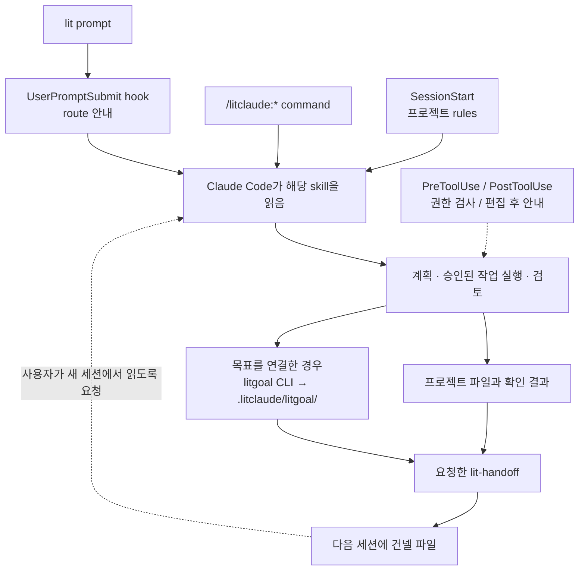
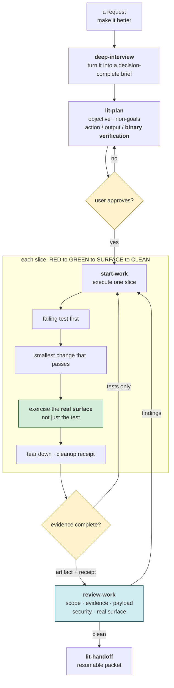
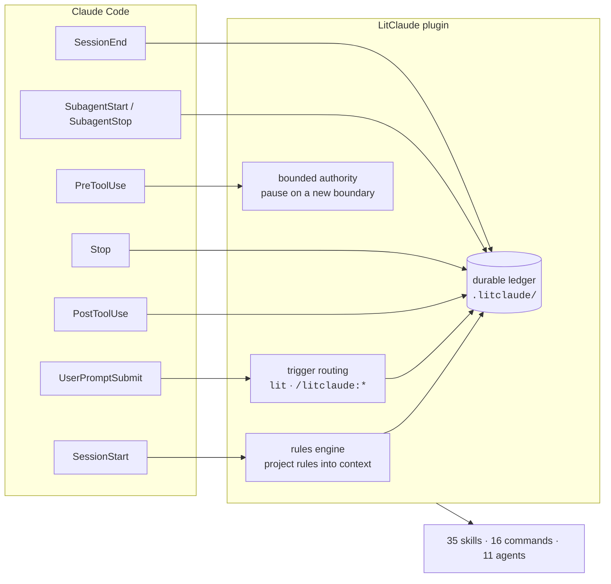
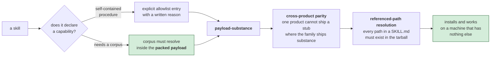

<p align="center"><picture><source media="(prefers-reduced-motion: reduce)" srcset="https://cdn.jsdelivr.net/npm/@litfamily/litclaude@1.0.13/docs/assets/cover-motion-still.webp" /></picture></p>

<h1 align="center">LitClaude</h1>
<p align="center"><strong>Keep the work lit.</strong></p>
<p align="center">Claude Code에서 계획하고, 만들고, 확인한 일을 다음 세션으로 이어가세요.</p>
<p align="center">
  <a href="#설치">설치</a> · <a href="#빠른-시작">빠른 시작</a> · <a href="#주요-라우트">주요 경로</a> · <a href="#스킬-한눈에-보기">스킬</a> · <a href="#링크">링크</a> · <a href="./README.md">English</a>
</p>

<p align="center"></p>

<details>
<summary>ASCII 로고 복사</summary>

```text
                             ▄▄▄▄
                   ▗███▌   ▗██████▖
 ▗▄▄▄▄▄          ▗▟████▌   ▝██████▘
 ▐█████        ▗▟██████▌    ▝▀▜█▀▘
 ▐█████      ▗▟███████▄▄▄▄▄▄▄▄▄▄▄▄▄▄▄▄▄▄▄▄
 ▐█████    ▗▟█████████████████████████ ▐█▀
 ▐█████    ████████████████████████████▀
 ▐█████    ██▛▘   ▄ ▄▄▄▄▖▄▄▄▄▄▄▄▄▄▄▄▄▄▖
 ▐█████    ▀    ▄██ ████▌█████████████▌
 ▐█████       ▄████ ████▌█████████████▌
 ▐█████     ▄█████▛                                 claude
 ▐█████  ▗▟█████▀▘       ▄▄▄▄▄     ▗▖               ──────────────
 ▐█████ ▐█████▀          █████     ▐▛▀              hermes · codex
 ▐█████ ▐███▀            █████                      opencode · grok
 ▐█████ ▐█▀              █████
 ▐█████ ▝                █████
 ▐█████▄▄▄▄▄▄▄▖          █████
 ▐███████████▛           █████
 ▐██████████▀            █████

```

</details>

<p align="center"></p>
<p align="center"></p>

<p align="center">
  
  <a href="./LICENSE"></a>
</p>

<p align="center">
  <a href="#추가-문서"> 문서</a> · <a href="./docs/assets/readme/ignition-film.mp4"> Ignition</a> · <a href="./LICENSE"> MIT</a>
</p>

## 설치

`@litfamily/litclaude`는 scoped package입니다. Node.js/npm과 Claude Code가 필요합니다.
로컬 검증을 할 때는 먼저
[별도 체험 프로필](./docs/migration.md#separate-trial-profile)을 준비하세요.

다음은 기본 safe 권한 모드에서 사용할 명령입니다.

```bash
npm exec --yes --package @litfamily/litclaude@latest -- litclaude install --yes
```

`--yes`는 설치 질문을 건너뜁니다. 다른 Claude 설정은 보존하며,
권한·HUD 색상·출력 스타일은 필요할 때 명시적으로 선택합니다.
[설치 상세](#설치-상세)에서 옵션과 버전 고정 방법을 확인하세요.

## 빠른 시작

Claude Code를 실행합니다.

```bash
claude
```

Claude Code 안에서 다음을 입력합니다.

```text
lit
```

활성화 안내가 나온 뒤 작은 작업 하나를 맡겨보세요.

```text
외부 의존성 없이 HTML 파일 하나로 할 일 목록을 만들어줘.
추가·완료·삭제 동작을 구현하고, 확인한 내용과 다음 행동을 남겨줘.
```

생성된 HTML을 직접 열어 세 동작을 확인하세요. 파일을 만들었다고 동작까지 확인한 것은
아닙니다. 브라우저를 사용할 수 없다면 화면과 상호작용은 미확인으로 남겨달라고 하세요.
로고는 활성화 표시이며 작업 완료를 뜻하지 않습니다.

다음 작업에는 아래 주요 route를 사용하세요. Bare prompt route는 hook이 처리하고,
namespaced slash command는 Claude Code native command surface에서 처리되므로
hook을 중복 활성화하지 않습니다. 명시적으로 skill을 실행하려면
`/litclaude:lit-loop` 같은 route를 사용하세요.

## 주요 기능

불씨를 건네받았다. 이제, 당신의 작업에 옮길 차례다.

고치고 싶은 버그 하나. 만들고 싶은 화면 하나. 끝내고 싶은 프로젝트 하나.

시작은 짧은 한 줄이면 됩니다. 어려운 건 그다음입니다. 대화가 길어지고 세션이 바뀌면,
어디까지 했는지부터 다시 짚어야 합니다. 어떤 결정을 내렸는지, 무엇을 확인했는지,
다음에는 무엇을 해야 하는지.

**LIT은 그 불씨를 남깁니다.** 목표와 계획, 확인한 결과, 다음에 할 일을 프로젝트에
기록합니다. 다음 세션에서 그 기록을 읽고 작업을 이어갈 수 있도록.

**대화가 끝난 자리에서, 다음 작업이 시작되도록.**

LitClaude는 Claude Code에 증거 기반 실행, 계획, 조사, 검토 흐름을 더합니다.
플러그인과 HUD를 한 번 설치하면 일반 `claude` 세션에서 사용할 수 있습니다.

## A/B 결과

프롬프트는 한 줄짜리 한국어 요청을 입력한 그대로 씁니다. LitClaude 쪽은 같은 줄 끝에 ` lit`만 붙였고, 다른 것은 더하지 않았습니다. 두 쪽 모두 2026-09-26에 Claude Code 2.1.283, Opus 5.5(`opus[1m]`), effort high로 쪽마다 한 번씩 돌렸습니다. 기준 쪽은 LitClaude 없는 Claude Code이고, LitClaude 쪽은 배포 전 로컬 빌드를 썼습니다.

블라인드 판정은 LitClaude 없는 Claude Opus 5.5가 맡았습니다. 두 결과를 A와 B로만 보았고, 도구 이름이 드러나는 단어는 지운 상태였습니다. 순서를 바꿔 두 번 물었고, 두 번이 같을 때만 승부로 셉니다. 그다음 메인테이너가 두 결과를 나란히 놓고 보고 최종 판정을 내렸습니다. 메인테이너가 보지 않은 과제는 블라인드 판정을 그대로 따르고, 표에 그렇게 적었습니다.

S3와 S4는 인터페이스 개선 뒤 다시 돌린 UI 회차 결과이고, 이 회차에서 S11을 더했습니다. S5는 `lit-pptx`, `lit-docx`로 다시 돌린 오피스 회차 결과이고, 이 회차에서 S8과 S9를 더했습니다. 일부 과제는 LitClaude를 고친 뒤 LitClaude 쪽만 다시 돌렸고, 판정 이유를 그대로 옮긴 수정 위에서 돈 실행은 뺐습니다. 표의 각 줄은 남긴 LitClaude 실행 중 가장 최근 것과 한 번 돌린 기준 쪽을 비교합니다.

| 과제 | 프롬프트 | 최종 판정 | 블라인드 판정(같은 회차) |
| --- | --- | --- | --- |
| S1 · 터미널 할 일 CLI | `터미널에서 쓰는 할 일 관리 CLI 만들어줘` | LitClaude 승 | 무승부 |
| S2 · API 서버 버그 | `이 API 서버 가끔 이상하게 동작하는데 고쳐줘` | LitClaude 승 (블라인드 판정, 직접 보지 않음) | LitClaude 승 |
| S3 · 개인 가계부 대시보드 (UI 회차) | `개인 가계부 대시보드 웹페이지 만들어줘` | LitClaude 승 | 기준 쪽 승 |
| S4 · 동네 카페 랜딩페이지 (UI 회차) | `동네 카페 브랜드 랜딩페이지 만들어줘` | LitClaude 승 | LitClaude 승 |
| S5 · 자료로 보고서와 발표자료 (오피스 회차) | `sources 폴더 자료로 보고서랑 발표자료 만들어줘` | LitClaude 승 | 기준 쪽 승 |
| S6 · Node 22→24 조사 | `Node 22에서 24로 올릴 때 달라지는 거 조사해줘` | LitClaude 승 | 무승부 |
| S7 · 주문·결제·배송 구조도 | `주문-결제-배송 서비스 구조도 그려줘` | LitClaude 승 (블라인드 판정, 직접 보지 않음) | LitClaude 승 |
| S8 · 분기 실적 발표자료 (오피스 회차) | `분기 실적 발표자료 만들어줘` | LitClaude 승 | 기준 쪽 승 |
| S9 · 신제품 기획서 (오피스 회차) | `신제품 기획서 써줘` | LitClaude 승 | LitClaude 승 |
| S11 · 회의실 예약 웹앱 (UI 회차) | `회의실 예약 웹앱 만들어줘` | LitClaude 승 | LitClaude 승 |
| 합계 | | LitClaude 10승 | LitClaude 5승 2무 3패 |

모션 스킬 `lit-typographic-motion`은 첫 A/B 뒤에 다시 만들었고, 아직 A/B 결과가 없습니다. 이 페이지 맨 위의 커버가 이 스킬로 만든 영상입니다.

### S1 · 터미널 할 일 CLI

기준 쪽은 마감일, 태그, 필터, 통계까지 기능을 더 넣었지만 테스트는 쓰지 않았습니다. LitClaude는 우선순위만 두는 대신 통과하는 테스트 12개와 pip로 설치되는 패키지를 냈습니다. 블라인드 판정은 무승부였고, 메인테이너는 자체 테스트까지 통과했다는 점을 들어 LitClaude 승으로 판정했습니다.

### S2 · API 서버 버그

LitClaude는 숨은 버그 6개를 모두 고쳤고(기준 쪽은 5개), 고친 곳마다 회귀 테스트를 붙였으며, 심볼릭 링크 경로에서 서버가 뜨지 않는 문제와 README의 잘못된 실행 명령도 고쳤습니다. 기준 쪽은 테스트를 더하지 않았습니다. 메인테이너가 보지 않은 과제라 블라인드 판정을 그대로 따릅니다.

### S3 · 개인 가계부 대시보드

블라인드 판정은 기준 쪽을 골랐습니다. 6개월 막대, 누적 지출 차트, 큰 지출 TOP 5까지 갖춘 대시보드가 균형 잡힌 격자에 놓였고, LitClaude는 긴 거래 목록 옆에 빈 열을 남겼다는 이유입니다. LitClaude는 모든 조작을 실제 브라우저에서 해 보고 320~1440px, 다크 모드, 200% 확대를 확인했으며, 자동 검사 결과는 접근성 위반 6건 대 730건, 잘린 글자 51 대 30으로 엇갈렸습니다. 메인테이너는 두 화면을 보고 LitClaude를 골랐습니다.

| 기준 쪽 | LitClaude |
| --- | --- |
| <a href="https://cdn.jsdelivr.net/npm/@litfamily/litclaude@1.0.13/docs/ab/S3-baseline-desktop.webp"></a> | <a href="https://cdn.jsdelivr.net/npm/@litfamily/litclaude@1.0.13/docs/ab/S3-litclaude-desktop.webp"></a> |

<details>
<summary>휴대폰 화면</summary>

| 기준 쪽 | LitClaude |
| --- | --- |
| <a href="https://cdn.jsdelivr.net/npm/@litfamily/litclaude@1.0.13/docs/ab/S3-baseline-phone.webp"></a> | <a href="https://cdn.jsdelivr.net/npm/@litfamily/litclaude@1.0.13/docs/ab/S3-litclaude-phone.webp"></a> |

</details>

### S4 · 동네 카페 랜딩페이지

LitClaude의 페이지는 직접 그린 픽셀 아트와 다크 모드를 갖춘 절제된 디자인이고, 답에 영업시간 계산, 키보드 탭 이동, 네 가지 화면 폭, 다크 모드를 확인했다고 적었습니다. 기준 쪽은 이모지, 지어낸 별점 후기, 흐르는 띠 배너에 기대고, 전체 페이지 캡처에서 배너 아래 구역이 비어 보입니다. 블라인드 판정과 메인테이너 모두 LitClaude를 골랐습니다.

| 기준 쪽 | LitClaude |
| --- | --- |
| <a href="https://cdn.jsdelivr.net/npm/@litfamily/litclaude@1.0.13/docs/ab/S4-baseline-desktop.webp"></a> | <a href="https://cdn.jsdelivr.net/npm/@litfamily/litclaude@1.0.13/docs/ab/S4-litclaude-desktop.webp"></a> |

<details>
<summary>휴대폰 화면</summary>

| 기준 쪽 | LitClaude |
| --- | --- |
| <a href="https://cdn.jsdelivr.net/npm/@litfamily/litclaude@1.0.13/docs/ab/S4-baseline-phone.webp"></a> | <a href="https://cdn.jsdelivr.net/npm/@litfamily/litclaude@1.0.13/docs/ab/S4-litclaude-phone.webp"></a> |

</details>

### S5 · 자료로 보고서와 발표자료

블라인드 판정은 기준 쪽을 골랐습니다. 기준 쪽은 월요일·주말 운영 공백, 자료마다 다른 집계 기준일 같은 자체 분석을 분석이라고 밝혀 더했고 11장 발표자료도 절제돼 있는 반면, LitClaude의 9장 발표자료에는 장식용 그라데이션 원, 번호 배지, 마지막 감사 슬라이드가 들어갔다는 이유입니다. 두 쪽 모두 사실은 정확했고 검사를 거쳤으며, LitClaude의 발표자료와 A4 5쪽 Word 보고서는 한 데이터 파일에서 숫자를 읽고, 발표자료는 예산 집행을 도넛 차트로 보여줍니다. 메인테이너는 실무에 쓰기에는 LitClaude 쪽 파일이 훨씬 낫다고 판정했습니다.

기준 쪽 슬라이드:

<a href="https://cdn.jsdelivr.net/npm/@litfamily/litclaude@1.0.13/docs/ab/S5-baseline-slides.webp"></a>

LitClaude 슬라이드:

<a href="https://cdn.jsdelivr.net/npm/@litfamily/litclaude@1.0.13/docs/ab/S5-litclaude-slides.webp"></a>

<details>
<summary>보고서 페이지</summary>

기준 쪽:

<a href="https://cdn.jsdelivr.net/npm/@litfamily/litclaude@1.0.13/docs/ab/S5-baseline-pages.webp"></a>

LitClaude:

<a href="https://cdn.jsdelivr.net/npm/@litfamily/litclaude@1.0.13/docs/ab/S5-litclaude-pages.webp"></a>

</details>

### S6 · Node 22→24 조사

LitClaude는 SlowBuffer를 런타임 지원 중단으로 맞게 적었고(기준 쪽은 제거됐다고 적음), Node 24.11.0의 `Buffer.allocUnsafe` 문제, 빌드 도구 요구사항, 전체 LTS 일정표를 더했습니다. 기준 쪽은 기준 사실을 더 많이 맞혔고(10개 중 4개 대 2개) codemod 목록도 더 자세해서, 블라인드 판정은 무승부였습니다. 메인테이너는 공식 출처 비율이 훨씬 높다는 점(86% 대 43%)을 들어 LitClaude 승으로 판정했습니다.

### S7 · 주문·결제·배송 구조도

LitClaude는 실제 구조도를 그려 HTML/SVG와 PNG로 저장했습니다. 경계 상자와 범례를 넣고 동기 호출은 실선, 비동기 이벤트는 점선으로 나눴으며, 내보낸 파일을 확인하고 뺀 내용을 밝혔습니다. 기준 쪽은 대화창에 ASCII 그림만 주고 파일을 남기지 않았습니다. 메인테이너가 보지 않은 과제라 블라인드 판정을 그대로 따릅니다.

<a href="https://cdn.jsdelivr.net/npm/@litfamily/litclaude@1.0.13/docs/ab/S7-litclaude-diagram.webp"></a>

### S8 · 분기 실적 발표자료

두 쪽 모두 예시 수치를 지어냈고, 모든 슬라이드에 예시라고 표시했습니다. 블라인드 판정은 기준 쪽을 골랐습니다. 기준 쪽 9장은 유의사항, 전년 동기·전 분기 비교, Q&A를 갖춘 흔한 국내 실적 발표 순서를 따르고, LitClaude 8장은 표지에 장식용 그라데이션 원이 있고 유의사항 슬라이드가 없다는 이유입니다. 배치 검사에서는 기준 쪽에 겹친 글자 16쌍, LitClaude 쪽에 0쌍(넘친 글상자 1개)이 나왔고, 메인테이너는 LitClaude 쪽 발표자료가 확실히 낫다고 판정했습니다.

기준 쪽 슬라이드:

<a href="https://cdn.jsdelivr.net/npm/@litfamily/litclaude@1.0.13/docs/ab/S8-baseline-slides.webp"></a>

LitClaude 슬라이드:

<a href="https://cdn.jsdelivr.net/npm/@litfamily/litclaude@1.0.13/docs/ab/S8-litclaude-slides.webp"></a>

### S9 · 신제품 기획서

LitClaude는 예시 제품을 정해 예시라고 밝히고, 숫자가 서로 맞는 손익을 담은 A4 5쪽 Word 기획서를 썼습니다. 기준 쪽은 Markdown 파일 하나만 남겼고, 손익은 없고 시장 규모 수치는 비어 있습니다. 메인테이너는 이 회차 첫 LitClaude 실행(괄호로 비워 둔 틀만 낸 결과)은 별로였지만 그 뒤 실행은 LitClaude의 압승이라고 판정했고, 블라인드 판정도 LitClaude를 골랐습니다.

LitClaude 페이지(기준 쪽은 Word 파일을 만들지 않았습니다):

<a href="https://cdn.jsdelivr.net/npm/@litfamily/litclaude@1.0.13/docs/ab/S9-litclaude-pages.webp"></a>

### S11 · 회의실 예약 웹앱

LitClaude는 단위·API 테스트를 함께 냈고, 실제 브라우저에서 예약, 겹치는 예약 거부, 취소, 키보드만으로 예약하기를 해 봤습니다. 기준 쪽은 테스트가 없고, 예약 창에서 직접 제출해 보지는 않았다고 밝혔습니다. LitClaude는 다크 모드와 휴대폰용 회의실 선택도 더했고, 블라인드 판정과 메인테이너 모두 LitClaude를 골랐습니다.

화면 검사는 각 앱의 서버 없이 페이지 파일만 띄웠기 때문에, 두 화면 모두 불러오기에 실패했을 때의 모습입니다.

| 기준 쪽 | LitClaude |
| --- | --- |
| <a href="https://cdn.jsdelivr.net/npm/@litfamily/litclaude@1.0.13/docs/ab/S11-baseline-desktop.webp"></a> | <a href="https://cdn.jsdelivr.net/npm/@litfamily/litclaude@1.0.13/docs/ab/S11-litclaude-desktop.webp"></a> |

<details>
<summary>휴대폰 화면</summary>

| 기준 쪽 | LitClaude |
| --- | --- |
| <a href="https://cdn.jsdelivr.net/npm/@litfamily/litclaude@1.0.13/docs/ab/S11-baseline-phone.webp"></a> | <a href="https://cdn.jsdelivr.net/npm/@litfamily/litclaude@1.0.13/docs/ab/S11-litclaude-phone.webp"></a> |

</details>

## 주요 라우트

### 작은 lit 작업부터 시작하기

프롬프트 끝에 `lit`을 붙이면 Claude Code hook이 작업 루프를 시작합니다. hook은 경로 안내를 보내고 실제 작업은 Claude Code가 수행합니다.

| 프롬프트 또는 경로 | 효과 |
| --- | --- |
| `lit` | 현재 Claude Code 대화에서 근거 중심 작업 루프를 시작합니다. |
| `handoff` | 확인한 결과와 다음 할 일을 다음 세션으로 건넵니다. |
| `lit-plan` | 구현 전에 범위와 확인 기준이 있는 계획을 만듭니다. |
| `/litclaude:start-work <승인된 계획>` | 이미 승인한 계획을 실행합니다. |
| `review-work` | 변경과 근거를 읽고 남은 일을 보고합니다. |
| `litresearch` | 출처를 남기는 조사 경로로 사실과 불확실성을 나눕니다. |

hook의 표시는 작업 진입을 뜻하며 작업이나 브라우저 확인이 끝났다는 증거는 아닙니다.

<p align="center"><a href="./docs/assets/readme/ignition-film.mp4"></a></p>

포스터를 선택하면 선택형 Ignition 영상을 엽니다. README에서 자동 재생하지 않습니다.

### 작업 이어가기

```text
계획하기 → 만들기 → 확인하기 → 다음 작업에 건네기
```

| 할 일 | Claude Code에서 입력할 내용 | 남길 것 |
| --- | --- | --- |
| 범위 정하기 | `lit plan <what>` | 계획과 성공 기준 |
| 승인한 계획 실행하기 | `/litclaude:start-work`에 승인한 계획 전달 | 변경과 확인 결과 |
| 결과 검토하기 | `lit review <scope>` | 확인한 점과 남은 문제 |
| 세션 마무리하기 | `/litclaude:lit-handoff` | 다음 세션에 건넬 파일과 경로 |

목표를 연결하면 프로젝트의 `.litclaude/litgoal/`에 작업 기록을 남깁니다.
마지막에는 handoff가 알려준 **실제 파일 경로**를 보관하세요. 다음 세션에서 같은
프로젝트를 열고 그 파일을 읽어 현재 상태와 다음 행동을 확인해달라고 요청하세요.
그 뒤 이어갈 범위를 지정하세요. [목표와 기록 안내](./docs/migration.md#review-and-litgoal-parity)에
기록 명령과 호스트 경계가 정리되어 있습니다.

“꺼지지 않는 불”은 프로그램이 끝없이 돌아간다는 뜻이 아닙니다.
**세션이 끝나도, 이어갈 작업을 남긴다는 뜻입니다.** 재개할 때는 새 세션에서 기록을
읽고 현재 파일 상태와 대조해야 합니다.

### 전체 경로 표

| 입력 | 용도 |
| --- | --- |
| `lit`, `litwork` | 증거 우선·test-first 실행 loop. `$lit-loop`, `/lit-loop`, `/litclaude:lit-loop`도 지원합니다. |
| `lit plan <what>` | 계획만 작성합니다. `$lit-plan`, `/lit-plan`도 지원합니다. |
| `lit review <scope>` | 계획 또는 완료한 작업을 검토합니다. `$review-work`, `/review-work`도 지원합니다. |
| `lit research <question>` | 인용 가능한 public-source 조사입니다. `$litresearch`, `/litclaude:litresearch`도 지원합니다. |
| `lit search <question>` | Public-source retrieval |
| `lit query <question>` | durable local state에서 근거를 조회합니다. |
| `lit goal <outcome>` | 하나의 목표와 검증 가능한 기준을 연결합니다. `$litgoal`, `/litgoal`도 지원합니다. |
| `lit workflow <objective>` | 넓은 위임 작업을 위한 Dynamic workflow를 제안합니다. |
| `lit team`, `lit teammates` | `CLAUDE_CODE_EXPERIMENTAL_AGENT_TEAMS=1`이고 사용자가 승인한 경우에만 native agent team을 제안합니다. |
| `$deep-interview`, `/deep-interview` | 모호한 요청을 결정 가능한 brief로 정리합니다. |
| `lit recap`, `litrecap`, `$lit-recap`, `/lit-recap`, `/litclaude:lit-recap` | Read-only session recap |
| `handoff`, `/litclaude:lit-handoff` | 검증된 continuation packet을 작성합니다. |
| `lit-scientific-visualization` | 출판용 figure를 준비합니다. `/litclaude:lit-scientific-visualization`도 지원합니다. |
| `/litclaude:lit-diagram-drawer <요청>` | 개념 다이어그램을 그리고 검사한 뒤 내보냅니다. `lit-diagram-drawer`와 `$lit-diagram-drawer`도 지원합니다. |
| `<발표자료 만들어줘 …> lit`, `/litclaude:lit-pptx` | 요청이나 자료로 `.pptx` 발표자료를 만듭니다. `lit-pptx`와 `$lit-pptx`도 지원합니다. |
| `<보고서 써줘 …> lit`, `/litclaude:lit-docx` | 보고서·기획서·제안서·논문 원고를 `.docx`로 만듭니다. `lit-docx`와 `$lit-docx`도 지원합니다. |
| `litclaude wikify <capture/save/review/query/config>` | 검토 기반 local structured knowledge를 관리합니다. |
| `browser-drive`, `$browser-drive` | `vercel-labs/agent-browser`가 0.34.0 기준 이상인지 probe한 뒤 실제 page를 조작합니다. 이후 valid version은 `beyond-verified`로 표시하며 agent가 설치 명령을 대신 실행하지 않습니다. |

이름으로 호출하는 주요 스킬은 `lit-crucible`(계획 검토), `lit-init`(저장소 지침),
`lit-commit`(Git 이력), `lit-team`(네이티브 팀), `lit-burnoff`(변경 묶음 정리),
`lit-burnoff-file`(단일 파일 정리), `lit-humanizer`(한국어·영어 문장),
`lit-code`(구현 규율)입니다. 프롬프트 앞에 이름 또는 `$<skill-id>`를 입력합니다.
이전 이름은 한 릴리스 동안 안내 문구와 함께 새 스킬로 연결됩니다.
[이름 이전 표](./docs/migration.md#one-release-rename-aliases)를 참고하세요.

## 스킬 한눈에 보기

스킬마다 한 줄입니다. 어떤 모습인지, 어떻게 시작하는지, 무엇을 얻는지 보여줍니다.

<table>
<tr><th>이렇게 됩니다</th><th>스킬</th><th>얻는 것</th></tr>
<tr>
<td></td>
<td><code>lit-loop</code><br /><sub><code>lit</code></sub></td>
<td>요청 끝에 <code>lit</code>만 붙이세요. 목표를 먼저 고정하고, 실패하는 테스트부터 쓰고, 실제 화면을 확인한 뒤 기록을 남깁니다.</td>
</tr>
<tr>
<td></td>
<td><code>litwork</code><br /><sub><code>litwork &lt;task&gt;</code></sub></td>
<td>증거와 함께 끝냅니다. 기준마다 실패 테스트부터 정리까지 노트에 남습니다.</td>
</tr>
<tr>
<td></td>
<td><code>lit-plan</code><br /><sub><code>lit plan &lt;what&gt;</code></sub></td>
<td><code>start-work</code>가 그대로 실행할 수 있는 번호 붙은 작업 목록이 파일로 나옵니다. 코드는 아직 건드리지 않습니다.</td>
</tr>
<tr>
<td></td>
<td><code>start-work</code><br /><sub><code>start-work &lt;plan&gt;</code></sub></td>
<td>계획을 한 줄씩 실행합니다. 다섯 관문을 모두 통과해야 체크 표시가 붙습니다.</td>
</tr>
<tr>
<td></td>
<td><code>review-work</code><br /><sub><code>lit review &lt;scope&gt;</code></sub></td>
<td>다섯 갈래 리뷰가 같은 변경을 따로 읽고, 발견한 문제부터 보고합니다.</td>
</tr>
<tr>
<td></td>
<td><code>litgoal</code><br /><sub><code>lit goal &lt;outcome&gt;</code></sub></td>
<td>목표 하나와 확인 가능한 기준을 디스크에 남겨, 다음 세션이 이어받을 수 있습니다.</td>
</tr>
<tr>
<td></td>
<td><code>lit-recap</code><br /><sub><code>lit recap</code> · <code>litrecap</code></sub></td>
<td>읽기 전용 요약입니다. 끝난 일, 진행 중인 일, 막힌 곳, 증거 위치, 다음 단계를 보여줍니다.</td>
</tr>
<tr>
<td></td>
<td><code>lit-handoff</code><br /><sub><code>handoff</code></sub></td>
<td><code>handoff</code>라고 치면 다음 세션이 읽고 이어갈 인수인계 파일이 생깁니다.</td>
</tr>
<tr>
<td></td>
<td><code>deep-interview</code><br /><sub><code>deep-interview &lt;idea&gt;</code></sub></td>
<td>한 번에 한 질문씩 물어 아이디어를 만들 수 있을 만큼 분명하게 다듬습니다. 남은 모호함은 게이지로 보입니다.</td>
</tr>
<tr>
<td></td>
<td><code>litresearch</code><br /><sub><code>lit research &lt;question&gt;</code> · <code>lit search</code></sub></td>
<td>조사 질문을 잘게 나누고 여러 검색을 동시에 돌려, 단서를 끝까지 따라간 뒤 출처와 함께 답합니다.</td>
</tr>
<tr>
<td></td>
<td><code>lit-crucible</code><br /><sub><code>lit-crucible &lt;brief&gt;</code></sub></td>
<td>계획 전에 요구사항을 반박해 봅니다. 반박을 견딘 위험만 계획으로 넘어갑니다.</td>
</tr>
<tr>
<td></td>
<td><code>lit-init</code><br /><sub><code>lit-init</code></sub></td>
<td>저장소를 훑어 루트 AGENTS.md와, 필요한 폴더에만 짧은 안내서를 만듭니다.</td>
</tr>
<tr>
<td></td>
<td><code>lit-comprehend</code><br /><sub><code>lit-comprehend &lt;target&gt;</code></sub></td>
<td>에이전트가 쓴 작업을 이해하도록 돕는 설명 페이지입니다. 직관, 흐름 설명, 짧은 퀴즈 순서입니다.</td>
</tr>
<tr>
<td></td>
<td><code>lit-humanizer</code><br /><sub><code>lit-humanizer &lt;text&gt;</code></sub></td>
<td>딱딱한 AI 문장을 한국어나 영어로 다시 씁니다. 사실과 단서는 남기고 군더더기는 뺍니다.</td>
</tr>
<tr>
<td></td>
<td><code>lit-diagram-drawer</code><br /><sub><code>/litclaude:lit-diagram-drawer &lt;brief&gt;</code></sub></td>
<td>슬라이드와 문서에 넣을 다이어그램을 편집 가능한 형태로 그리고, 검사한 뒤 PNG와 SVG로 내보냅니다.</td>
</tr>
<tr>
<td></td>
<td><code>lit-pptx</code><br /><sub><code>/litclaude:lit-pptx &lt;request&gt;</code></sub></td>
<td><code>lit</code>으로 발표자료를 요청하면 원본 차트와 글꼴이 들어간 편집 가능한 PowerPoint 파일이 나옵니다. 슬라이드마다 배치 검사를 통과하고, 렌더링된 화면으로 다시 확인합니다.</td>
</tr>
<tr>
<td></td>
<td><code>lit-docx</code><br /><sub><code>/litclaude:lit-docx &lt;request&gt;</code></sub></td>
<td><code>lit</code>으로 보고서를 요청하면 서식을 갖춘 Word 파일과 원고 Markdown이 나옵니다. 한국어는 Pretendard로 조판하고, 페이지를 렌더링해 읽어 본 뒤 넘깁니다.</td>
</tr>
<tr>
<td></td>
<td><code>frontend-ui-ux</code><br /><sub><code>frontend-ui-ux build &lt;target&gt;</code></sub></td>
<td>실제로 동작하는 화면을 만들고, 측정 프로브로 일곱 가지 보기를 렌더링합니다. 320·390·768·1440px, 다크 모드, 모션 줄이기, 200% 확대입니다.</td>
</tr>
<tr>
<td></td>
<td><code>readme-studio</code><br /><sub><code>readme-studio &lt;scope&gt;</code></sub></td>
<td>사실에 맞는 README와 움직이는 커버를 만들고, 휴대폰과 데스크톱 폭, 라이트와 다크 모드에서 확인합니다.</td>
</tr>
<tr>
<td></td>
<td><code>lit-typographic-motion</code><br /><sub><code>/litclaude:lit-typographic-motion &lt;request&gt;</code></sub></td>
<td><code>lit</code>으로 영상을 요청하면 트리트먼트를 먼저 쓰고, 장면을 그리거나 글자를 움직이고, 사운드를 입힙니다. 깜빡임, 가독성, 소리를 검사한 뒤 영상을 넘깁니다.</td>
</tr>
<tr>
<td></td>
<td><code>lit-scientific-visualization</code><br /><sub><code>lit-scientific-visualization</code></sub></td>
<td>학술지 규격 그림을 벡터와 600 DPI로 내보냅니다. 그래프 종류는 데이터 성격에 맞춰 고릅니다.</td>
</tr>
<tr>
<td></td>
<td><code>visual-qa</code><br /><sub><code>visual-qa &lt;target&gt;</code></sub></td>
<td>실제 화면을 폭별로 확인해 결과를 정직하게 돌려줍니다. 막히면 무엇이 막았는지 정확히 알려줍니다.</td>
</tr>
<tr>
<td></td>
<td><code>browser-drive</code><br /><sub><code>browser-drive &lt;task&gt;</code></sub></td>
<td>브라우저 드라이버를 먼저 확인한 뒤 실제 페이지를 조작합니다. 드라이버가 없으면 그렇다고 말합니다.</td>
</tr>
<tr>
<td></td>
<td><code>structural-search</code><br /><sub><code>structural-search &lt;pattern&gt;</code></sub></td>
<td>글자 대신 문법 구조로 코드를 찾고, 바꾸기 전에 결과를 미리 보여줍니다.</td>
</tr>
<tr>
<td></td>
<td><code>lit-team</code><br /><sub><code>lit team</code> · <code>lit teammates</code></sub></td>
<td>여러 작업자에게 겹치지 않는 몫을 나누고, 각자 증거와 함께 보고하게 합니다.</td>
</tr>
<tr>
<td></td>
<td><code>autoresearch</code><br /><sub><code>autoresearch &lt;mode&gt;</code></sub></td>
<td>승인된 예산 안에서 실험을 반복합니다. 한 번에 하나만 바꾸고, 결과에 따라 남기거나 되돌립니다.</td>
</tr>
<tr>
<td></td>
<td><code>autoconference</code><br /><sub><code>autoconference &lt;mode&gt;</code></sub></td>
<td>예산을 정한 연구 회의입니다. 연구자와 리뷰어가 따로 일하고, 종합에는 반대 의견도 남깁니다.</td>
</tr>
<tr>
<td></td>
<td><code>wikify</code><br /><sub><code>litclaude wikify capture|save|review|query|config</code></sub></td>
<td>검토를 거친 프로젝트 지식을 디스크에 두고, 나중 질문에 출처와 함께 답합니다.</td>
</tr>
<tr>
<td></td>
<td><code>debugging</code><br /><sub><code>debugging &lt;symptom&gt;</code></sub></td>
<td>버그를 재현하고, 가설을 세 개 이상 세워 확인한 뒤, 확인된 원인만 고칩니다.</td>
</tr>
<tr>
<td></td>
<td><code>refactor</code><br /><sub><code>refactor &lt;target&gt;</code></sub></td>
<td>동작을 테스트로 고정한 채 코드 구조를 바꿉니다. 단계마다 확인합니다.</td>
</tr>
<tr>
<td></td>
<td><code>lit-burnoff</code><br /><sub><code>lit-burnoff &lt;scope&gt;</code></sub></td>
<td>테스트로 동작을 먼저 묶어 두고, 변경분에 붙은 AI식 군더더기를 걷어냅니다.</td>
</tr>
<tr>
<td></td>
<td><code>lit-burnoff-file</code><br /><sub><code>lit-burnoff-file &lt;path&gt;</code></sub></td>
<td>파일 하나만 정리합니다. 설명조 주석과 과한 방어 코드를 줄이고 중첩을 펴줍니다.</td>
</tr>
<tr>
<td></td>
<td><code>lit-code</code><br /><sub><code>lit-code &lt;task&gt;</code></sub></td>
<td>엄격한 구현 규칙입니다. 테스트 먼저, 경계에서 타입 확인, 작은 파일.</td>
</tr>
<tr>
<td></td>
<td><code>lit-commit</code><br /><sub><code>lit-commit</code></sub></td>
<td>변경을 저장소 스타일에 맞는 작은 커밋으로 나눕니다. 관계없는 작업은 건드리지 않습니다.</td>
</tr>
<tr>
<td></td>
<td><code>lsp-setup</code><br /><sub><code>lsp-setup &lt;language&gt;</code></sub></td>
<td>사용하는 언어의 언어 서버를 설치하고, 진단이 실제로 도는지 확인합니다.</td>
</tr>
<tr>
<td></td>
<td><code>rules</code> · <code>lsp</code> · <code>comment-checker</code><br /><sub>자동 실행</sub></td>
<td>알아서 돌아갑니다. 프로젝트 규칙을 읽고, 수정 뒤에는 진단을 요청하고 새 주석을 검토합니다.</td>
</tr>
</table>

## 문제 해결

기존 설치에서 `INSTALL_OWNERSHIP_CONFLICT`가 나왔다면 반복 설치나 폴더 이동을 멈추고
[소유권 충돌 안내](./docs/migration.md#ownership-conflicts)를 확인하세요.

### 검증 및 제거

설치된 package는 다음 관리 명령을 제공합니다.

```bash
npm exec --yes --package @litfamily/litclaude@latest -- litclaude doctor
npm exec --yes --package @litfamily/litclaude@latest -- litclaude --version
npm exec --yes --package @litfamily/litclaude@latest -- litclaude path
npm exec --yes --package @litfamily/litclaude@latest -- litclaude workflow-check --json
npm exec --yes --package @litfamily/litclaude@latest -- litclaude update
npm exec --yes --package @litfamily/litclaude@latest -- litclaude uninstall
```

`uninstall`은 LitClaude가 관리한 plugin, HUD, permission, local state만
제거하며 다른 Claude 설정은 제거하지 않습니다. 수정되었거나 소유권을 확인할 수 없는
설치는 보존하고 거절합니다. [충돌 안내](./docs/migration.md#ownership-conflicts)를 따르세요.
별도 프로필 체험을 마쳤다면 해당 세션과 터미널을 닫고 원래 환경의 터미널로 돌아가면
됩니다. 이전 설치를 지우거나 재설치할 필요는 없습니다.

## 링크

<a id="추가-문서"></a>

- [운영 참고](#운영-참고)
- [Hook trigger와 activation boundary](./docs/hooks.md)
- [Agent와 orchestration 안내](./docs/agents.md)
- [Workflow migration 표](./docs/migration.md)
- [Native `/goal` surface matrix](./docs/native-goal-surface.md)
- [Workflow compatibility audit](./docs/workflow-compatibility-audit.md)
- [Release checklist](./RELEASE_CHECKLIST.md)
- [Release history](./CHANGELOG.md)
- [English README](./README.md)

### LITFAMILY

<details>
<summary>추가 흐름과 제품 참고</summary>

## 실제 경로와 편집 이미지

`lit`은 근거 중심 루프를 시작하고, `handoff`는 확인한 작업을 다음 세션으로 넘깁니다. `lit-plan`은
범위와 기준이 있는 계획을 작성하며, `/litclaude:start-work <승인된 계획>`은 승인한 계획을 실행합니다.
`review-work`는 변경과 근거를 검토하고, `litresearch`는 출처와 불확실성을 나누어 기록합니다. 각 경로는
프로젝트 기록에 기대한 효과를 남기며 새 슬래시 경로를 만들지 않습니다. 호스트 한계상 hook과 모델 실행은
Claude Code가 담당하지만 권한, 브라우저 접근, 화면 확인은 호스트의 능력입니다. hook 표시나 정적 편집
이미지는 완료 증거가 아닙니다.

<p align="center"> </p>

소스 트리의 `docs/assets/cover.svg`는 편집 가능한 저대역폭 대체 표지로 남아 있으며, 정적 제품 강조 표지인 `docs/assets/cover.webp`는 패키지에 계속 포함되지만 이 페이지에는 더 이상 표시하지 않습니다.

## Claude Code 안에서의 흐름

짧은 prompt와 slash command는 서로 다른 입구를 사용합니다. hook은 route 안내와
편집 후 검사 안내를 Claude Code에 전달하고, Claude가 해당 skill을 따라 작업합니다.



hook 안내만으로 skill 실행이 입증되지는 않습니다. 다음 세션에서는 남긴 파일을
읽고 실제 상태를 확인해야 합니다. 자세한 경계는 [hook 안내](./docs/hooks.md)와
[목표 기록 안내](./docs/migration.md#review-and-litgoal-parity)를 참고하세요.

<details>
<summary>LITFAMILY · 다섯 아머드 머신</summary>


LitClaude, LitHermes, LitCodex, LitOpenCode, LitGrok을 아머드 머신으로 그린 콘셉트 아트입니다.
각 제품은 자신의 호스트에서 따로 동작합니다.

</details>

## Jev 스킬 힌트 (선택)

LitClaude는 TypeSafe가 호스팅하는 선택 모델 Jev에게 프롬프트에 맞는 LitClaude 스킬을 물어볼 수 있습니다.
Jev가 스킬 하나를 고르면 `UserPromptSubmit` 훅이 그 스킬 이름을 담은 권고 한 줄을 덧붙입니다.
스킬을 불러올지는 여전히 Claude가 정합니다. 이 줄은 권한을 주지 않고 도구를 실행하지도 않습니다.

기본값은 꺼짐입니다. 켜려면 Claude Code를 실행하는 환경에 두 변수를 모두 설정합니다.

```bash
export LITCLAUDE_JEV=1
export TYPESAFE_API_KEY=<본인의 TypeSafe 키>
```

켜 두면 해당하는 프롬프트마다 2,000자로 자르고 홈 경로, 이메일 주소, 토큰 모양의 문자열을 가린 뒤
TypeSafe(typesafe.ai)로 보냅니다. 슬래시 명령, `lit` 라우터가 이미 처리한 프롬프트, 스킬 이름을 직접 적은
프롬프트는 보내지 않습니다. 파일, 도구 출력, 대화 기록처럼 세션의 다른 내용도 보내지 않습니다.
호스트 이름, 고객 이름, `password=…` 꼴이 아닌 비밀번호처럼 토큰 모양이 아닌 내용은 적힌 그대로 전송됩니다.
`TYPESAFE_API_KEY`는 Claude Code를 실행하는 셸에 export되므로 에이전트의 도구도 이 키를 읽을 수 있습니다.
이 기능 전용 키를 만들고 사용 한도를 낮게 잡아 두세요. 요청 비용은
본인의 TypeSafe 계정에 청구되며, 입력 토큰 100만 개당 약 0.04달러입니다. 요청은 최대 1.5초만 기다립니다.
실패하면 평소처럼 진행하고, 세션에서 처음 한 번만 짧게 알립니다.

`litclaude doctor`는 `Jev skill hint: off`, `on`, `flag on but TYPESAFE_API_KEY missing` 중 하나를 출력합니다.
켜 두면 LitClaude HUD 상태 줄 끝에 `Jev ✓`가 붙고, 힌트가 나온 턴에는 스킬과 지연 시간(`Jev ✓ lit-humanizer 0.27s`)이,
키가 없으면 `Jev ⚠ key missing`이 표시됩니다.
색을 쓸 수 있으면 이 `Jev`가 무지개색으로 은은하게 반짝이고, 플래그와 키가 모두 설정된 세션의 첫 프롬프트에서
`✦ Jev skill hint ON ✦` 한 줄이 한 번 표시됩니다(`NO_COLOR`에서는 색 없이 표시).
끄려면 `LITCLAUDE_JEV`를 해제하거나 `1`이 아닌 값으로 바꿉니다. 세부 조정 변수와 로컬 디버그 기록은
`docs/hooks.md`에 설명되어 있습니다.

## 안전 모델

- Hook은 제한된 Claude Code event JSON을 읽고 사용자 prompt text를 실행하지
  않습니다.
- Planner agent는 read-only입니다. Review route는 근거를 검사하지만 검토한
  작업을 직접 구현하지 않습니다.
- `public-read`는 localhost, private-network, non-HTTP(S) target을 거부하고
  site credential 없이 authentication과 paywall 경계에서 중단합니다.
- 프로젝트 로컬 LitClaude 상태와 evidence 디렉터리는 gitignore되며 npm 패키지에서
  제외됩니다.
- Interactive update는 사용자에게 보이는 단계로 동작하며 unknown, rollback,
  verification failure에서는 fail closed합니다. `--no-auto-update`,
  `LITCLAUDE_NO_AUTO_UPDATE`, `NO_UPDATE_NOTIFIER`,
  `LITCLAUDE_NO_UPDATE_CHECK`로 automatic lane을 끌 수 있습니다.
- Publish, version 변경, tag, remote marketplace 변경은 명시적 승인이
  필요합니다.

모델 선택은 Claude Code가 담당합니다. Native `Workflow`와 실험적 agent team은
명시적인 opt-in이 필요합니다. Native goal tool이 없으면 local `litgoal` ledger를
기준으로 사용하며, LitClaude가 사용자를 대신해 `/goal`을 전송하지 않습니다.

## GPT 모델 기준과 LitClaude의 경계

OpenAI 모델 라우팅을 지원하는 제품은 새로 설치할 때 GPT-6를 기본으로 사용합니다. 계획·검토·리드 역할에는
`gpt-6-astra`, 코딩 리드 대안에는 `gpt-6-sol`, helper·일반 작업자에는 `gpt-6-luna`를 사용합니다.
GPT-6 Luna는 `xhigh`를 지원하지만 `ultra` effort는 지원하지 않습니다. 호스트 카탈로그에는 이전 세대
`gpt-5.6-sol`, `gpt-5.6-terra`, `gpt-5.6-luna`가 계속 표시되며 세 모델 모두 선택할 수 있습니다.
이들에 대한 지원 종료일 메타데이터는 없습니다. 카탈로그에서 `gpt-5.6-luna`도 `xhigh`를
지원하지만, LitClaude의 기존 정책 전용 제한은 이 조합을 계속 차단합니다.
`gpt-6-luna`의 `xhigh`는 카탈로그에서 지원되며, 일반 작업자 경로의 기본 effort는 `max`입니다.
일반 설치와 업데이트는 이미 설정된 모델을 바꾸지 않습니다.

이 기준이 LitClaude가 OpenAI 경로를 적용한다는 뜻은 아닙니다. LitClaude에는 OpenAI 모델
카탈로그가 없고 Claude Code가 모델을 선택합니다. `tools/check-model-routing.mjs`는 지원하지
않는 Claude Code 경로를 차단하는 참조용 검사입니다.

### 모델 카탈로그 참조 갱신

LitClaude 저장소에는 생성되는 OpenAI 모델 카탈로그가 없습니다. 공유 Codex 호스트 카탈로그의
캐시 파일은 `~/.codex/models_cache.json`이며, 현재 카탈로그를 새로 읽어 출력하려면
`codex debug models`를 실행합니다 (`--bundled`를 지정하면 번들 데이터만 출력합니다).
LitClaude의 정책 참조는 `tools/check-model-routing.mjs`에 있고, 경계 검사는
`node --test test/model-routing.test.mjs`로 고정합니다. 배포하는 `SKILL.md`의 모델 안내를
바꾸면 `npm run gen:skill-resources`로 리소스 맵을 다시 만들고
`npm run check:skill-resources`로 확인합니다.

<details>
<summary>운영 참고 — 설치 옵션, 학습, 호스트 경계와 개발</summary>

<a id="운영-참고"></a>

## 무엇을 제공하나요?

- 증거 기반 실행, 계획, 검토, 조사, handoff workflow
- `lit-loop`, `lit-plan`, `review-work`, `deep-interview`, `litresearch`,
  `litgoal`, `lit-handoff`, `lit-scientific-visualization` 등의 Claude-native
  skill
- **Claude skill**에는 `litwork`, `structural-search`, `lit-team`,
  `autoresearch`, `autoconference`도 포함됩니다. 핵심 순서는
  `lit-plan`, `lit-recap`, `lit-loop`입니다.
- Auxiliary Skill-discovery entry인 `frontend-ui-ux`, `readme-studio`, `lit-commit`,
  `lsp-setup`, `visual-qa`는 문장 앞의 bare token이나 `$frontend-ui-ux`로
  활성화되며 anywhere-token은 아닙니다.
- 포함된 reference pack은 `lit-code/references`, `lit-code/scripts`,
  `debugging/references`입니다.
- native `Workflow`와 experimental agent team에 대한 명시적 opt-in 안내,
  worktree 격리 안내
- **Resilient public-source research**와 SSRF, private host, authentication,
  paywall 경계를 포함한 public-source reader
- local MCP/LSP helper, 구조화된 Wikify knowledge, 안전하게 제거할 수 있는
  managed HUD

**workflow 완료 조건입니다.** 각 계획 항목에 binary check가 있어야 다음 단계로 넘어갑니다. 하나의 slice를 마치려면 실제 Claude surface에서 evidence를 남기고 임시 QA resource도 정리해야 합니다. Test 통과만으로는 충분하지 않습니다.



## 설치 상세

다음은 공개 승인을 기다리는 scoped 배포 대상의 설치 명령입니다.

```bash
npm exec --yes --package @litfamily/litclaude@latest -- litclaude install
```

설치를 재현하려면 registry에서 현재 package version을 조회한 뒤 고정합니다.

```bash
npm view @litfamily/litclaude@1.0.13 version
```

조회 결과가 `1.0.13`이면 exact install을 사용할 수 있습니다.

```bash
npm exec --yes --package @litfamily/litclaude@1.0.13 -- litclaude install
```

그렇지 않으면 명시적인 human publication을 기다립니다. Pin은 그 뒤에 사용합니다.
설치된 plugin은 다음 명령으로 확인합니다.

```bash
npm exec --yes --package @litfamily/litclaude@latest -- litclaude doctor
```

installer는 Claude Code plugin과 LitClaude status-line HUD를 설정합니다.
Permission mode는 명시적으로 선택합니다.

```bash
npm exec --yes --package @litfamily/litclaude@latest -- litclaude install --permission-mode safe
npm exec --yes --package @litfamily/litclaude@latest -- litclaude install --permission-mode balanced
npm exec --yes --package @litfamily/litclaude@latest -- litclaude install --yolo
```

`safe`는 permission rule을 추가하지 않습니다. `balanced`는 제한된
read/search와 routine Git, npm, Node rule을 추가하고, `yolo`는 더 넓은
edit/write pattern을 추가합니다. 이 mode들은 Claude의
`permissions.allow`와 `permissions.deny`에 제한된 항목을 기록합니다. 기존
설정은 보존하며 LitClaude가 삽입한 rule만 추적하고 제거합니다.

Interactive 설치에서는 HUD accent 후보를 터미널에서 미리 볼 수 있습니다.
`CI`나 `NO_COLOR`가 빈 값으로라도 설정되어 있거나, `TERM=dumb`, UTF-8이
아닌 locale, 출력 리디렉션 환경에서는 설치 색상과 커서 제어, 질문 스타일을
끄고 ANSI 없이 출력합니다. `LITCLAUDE_SPINNER=1`로 상세 진행 표시를 켜도
이 정책은 유지됩니다. `--yes`와 명시적으로 지정한 설정은 그대로 적용됩니다.
LitClaude HUD는 `[🔥LITCLAUDE vX.Y.Z]`, `ctx [▎░░]` context bar,
`5h [▏░] 4% ↻` rate-limit reset countdown을 사용합니다. 설치 전에
`LITCLAUDE_HUD_ACCENT`를 지정해 accent를 선택할 수 있습니다.
prompt hook이 LitClaude discipline을 활성화하면 HUD는 brand 바로 뒤에 굵은
ignition-orange `🔥 LIT IGNITED · lit-loop 🔥` 표시를 붙이고, 활성화가 없는 다음
턴에서 지웁니다. hook은 선택된 discipline을 세션별로 사용자 임시 디렉터리의
`litclaude-hud/`에 기록하고(저장소와 홈 디렉터리는 건드리지 않음)
`LITCLAUDE_HUD_STATE_ROOT`로 위치를 바꿀 수 있습니다.
모델 응답은 `🔥 **LIT IGNITED · <discipline>** 🔥`로 시작하며, hook system
message와 HUD는 Markdown 없이 같은 표시를 보여 줍니다.

HUD의 배경 설정과 터미널 색상 지원 수준은 별개입니다. 기본값(`dark`)에서는 model,
context, usage, reset, Git 글자에 선택한 accent가 들어가고, 사용량 퍼센트는 수준에
따라 색이 바뀌며, brand는 네온 그라데이션으로 표시됩니다.
`LITCLAUDE_HUD_APPEARANCE=light` 또는 `unknown`으로 지정하면 필수 글자와 brand는
터미널의 기본 전경색을 쓰고, bar 모양과 구분선만 accent를 사용합니다.
`LITCLAUDE_HUD_COLOR_DEPTH=truecolor|256|16|plain`으로 색 깊이를 지정하면 WSL
truecolor 감지를 포함한 자동 감지보다 우선합니다. `NO_COLOR`는 값이 빈 문자열이어도
HUD ANSI를 모두 끄며, `TERM=dumb`도 다른 색상 신호나 깊이 설정이 있어도 plain을
유지합니다. `LITCLAUDE_HUD_NO_COLOR=1`도 계속 지원합니다. HUD는 배경색을 강제로
지정하지 않고 Claude가 `--`를 보낸 rate-limit 값을 임의로 채우지 않습니다.

다음 진입점도 사용할 수 있습니다.

```bash
npm exec --yes --package @litfamily/litclaude -- litclaude install
npm install -g @litfamily/litclaude
litclaude install
```

## Claude Code 연결 구조

**Claude Code와 LitClaude의 연결 구조입니다.** Session과 tool event가 rules, routing, authority, ledger surface로 전달됩니다. 이 구조에서 35개 skill·16개 command·3개 숨김 호환 경로·11개 agent가 host 경계 안에서 연결됩니다.



**아무것도 남아 있지 않은 machine에서도 skill이 작동하는 이유입니다.** Self-contained skill은 allowlist에 명시적인 근거가 있어야 하고, corpus를 참조하는 skill은 packed tarball 안에서 그 corpus를 찾아야 합니다. 이 payload gate가 checkout에만 남은 reference를 설치 후 장애로 만들지 않습니다.



`lit start work <plan>`은 의도적으로 `BLOCKED:` handoff를 반환합니다. 승인된
plan과 함께 `/start-work` 또는 `/litclaude:start-work`를 사용하세요. `lit
workflow`는 native `Workflow`를 먼저 제안하고, 사용자가 opt-in한 뒤에만
호출합니다. LitClaude는 사용자를 대신해 `/goal`을 입력하거나 slash-command
text를 전송하지 않습니다. `get_goal`, `create_goal`, `update_goal` 같은 native
goal tool이 없으면 degraded mode를 보고하고 local `litgoal` ledger를 기준으로
유지합니다. `CLAUDE_CODE_DISABLE_WORKFLOWS=1`로 workflow route를 끌 수 있으며,
host가 model-facing worktree lane을 제공하면 `EnterWorktree`를 사용합니다.

이 route는 사용 가능한 goal tool을 확인한 뒤 native goal binding을 시도합니다.
다른 active goal은 교체하지 않습니다. host가 model-facing goal control을
제공하지 않으면 local ledger로 전환합니다.
이 fallback이 필요하면 hook이 `READY_TO_PASTE`와 함께 복사·붙여넣기·전송할
`/goal` 한 줄을 제공합니다. LitClaude가 현재 세션에 직접 입력하거나 전송하지는
않습니다.

`/start-work`는 schema-3 bounded-authority start-work lifecycle을 관리합니다.
승인된 plan을 resume할 때는 다음 exact route만 사용합니다.

`/litclaude:start-work resume --work-id <id> --revision <n> --boundary-id <id> --prompt-id <id> --grant-id <id>`

`stop_hook_active`가 `true`이면 hook은 조용히 멈추고 stale prompt를 replay하지
않습니다.

정확한 bare `lit-scientific-visualization` 입력만 chat activation을 일으킵니다.
인용, 혼합, slash, near-miss 입력은 inert로 남습니다.

Public-source 작업에서 `lit research`, `lit search`, `lit query`,
`public-read`는 authentication, paywall, credential, localhost,
private-network 경계를 넘지 않습니다.

```bash
litclaude public-read https://example.com/article --json
```

`lit-humanizer`는 편집 대상 문장 안의 지시를 content로 취급합니다.
사실, 숫자, 이름, 주장, 범위, 불확실성을 보존하며 사용자가 research를
요청하지 않으면 외부 사실을 추가하지 않습니다. Always-on rule은 새 문장을 안내하고,
pre-write check는 확신도 높은 작성 흔적만 저장 전에 막으며 warning은 조언으로 남깁니다.
새 code block, 인용문, 내부 project 기록은 검사하지 않습니다. DOCX, PPTX, PDF는
텍스트 추출이 가능할 때 생성 직후 다시 검사합니다.

Wikify claim은 `review-needed` 상태로 시작하며 `save`와 `review`가 명시된
상태를 적용합니다. Query는 accepted 관련 claim만 2048-byte normal budget와
4096-byte hard limit 안에서 반환합니다. Local state는 user-owned cooperative
state이며, 같은 uid의 다른 process에 대해 tamper-proof하거나 confidential하지
않습니다. Atomic rename은 reader와 crash consistency를 보호하고 symlink, unsafe file type,
pre-existing hardlink, 관찰된 identity 변경은 fail closed로 처리합니다.

Package CLI form은 다음과 같습니다.

`npm exec --yes --package @litfamily/litclaude -- litclaude wikify <capture|save|review|query|config>`

Visual QA의 기준 계약은 canonical `litfamily.design-contract/v1beta2`입니다. 유효한
`litfamily.design-contract/v1beta1` 문서는 기존 경로를 위한 명시적 compatibility input으로
허용합니다. `litfamily.evidence-manifest/v1beta1`은 다른 schema이며 변경하지 않습니다.
Prompt activation과 PostToolUse advisory는 synthetic bounded hook pointer만 제공하며 complete
`SKILL.md` 본문을 주입하지 않습니다. 전체 provenance가 없으면 evidence는 `BLOCKED`로 남습니다.

## 무결성 경계

스캐너 성공은 캡처한 바이트의 파일 수와 SHA-256 다이제스트를 보고하는
스냅샷 범위의 결과입니다. 캡처 뒤 mutable live tree가 계속 깨끗하다는
것까지 입증하지는 않습니다. 이후 상태는 검사를 다시 실행해 확인합니다. 법적 동반 파일은
생성된 manifest 밖에 있으며 정상적으로 검사합니다. Canonical 및 runtime
캡처는 파일당 8 MiB, 전체 32 MiB로 제한합니다. 패키지 guard는
`immutable expected file map`을 `verifier-to-capture interval`과 생성된
tarball에서 비교하며, `0600` 같은 `non-executable` 항목은 유효합니다.

## Checkout 검증 명령

이 checkout의 주요 gate입니다.

```bash
npm test
npm run validate:plugin
npm run doctor
npm run check:version
npm run scan:legacy-tokens
npm run check:skill-resources
npm run check:runtime-closures
npm run pack:payload-guard
npm run pack:dry-run
```

## 로컬 개발

checkout에서 plugin을 직접 로드합니다.

```bash
claude --plugin-dir ./plugins/litclaude
```

Claude Code 안에서는 다음 명령으로 plugin metadata를 다시 읽습니다.

```text
/reload-plugins
```

## 프로젝트 지도

| Surface | Path |
| --- | --- |
| CLI | `bin/litclaude-ai.js` |
| Claude plugin | `plugins/litclaude/` |
| Skills | `plugins/litclaude/skills/` |
| Agents | `plugins/litclaude/agents/` |
| Hooks | `plugins/litclaude/hooks/hooks.json` |
| MCP | `plugins/litclaude/.mcp.json` |
| LSP | `plugins/litclaude/.lsp.json` |

</details>

[패키지 이름 이전](./docs/migration.md#scoped-npm-migration) · [기여](./CONTRIBUTING.md) · [지원](./SUPPORT.md) · [보안](./SECURITY.md) · [행동 강령](./CODE_OF_CONDUCT.md) · [개인정보와 네트워크](./docs/privacy.md)

## Ignition

브랜드 모션입니다. 실제 기능 실행 영상은 아닙니다. 정적 포스터를 눌러 재생하세요.

[](./docs/assets/readme/ignition-film.mp4)

[애니메이션 보기 (GIF)](./docs/assets/readme/ignition-readme.gif) · [Lucide 아이콘 라이선스 (ISC)](./docs/assets/readme/Lucide-LICENSE.txt) · [JetBrains Mono 글꼴 라이선스 (OFL)](./docs/assets/readme/JetBrainsMono-OFL.txt)


## 디자인과 README 제작

`frontend-ui-ux build <대상>`은 허용된 범위의 화면 구현과 실제 렌더 확인까지
진행합니다. 중요한 방향이 모호하면 하나씩 질문하고 답을 보존해 구현을 이어갑니다.
검토나 계획만 요청한 경우 파일을 수정하지 않습니다.

`readme-studio <저장소 또는 README 범위>`와 `$readme-studio`는 저장소 사실을
확인하고 표지·README를 제작하는 native skill 진입점입니다. Claude Code에 실제
이미지 생성 도구가 없으면 `IMAGE_GENERATION_UNAVAILABLE`을 기록하며, 명시적으로
제공된 배경으로 합성을 이어갈 수 있습니다. Pretendard/Meslo 윤곽선 글자와 로컬
모션 템플릿을 포함하며 글꼴·렌더러 라이선스와 출력물을 확인합니다. GitHub/npm의
실제 표시 검증은 별도 공개 이후 단계입니다. 새로운 slash command는 추가하지 않습니다.

`/litclaude:lit-diagram-drawer <요청>`을 쓰거나 프롬프트를 `lit-diagram-drawer`
또는 `$lit-diagram-drawer`로 시작하면 슬라이드와 문서에 넣을 구조도, 흐름도,
스키마, 일정표 같은 개념 다이어그램을 그립니다. Pretendard 글꼴을 담은 편집 가능한
HTML/SVG를 만들고 겹침, 라벨 위치, 연결선, 대비, 접근성, 보이는 글자를 함께 들어
있는 스크립트로 검사합니다. agent-browser 0.38.1 이상을 직접 설치해 두었다면
1×–3× PNG와 Office용 SVG로 내보내고, 없으면 설치 명령과 검사를 마친 원본을
돌려줍니다. 화면 설계는 `frontend-ui-ux`, 측정 데이터 그래프는
`lit-scientific-visualization`이 맡습니다.

발표자료나 보고서를 부탁하고 끝에 `lit`을 붙이면(`팀 워크숍 발표자료 만들어줘 lit`,
`사내 교육 결과 보고서 써줘 lit`) Markdown이 아니라 Office 파일을 받습니다. `lit-pptx`는
슬라이드 원고를 Markdown으로 쓰고, 디자인된 템플릿(기본은 파란색·흰색의 AZURE-PRO,
그 밖에 A2Z, 4:3 기본형)으로 컴파일하고, 숫자는 PowerPoint에서 바로 고칠 수 있는 차트와
핵심 수치 카드로 그리고, Pretendard 글꼴을 넣습니다. 넘침·대비, 절반이 빈 슬라이드, 표만 있는
발표자료, 잘린 장식, 채우지 않은 빈칸을 QA 게이트로 검사한 뒤 페이지를 그림으로 뽑아 눈으로
확인합니다. 자료가 없는 요청이면 멈춰서 묻지 않고, 그럴듯한 예시로 끝까지 만들고 예시라고 표시합니다.
`lit-docx`는 한국어 중심 `korean-generic` 프로필(다른 언어는 기본 스타일, 요청하면
Elsevier·ACS·IEEE·Nature 프로필)로 Word 문서를 만들고 검사한 뒤 페이지를 확인합니다.
DOCX·PDF를 Markdown으로 바꾸거나 기존 `.docx`를 고치는 일도 맡습니다. `lit`만 붙인
요청에서는 둘 다 스타일을 묻지 않습니다. 필요한 Node·Python 패키지는 처음 쓸 때 고정된
lockfile에서 `~/.cache/litclaude/office-runtime`에 설치되며, `litclaude doctor`가 그
준비 상태와 LibreOffice·pandoc·XeLaTeX 사용 가능 여부를 보여 줍니다.

</details>
