<p align="center"><picture><source media="(prefers-reduced-motion: reduce)" srcset="./docs/assets/cover-motion-still.webp" />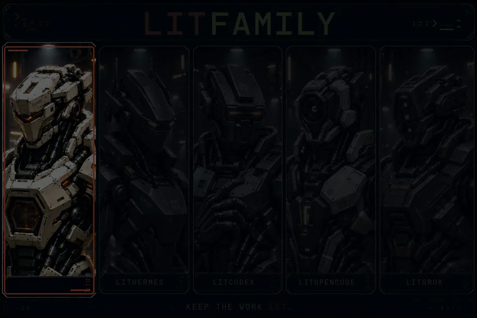</picture></p>

<h1 align="center">LitClaude</h1>
<p align="center"><strong>Keep the work lit.</strong></p>
<p align="center">Claude Code에서 계획하고, 만들고, 확인한 일을 다음 세션으로 이어가세요.</p>
<p align="center">
  <a href="#왜-litclaude인가요">소개</a> · <a href="#설치">설치</a> · <a href="#빠른-시작">빠른 시작</a> · <a href="#무엇을-입력하나요">입력할 내용</a> · <a href="#스킬-한눈에-보기">스킬</a> · <a href="#더-알아보기">더 알아보기</a> · <a href="./README.md">English</a>
</p>

<p align="center">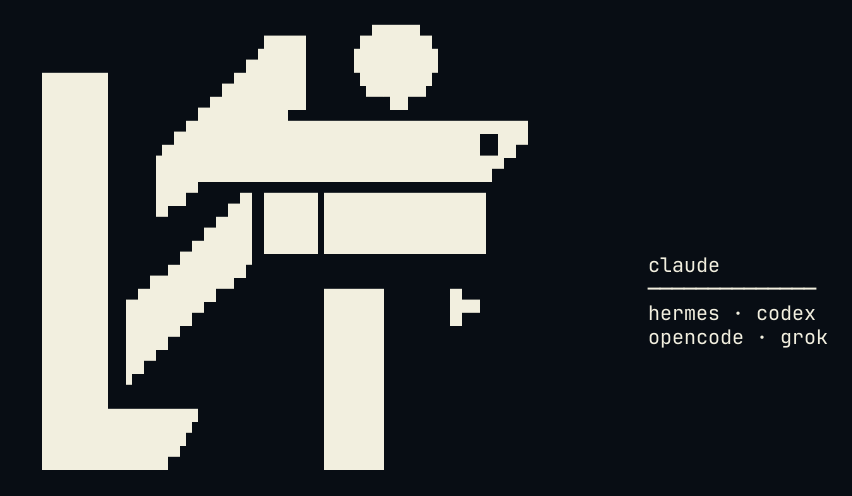</p>

<details>
<summary>ASCII 로고 복사</summary>

```text
                             ▄▄▄▄
                   ▗███▌   ▗██████▖
 ▗▄▄▄▄▄          ▗▟████▌   ▝██████▘
 ▐█████        ▗▟██████▌    ▝▀▜█▀▘
 ▐█████      ▗▟███████▄▄▄▄▄▄▄▄▄▄▄▄▄▄▄▄▄▄▄▄
 ▐█████    ▗▟█████████████████████████ ▐█▀
 ▐█████    ████████████████████████████▀
 ▐█████    ██▛▘   ▄ ▄▄▄▄▖▄▄▄▄▄▄▄▄▄▄▄▄▄▖
 ▐█████    ▀    ▄██ ████▌█████████████▌
 ▐█████       ▄████ ████▌█████████████▌
 ▐█████     ▄█████▛                                 claude
 ▐█████  ▗▟█████▀▘       ▄▄▄▄▄     ▗▖               ──────────────
 ▐█████ ▐█████▀          █████     ▐▛▀              hermes · codex
 ▐█████ ▐███▀            █████                      opencode · grok
 ▐█████ ▐█▀              █████
 ▐█████ ▝                █████
 ▐█████▄▄▄▄▄▄▄▖          █████
 ▐███████████▛           █████
 ▐██████████▀            █████

```

</details>

<p align="center"></p>
<p align="center"></p>

<p align="center">
  
  <a href="./LICENSE"></a>
</p>

<p align="center">
  <a href="#추가-문서"> 문서</a> · <a href="./docs/assets/readme/ignition-film.mp4"> Ignition</a> · <a href="./LICENSE"> MIT</a>
</p>

## 왜 LitClaude인가요

고치고 싶은 버그 하나, 만들고 싶은 화면 하나, 끝내고 싶은 프로젝트 하나. Claude Code에
맡기는 건 한 줄이면 됩니다. 어려운 건 그다음입니다. 대화가 길어지고 세션이 바뀌면
어디까지 했는지부터 다시 짚어야 합니다. 무엇을 정했는지, 무엇을 확인했는지, 다음에
무엇을 할지.

LitClaude는 그 불씨를 작업 곁에 남깁니다. 요청 끝에 `lit`을 붙이면 Claude가 목표를 먼저
고정하고, 실패하는 테스트부터 쓰고, 실제 화면에서 확인한 뒤 기록을 남깁니다. 목표와 계획,
확인한 결과, 다음에 할 일이 프로젝트에 남으니 다음 세션은 그 기록을 읽고 이어가면 됩니다.

LitClaude는 Claude Code에 근거를 남기며 실행하고, 계획하고, 조사하고, 검토하는 흐름을 더합니다.
플러그인과 HUD를 한 번 설치하면 평소처럼 `claude` 세션에서 쓰면 됩니다.

## 설치

`@litfamily/litclaude`는 scoped package입니다. Node.js와 npm, 그리고 Claude Code가 있으면 되고,
명령 하나로 설치합니다.

```bash
npm exec --yes --package @litfamily/litclaude@latest -- litclaude install --yes
```

`--yes`는 설치 질문을 건너뛰고 기본값을 씁니다. 새로 설치하면 권한 규칙을 하나도 더하지
않는 `safe` 권한 모드로 시작합니다. 나머지 Claude 설정은 그대로이며, 권한·HUD 색상·출력
스타일은 직접 고를 때만 바뀝니다. 옵션과 버전 고정 방법은 [설치 상세](#설치-상세)에
있습니다. 평소 환경을 건드리기 전에 먼저 써 보고 싶다면
[별도 체험 프로필](./docs/migration.md#separate-trial-profile)부터 준비하세요.

설치할 때는 플러그인 말고도 조금 더 내려받습니다. 영상 만들기 스킬(lit-typographic-motion)에는
렌더링 엔진과 글꼴이 필요한데, 영상을 만드는 도중에는 이것을 내려받지 않기 때문에 설치할 때
미리 받아 둡니다.
플러그인을 등록한 다음, 버전을 고정한 엔진 패키지를 `npm ci`로 설치하고 역시 고정된 글꼴을
내려받아 하나하나 sha256으로 확인합니다. 저장 위치는 `$LITCLAUDE_MOTION_RUNTIME`이고, 이 값을
설정하지 않았으면 `${XDG_CACHE_HOME:-~/.cache}/litclaude/motion-runtime`입니다. 이 준비가 실패해도
설치는 끝나고, 나중에 직접 실행할 명령을 알려 줍니다.

`npm install -g @litfamily/litclaude`로 전역 설치하면 이 과정도 자동으로 함께 실행됩니다. 설치 뒤에
도는 스크립트(`scripts/postinstall.mjs`)가 `litclaude install`을 실행하기 때문입니다. 이 스크립트는
전역 설치에서만 돌고, 전역이 아닌 설치나 `CI` 환경, 소스 checkout에서는 건너뜁니다. 자동 설정을
원하지 않으면 두 가지 방법이 있습니다.

- 영상 도구만 나중으로 미루고 싶다면 `LITCLAUDE_MOTION_PREWARM=0`을 설정하세요. 필요해지면
  `litclaude-ai motion-runtime install`로 그때 받으면 됩니다.
- 자동 설정을 통째로 끄고 싶다면 `LITCLAUDE_AUTO_INSTALL=0`(또는 `LITCLAUDE_POSTINSTALL_SKIP=1`)을
  설정하거나 npm 명령에 `--ignore-scripts`를 붙이세요. 이때도 패키지는 내려받으니, 준비가 되면
  `litclaude install`을 직접 실행하면 됩니다.

## 빠른 시작

평소처럼 Claude Code를 실행합니다.

```bash
claude
```

그리고 이렇게 입력합니다.

```text
lit
```

활성화 안내가 나오면 작은 작업 하나를 맡겨 보세요.

```text
외부 의존성 없이 HTML 파일 하나로 할 일 목록을 만들어줘.
추가·완료·삭제 동작을 구현하고, 확인한 내용과 다음 행동을 남겨줘.
```

끝나면 HTML을 직접 열어 세 동작을 하나씩 눌러 보세요. 버튼이 제대로 작동하는지는 그렇게 해
봐야 압니다. Claude가 브라우저를 쓸 수 없는 환경이라면, 화면과 클릭은 아직 확인하지 못했다고 적어
달라고 하세요. 그래야 무엇을 직접 해 봐야 하는지 알 수 있습니다. 처음에 뜬 로고는 작업이 시작됐다는
표시입니다.

### 화면에 나오는 모습

아래 그림은 LitClaude가 터미널에 출력하는 내용입니다. 설치하기 전에 미리 볼 수 있도록 실었습니다.
그림마다 LitClaude의 설치 프로그램, doctor 명령, 세션 시작 훅, 프롬프트 훅, 상태 줄이 실제로
출력한 내용을 캡처했고, 빈 데모 프로젝트와 임시 홈 폴더에서 실행했습니다. 홈 폴더 경로만 `~`로
줄였습니다. 창 테두리는 글자 둘레에 그려 넣은 것이라 실제 터미널에서는 글꼴과 색이 다르게
보일 수 있습니다. 그림 속 버전 번호는 캡처한 릴리스의 번호입니다. 선택 기능인 Jev 스킬 힌트의
화면은 [따로 모아 두었습니다](#jev-스킬-힌트-선택).

설치는 계획을 먼저 보여 줍니다. 플러그인을 복사하는 일부터 설치된 항목을 모두 확인하는 일까지
다섯 단계입니다. 마지막 줄은 모델은 계속 Claude Code가 고르고 나머지 Claude 설정은 그대로라는
뜻입니다. 이 그림은 어두운 터미널입니다.

<p align="center"></p>

*설치 프로그램에서 캡처*

다섯 단계는 각각 체크 표시로 끝나는 짧은 블록을 출력하고, 그다음에 설치 영수증이 나옵니다. 영수증에는
버전, 플러그인, 파일이 들어간 폴더, HUD 강조색, 권한 모드(safe는 권한 규칙을 더하지 않습니다),
Claude Code를 시작하는 명령이 적힙니다. 마지막 줄들은 영상 도구에 관한 내용입니다. 이번 실행에서는
도구가 이미 디스크에 있어서 그 줄이 바로 나왔고, 처음 설치할 때는 먼저 내려받습니다.
자세한 내용은 [설치](#설치)에 있습니다.

<p align="center"><picture><source media="(prefers-color-scheme: dark)" srcset="./docs/assets/screens/install-done-dark.webp" /></picture></p>

*설치 프로그램에서 캡처*

Claude Code 세션이 시작될 때마다 LitClaude가 마크와 버전을 출력합니다. 이 마크가 보이면 그 세션에서
플러그인이 로드된 것입니다.

<p align="center"><picture><source media="(prefers-color-scheme: dark)" srcset="./docs/assets/screens/session-start-dark.webp" />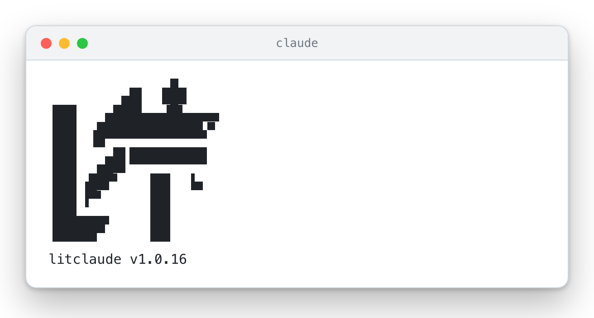</picture></p>

*세션 시작 훅에서 캡처*

`lit`를 입력하면 프롬프트 훅이 점화 마크와 함께 선택한 워크플로 이름을 출력합니다. 여기서는
lit-loop입니다. 상태 줄에도 브랜드 이름 옆에 같은 마크가 붙고, 워크플로를 시작하지 않는
프롬프트가 올 때까지 남아 있습니다. 창 아래의 확대 표지는 작은 화면에서도 마크를 읽기 쉽게
해 줍니다. 이 그림은 어두운 터미널입니다.

<p align="center">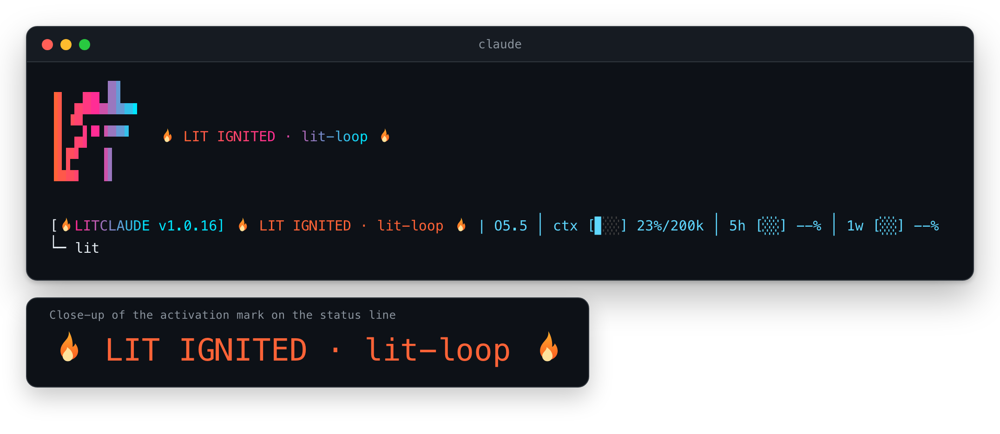</p>

*프롬프트 훅과 상태 줄에서 캡처*

`litclaude doctor`는 설치된 플러그인을 점검하는데 보고서가 길어서, 그림에는 마지막 줄들을
실었습니다. 영상 도구, Claude Code 버전, 플러그인 검증, 권한 모드, 상태 줄 점검이 나오고
DOCTOR_PASS로 끝납니다. 창 너비는 100칸이고, 가장 긴 줄은 터미널이 줄을 바꾸는 방식대로
접혀 있습니다.

<p align="center"><picture><source media="(prefers-color-scheme: dark)" srcset="./docs/assets/screens/doctor-dark.webp" /></picture></p>

*doctor 명령에서 캡처*

## 움직이는 모습 보기

요청 끝에 lit을 붙이면 흐릿하던 커다란 글자에 불이 붙습니다. 같은 불빛이 작은 작업 하나를 따라갑니다.
목표를 고정하고, 세 가지 확인 항목이 먼저 실패하고, 실제 페이지를 눌러 통과시킨 다음, 결과를 다음
세션이 읽을 기록에 남깁니다. 길이는 약 22초이고 글꼴은 Pretendard입니다. 화면에 나오는 모든 것은 영상을
위해 그렸고, 마지막 상태 줄은 실제 상태 줄의 문구를 옮겨 적었습니다. 미리보기는 소리 없이 반복되고,
MP4에는 생성한 배경 음악이 들어 있습니다. 이 한국어 판은 영어 판과 같은 영상에 한국어 문구를 넣은 것입니다.

<p align="center"><picture><source media="(prefers-reduced-motion: reduce)" srcset="./docs/assets/promo/litclaude-promo-ko-still.webp" /></picture></p>

[소리와 함께 MP4 재생](./docs/assets/promo/litclaude-promo-ko.mp4)

## 무엇을 입력하나요

### 작은 작업 하나로 시작하기

프롬프트 끝에 `lit`을 붙이면 LitClaude가 어떤 작업 흐름을 따를지 Claude에게 짧게 일러 줍니다.
실제 작업은 Claude Code가 합니다.

| 프롬프트 또는 경로 | 효과 |
| --- | --- |
| `lit` | 현재 Claude Code 대화에서 근거 중심 작업 루프를 시작합니다. |
| `handoff` | 확인한 결과와 다음 할 일을 다음 세션으로 건넵니다. |
| `lit-plan` | 구현 전에 범위와 확인 기준이 있는 계획을 만듭니다. |
| `/litclaude:start-work <승인된 계획>` | 이미 승인한 계획을 실행합니다. |
| `review-work` | 변경과 근거를 읽고 남은 일을 보고합니다. |
| `litresearch` | 출처를 남기는 조사 경로로 사실과 불확실성을 나눕니다. |

활성화 표시가 뜨면 작업이 시작된 것입니다. 끝난 결과는 직접 확인해 보세요.

`lit`처럼 짧게 입력한 프롬프트는 보낼 때 LitClaude가 읽습니다. slash command는 Claude Code의
명령 처리로 곧장 넘어갑니다. 그래서 `/litclaude:lit-loop` 같은 명령을 쓰면 hook이 끼어들지 않고
스킬이 한 번만 시작됩니다. 스킬을 이름으로 부르고 싶을 때 이 형태를 쓰세요.

<p align="center"><a href="./docs/assets/readme/ignition-film.mp4"></a></p>

포스터를 누르면 Ignition 영상이 열립니다. 영상은 직접 고를 때만 재생됩니다.

### 다음 세션으로 이어가기

```text
계획하기 → 만들기 → 확인하기 → 다음 작업에 건네기
```

| 할 일 | Claude Code에서 입력할 내용 | 남길 것 |
| --- | --- | --- |
| 범위 정하기 | `lit plan <what>` | 계획과 성공 기준 |
| 승인한 계획 실행하기 | `/litclaude:start-work`에 승인한 계획 전달 | 변경과 확인 결과 |
| 결과 검토하기 | `lit review <scope>` | 확인한 점과 남은 문제 |
| 세션 마무리하기 | `/litclaude:lit-handoff` | 다음 세션에 건넬 파일과 경로 |

목표를 연결하면 프로젝트의 `.litclaude/litgoal/`에 작업 기록이 남습니다. 마무리할 때는
handoff가 알려 준 **실제 파일 경로**를 챙겨 두세요. 다음 세션에서 같은 프로젝트를 열고,
Claude에게 그 파일을 읽고 현재 상태와 다음 행동을 확인해 달라고 하세요. 그런 뒤 이어갈
범위를 정하면 됩니다. 기록 명령과 호스트 경계는 [목표와 기록 안내](./docs/migration.md#review-and-litgoal-parity)에
정리되어 있습니다.

“꺼지지 않는 불”은 **세션이 끝나도 이어갈 작업을 남긴다는 뜻입니다.** 세션을 닫으면 모든
것이 멈추고, 다음 세션은 직접 열어야 시작됩니다. 새 세션에서 기록을 읽고 지금 파일과 맞춰
본 뒤 이어가세요.

### 전체 경로 표

| 입력 | 용도 |
| --- | --- |
| `lit`, `litwork` | 근거를 남기며 테스트부터 쓰는 실행 루프입니다. `$lit-loop`, `/lit-loop`, `/litclaude:lit-loop`도 됩니다. |
| `lit plan <what>` | 계획만 씁니다. `$lit-plan`, `/lit-plan`도 됩니다. |
| `lit review <scope>` | 계획이나 끝낸 작업을 검토합니다. `$review-work`, `/review-work`도 됩니다. |
| `lit research <question>` | 출처를 밝히는 공개 자료 조사입니다. `$litresearch`, `/litclaude:litresearch`도 됩니다. |
| `lit search <question>` | 공개 자료를 찾아 옵니다. |
| `lit query <question>` | 프로젝트에 남긴 기록에서 근거를 찾습니다. |
| `lit goal <outcome>` | 목표 하나와 확인할 수 있는 기준을 묶어 둡니다. `$litgoal`, `/litgoal`도 됩니다. |
| `lit workflow <objective>` | 여러 에이전트에게 나눠 맡길 큰 작업에 Dynamic workflow를 제안합니다. |
| `lit team`, `lit teammates` | `CLAUDE_CODE_EXPERIMENTAL_AGENT_TEAMS=1`을 켜 두었고 사용자가 승인할 때만 Claude Code의 에이전트 팀을 제안합니다. |
| `$deep-interview`, `/deep-interview` | 모호한 요청을 바로 결정할 수 있는 요구서로 다듬습니다. |
| `lit recap`, `litrecap`, `$lit-recap`, `/lit-recap`, `/litclaude:lit-recap` | 파일을 건드리지 않고 세션을 요약합니다. |
| `handoff`, `/litclaude:lit-handoff` | 확인을 거친 이어가기 파일을 씁니다. |
| `lit-handoff auto on <퍼센트>`, `auto off`, `auto status` | [자동 핸드오프](#자동-핸드오프)를 정한 퍼센트에서 켜거나 끄고, 상태를 보여 줍니다. |
| `lit-scientific-visualization` | 논문에 넣을 그림을 준비합니다. `/litclaude:lit-scientific-visualization`도 됩니다. |
| `/litclaude:lit-diagram-drawer <요청>` | 개념 다이어그램을 그리고 검사한 뒤 내보냅니다. `lit-diagram-drawer`와 `$lit-diagram-drawer`도 지원합니다. |
| `<발표자료 만들어줘 …> lit`, `/litclaude:lit-pptx` | 요청이나 자료로 `.pptx` 발표자료를 만듭니다. `lit-pptx`와 `$lit-pptx`도 지원합니다. |
| `<보고서 써줘 …> lit`, `/litclaude:lit-docx` | 보고서·기획서·제안서·논문 원고를 `.docx`로 만듭니다. `lit-docx`와 `$lit-docx`도 지원합니다. |
| `litclaude wikify <capture/save/review/query/config>` | 검토를 거친 프로젝트 지식을 로컬에 정리합니다. |
| `browser-drive`, `$browser-drive` | 실제 웹 페이지를 조작합니다. 먼저 `vercel-labs/agent-browser` 0.34.0 이상이 있는지 확인하고, 0.34.0보다 새 버전이면 그대로 쓰되 `beyond-verified`로 표시합니다. 없거나 더 오래된 버전이면 설치 명령만 알려 주고, 실행은 사용자에게 맡깁니다. |

이름으로 부르는 스킬도 있습니다. `lit-crucible`(계획 검토), `lit-init`(저장소 지침),
`lit-commit`(Git 이력), `lit-team`(네이티브 팀), `lit-burnoff`(변경 묶음 정리),
`lit-burnoff-file`(단일 파일 정리), `lit-humanizer`(한국어·영어 문장),
`lit-code`(구현 규율)입니다. 프롬프트 앞에 이름이나 `$<skill-id>`를 쓰면 됩니다.
예전 이름도 한 릴리스 동안은 안내 문구와 함께 새 스킬로 연결됩니다.
[이름 이전 표](./docs/migration.md#one-release-rename-aliases)를 참고하세요.

## 자동 핸드오프

긴 세션은 컨텍스트 창이 차고, Claude Code가 이를 압축하면 작업의 세부 내용이 요약에서 빠질 수 있습니다. 자동 핸드오프는 창에 여유가 있을 때 핸드오프 파일을 저장해 두었다가 압축이 끝나면 다시 불러옵니다. 켜기 전에는 꺼져 있고, 퍼센트는 직접 정합니다. LitClaude에는 기본 퍼센트가 없습니다.

아래 줄 중 하나를 프롬프트 전체로 입력하세요.

- `lit-handoff auto on 60`은 컨텍스트 창의 60%에서 켭니다. 1부터 99까지 정수를 쓸 수 있습니다. 숫자 없이 `lit-handoff auto on`만 입력하면 마지막으로 정한 퍼센트를 다시 쓰고, 한 번도 정하지 않았다면 퍼센트를 물어봅니다.
- `lit-handoff auto off`는 끄고, 정해 둔 퍼센트는 다음을 위해 기억합니다.
- `lit-handoff auto status`는 지금 적용 중인 설정을 알려 줍니다.

Claude Code를 시작하기 전에 셸에서 정할 수도 있습니다. `LITCLAUDE_AUTO_HANDOFF=1`은 켜고, `LITCLAUDE_AUTO_HANDOFF_PERCENT=60`은 퍼센트를 고릅니다. 환경 변수가 저장된 설정보다 우선하고, `LITCLAUDE_AUTO_HANDOFF=0`이면 계속 꺼 둡니다. 1~99 밖의 퍼센트는 꺼진 상태로 두고, 이유는 `litclaude doctor`가 알려 줍니다. 저장된 설정은 프로젝트마다 `.litclaude/auto-handoff/`에 있습니다.

켜면 이런 일이 일어납니다. 플러그인이 할 수 있는 일은 Claude Code가 정하므로, 단계마다 LitClaude가 직접 하는지 알려 주기만 하는지 적어 두었습니다.

1. **자동:** 상태 표시줄이 답변마다 컨텍스트 퍼센트를 기록합니다. LitClaude 상태 표시줄이 없다면, 모델의 창 크기(토큰)를 `LITCLAUDE_AUTO_HANDOFF_WINDOW`로 알려 주면 Stop 훅이 대화 기록에서 퍼센트를 추정합니다.
2. **자동:** 퍼센트가 정한 숫자에 처음 닿으면 Stop 훅이 Claude에게 lit-handoff 절차대로 핸드오프를 쓰고 마지막에 평범한 한 줄을 남기라고 요청합니다. 파일은 Claude가 쓰므로 이 단계는 Claude가 지시를 따르는지에 달려 있습니다. 한 번 넘을 때마다 한 번만 일어나며, 다시 일어나려면 사용량이 정한 퍼센트 아래로 내려갔다가 올라야 합니다.
3. **알림:** Claude Code는 플러그인이 압축을 시작하게 해 주지 않으므로, Claude가 남기는 마지막 줄은 `Handoff saved. Run /compact now.`이고 `/compact`는 직접 실행합니다. Claude Code가 알아서 압축하게 하려면 `CLAUDE_AUTOCOMPACT_PCT_OVERRIDE`를 정한 퍼센트보다 큰 숫자로 설정하세요. 알림 줄은 그대로 나오지만 무시해도 됩니다.
4. **자동:** 압축이 끝나면 세션 시작 훅이 핸드오프를 한 번 다시 불러옵니다. 파일 경로와 앞 4,000자를 전달합니다. 트리거 이후에 쓰였고 트리거의 id 줄이 들어 있는 파일만 받아들이며, 그런 파일이 없으면 없다고 알려 줍니다.

켜 있는 동안 상태 표시줄에 `handoff@60%`가 보이고(설정이 잘못되면 `handoff ⚠`), `litclaude doctor`는 `Auto-handoff: on at 60%`를 출력합니다. `CLAUDE_AUTOCOMPACT_PCT_OVERRIDE`가 정한 퍼센트 이하이면 핸드오프를 쓰기 전에 Claude Code가 먼저 압축하므로 doctor가 경고합니다. 훅의 자세한 동작은 [훅 안내](./docs/hooks.md#automatic-handoff)에, 저장하는 파일은 [개인정보 안내](./docs/privacy.md#local-state)에 있습니다.

## 스킬 한눈에 보기

스킬마다 한 줄입니다. 어떤 모습인지, 어떻게 시작하는지, 무엇을 얻는지 보여줍니다.

<table>
<tr><th>이렇게 됩니다</th><th>스킬</th><th>얻는 것</th></tr>
<tr>
<td>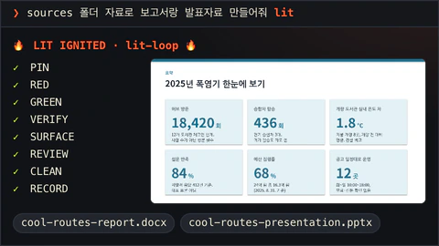</td>
<td><code>lit-loop</code><br /><sub><code>lit</code></sub></td>
<td>요청 끝에 <code>lit</code>만 붙이세요. 목표를 먼저 고정하고, 실패하는 테스트부터 쓰고, 실제 화면을 확인한 뒤 기록을 남깁니다.</td>
</tr>
<tr>
<td>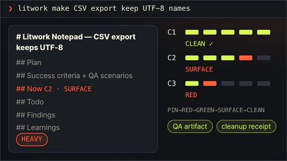</td>
<td><code>litwork</code><br /><sub><code>litwork &lt;task&gt;</code></sub></td>
<td>증거와 함께 끝냅니다. 기준마다 실패 테스트부터 정리까지 노트에 남습니다.</td>
</tr>
<tr>
<td>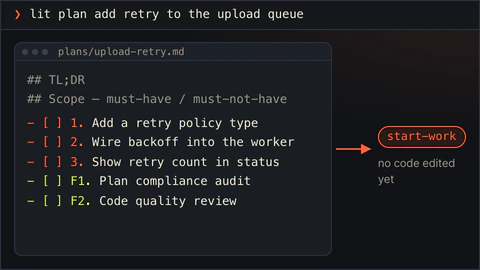</td>
<td><code>lit-plan</code><br /><sub><code>lit plan &lt;what&gt;</code></sub></td>
<td><code>start-work</code>가 그대로 실행할 수 있는 번호 붙은 작업 목록이 파일로 나옵니다. 코드는 아직 건드리지 않습니다.</td>
</tr>
<tr>
<td>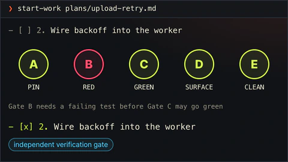</td>
<td><code>start-work</code><br /><sub><code>start-work &lt;plan&gt;</code></sub></td>
<td>계획을 한 줄씩 실행합니다. 다섯 관문을 모두 통과해야 체크 표시가 붙습니다.</td>
</tr>
<tr>
<td>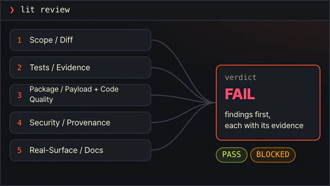</td>
<td><code>review-work</code><br /><sub><code>lit review &lt;scope&gt;</code></sub></td>
<td>다섯 갈래 리뷰가 같은 변경을 따로 읽고, 발견한 문제부터 보고합니다.</td>
</tr>
<tr>
<td>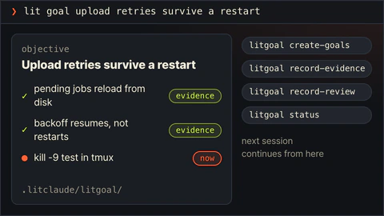</td>
<td><code>litgoal</code><br /><sub><code>lit goal &lt;outcome&gt;</code></sub></td>
<td>목표 하나와 확인 가능한 기준을 디스크에 남겨, 다음 세션이 이어받을 수 있습니다.</td>
</tr>
<tr>
<td>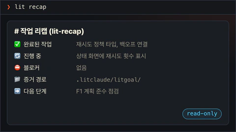</td>
<td><code>lit-recap</code><br /><sub><code>lit recap</code> · <code>litrecap</code></sub></td>
<td>읽기 전용 요약입니다. 끝난 일, 진행 중인 일, 막힌 곳, 증거 위치, 다음 단계를 보여줍니다.</td>
</tr>
<tr>
<td>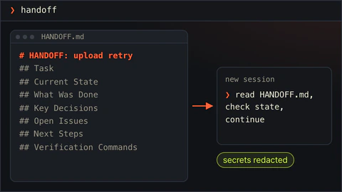</td>
<td><code>lit-handoff</code><br /><sub><code>handoff</code></sub></td>
<td><code>handoff</code>라고 치면 다음 세션이 읽고 이어갈 인수인계 파일이 생깁니다.</td>
</tr>
<tr>
<td>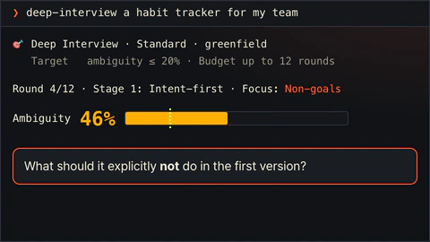</td>
<td><code>deep-interview</code><br /><sub><code>deep-interview &lt;idea&gt;</code></sub></td>
<td>한 번에 한 질문씩 물어 아이디어를 만들 수 있을 만큼 분명하게 다듬습니다. 남은 모호함은 게이지로 보입니다.</td>
</tr>
<tr>
<td>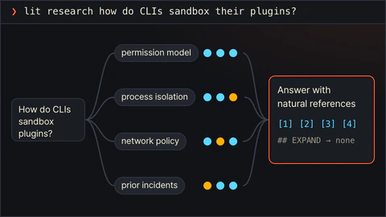</td>
<td><code>litresearch</code><br /><sub><code>lit research &lt;question&gt;</code> · <code>lit search</code></sub></td>
<td>조사 질문을 잘게 나누고 여러 검색을 동시에 돌려, 단서를 끝까지 따라간 뒤 출처와 함께 답합니다.</td>
</tr>
<tr>
<td>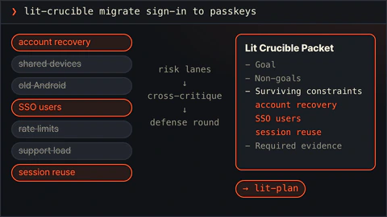</td>
<td><code>lit-crucible</code><br /><sub><code>lit-crucible &lt;brief&gt;</code></sub></td>
<td>계획 전에 요구사항을 반박해 봅니다. 반박을 견딘 위험만 계획으로 넘어갑니다.</td>
</tr>
<tr>
<td>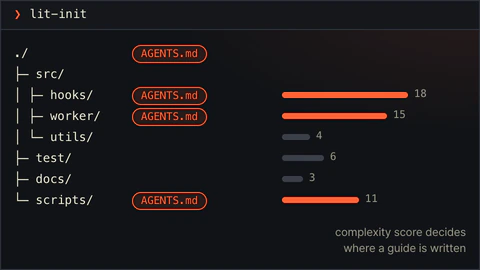</td>
<td><code>lit-init</code><br /><sub><code>lit-init</code></sub></td>
<td>저장소를 훑어 루트 AGENTS.md와, 필요한 폴더에만 짧은 안내서를 만듭니다.</td>
</tr>
<tr>
<td>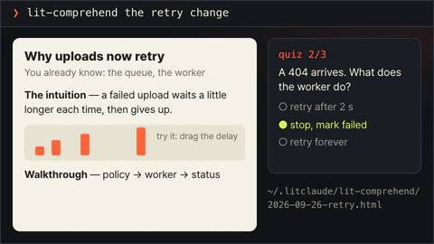</td>
<td><code>lit-comprehend</code><br /><sub><code>lit-comprehend &lt;target&gt;</code></sub></td>
<td>에이전트가 쓴 작업을 이해하도록 돕는 설명 페이지입니다. 직관, 흐름 설명, 짧은 퀴즈 순서입니다.</td>
</tr>
<tr>
<td>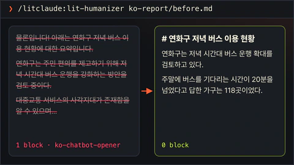</td>
<td><code>lit-humanizer</code><br /><sub><code>lit-humanizer &lt;text&gt;</code></sub></td>
<td>딱딱한 AI 문장을 한국어나 영어로 다시 씁니다. 사실과 단서는 남기고 군더더기는 뺍니다.</td>
</tr>
<tr>
<td>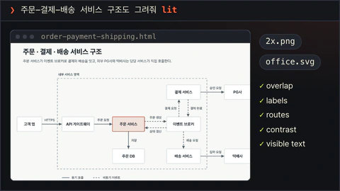</td>
<td><code>lit-diagram-drawer</code><br /><sub><code>/litclaude:lit-diagram-drawer &lt;brief&gt;</code></sub></td>
<td>슬라이드와 문서에 넣을 다이어그램을 편집 가능한 형태로 그리고, 검사한 뒤 PNG와 SVG로 내보냅니다.</td>
</tr>
<tr>
<td>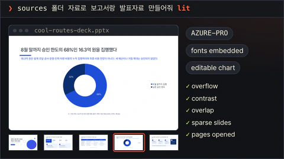</td>
<td><code>lit-pptx</code><br /><sub><code>/litclaude:lit-pptx &lt;request&gt;</code></sub></td>
<td><code>lit</code>으로 발표자료를 요청하면 원본 차트와 글꼴이 들어간 편집 가능한 PowerPoint 파일이 나옵니다. 슬라이드마다 배치 검사를 통과하고, 렌더링된 화면으로 다시 확인합니다.</td>
</tr>
<tr>
<td>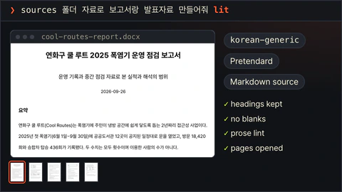</td>
<td><code>lit-docx</code><br /><sub><code>/litclaude:lit-docx &lt;request&gt;</code></sub></td>
<td><code>lit</code>으로 보고서를 요청하면 서식을 갖춘 Word 파일과 원고 Markdown이 나옵니다. 한국어는 Pretendard로 조판하고, 페이지를 렌더링해 읽어 본 뒤 넘깁니다.</td>
</tr>
<tr>
<td>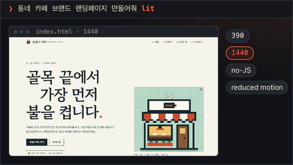</td>
<td><code>frontend-ui-ux</code><br /><sub><code>frontend-ui-ux build &lt;target&gt;</code></sub></td>
<td>실제로 동작하는 화면을 만들고, 측정 프로브로 일곱 가지 보기를 렌더링합니다. 320·390·768·1440px, 다크 모드, 모션 줄이기, 200% 확대입니다.</td>
</tr>
<tr>
<td>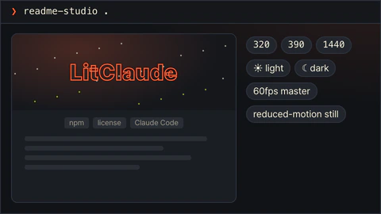</td>
<td><code>readme-studio</code><br /><sub><code>readme-studio &lt;scope&gt;</code></sub></td>
<td>사실에 맞는 README와 움직이는 커버를 만들고, 휴대폰과 데스크톱 폭, 라이트와 다크 모드에서 확인합니다.</td>
</tr>
<tr>
<td>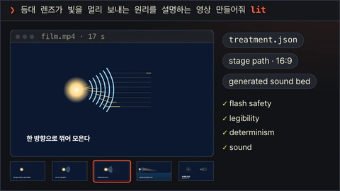</td>
<td><code>lit-typographic-motion</code><br /><sub><code>/litclaude:lit-typographic-motion &lt;request&gt;</code></sub></td>
<td><code>lit</code>으로 영상을 요청하면 트리트먼트를 먼저 쓰고, 장면을 그리거나 글자를 움직이고, 사운드를 입힙니다. 깜빡임, 가독성, 소리를 검사한 뒤 영상을 넘깁니다.</td>
</tr>
<tr>
<td>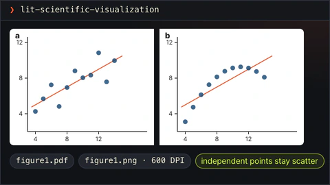</td>
<td><code>lit-scientific-visualization</code><br /><sub><code>lit-scientific-visualization</code></sub></td>
<td>학술지 규격 그림을 벡터와 600 DPI로 내보냅니다. 그래프 종류는 데이터 성격에 맞춰 고릅니다.</td>
</tr>
<tr>
<td>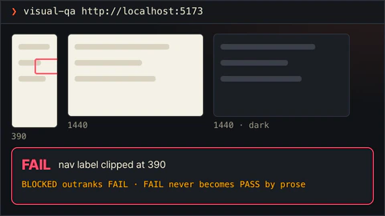</td>
<td><code>visual-qa</code><br /><sub><code>visual-qa &lt;target&gt;</code></sub></td>
<td>실제 화면을 폭별로 확인해 결과를 정직하게 돌려줍니다. 막히면 무엇이 막았는지 정확히 알려줍니다.</td>
</tr>
<tr>
<td>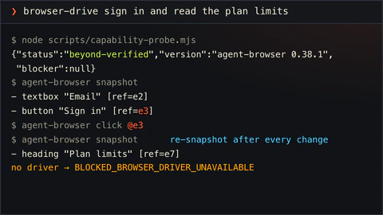</td>
<td><code>browser-drive</code><br /><sub><code>browser-drive &lt;task&gt;</code></sub></td>
<td>브라우저 드라이버를 먼저 확인한 뒤 실제 페이지를 조작합니다. 드라이버가 없으면 그렇다고 말합니다.</td>
</tr>
<tr>
<td>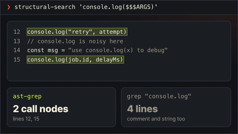</td>
<td><code>structural-search</code><br /><sub><code>structural-search &lt;pattern&gt;</code></sub></td>
<td>글자 대신 문법 구조로 코드를 찾고, 바꾸기 전에 결과를 미리 보여줍니다.</td>
</tr>
<tr>
<td>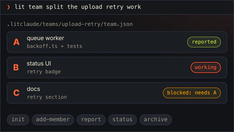</td>
<td><code>lit-team</code><br /><sub><code>lit team</code> · <code>lit teammates</code></sub></td>
<td>여러 작업자에게 겹치지 않는 몫을 나누고, 각자 증거와 함께 보고하게 합니다.</td>
</tr>
<tr>
<td>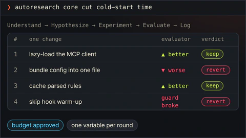</td>
<td><code>autoresearch</code><br /><sub><code>autoresearch &lt;mode&gt;</code></sub></td>
<td>승인된 예산 안에서 실험을 반복합니다. 한 번에 하나만 바꾸고, 결과에 따라 남기거나 되돌립니다.</td>
</tr>
<tr>
<td>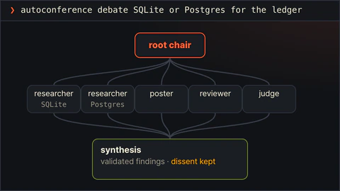</td>
<td><code>autoconference</code><br /><sub><code>autoconference &lt;mode&gt;</code></sub></td>
<td>예산을 정한 연구 회의입니다. 연구자와 리뷰어가 따로 일하고, 종합에는 반대 의견도 남깁니다.</td>
</tr>
<tr>
<td>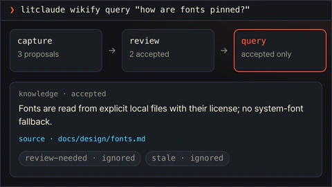</td>
<td><code>wikify</code><br /><sub><code>litclaude wikify capture|save|review|query|config</code></sub></td>
<td>검토를 거친 프로젝트 지식을 디스크에 두고, 나중 질문에 출처와 함께 답합니다.</td>
</tr>
<tr>
<td>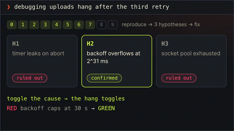</td>
<td><code>debugging</code><br /><sub><code>debugging &lt;symptom&gt;</code></sub></td>
<td>버그를 재현하고, 가설을 세 개 이상 세워 확인한 뒤, 확인된 원인만 고칩니다.</td>
</tr>
<tr>
<td>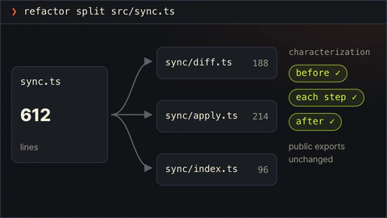</td>
<td><code>refactor</code><br /><sub><code>refactor &lt;target&gt;</code></sub></td>
<td>동작을 테스트로 고정한 채 코드 구조를 바꿉니다. 단계마다 확인합니다.</td>
</tr>
<tr>
<td>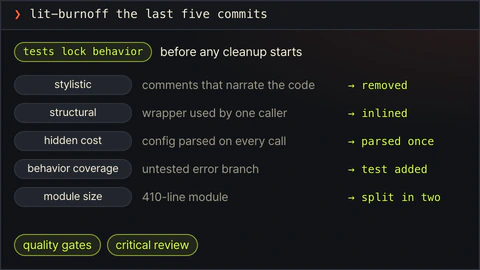</td>
<td><code>lit-burnoff</code><br /><sub><code>lit-burnoff &lt;scope&gt;</code></sub></td>
<td>테스트로 동작을 먼저 묶어 두고, 변경분에 붙은 AI식 군더더기를 걷어냅니다.</td>
</tr>
<tr>
<td>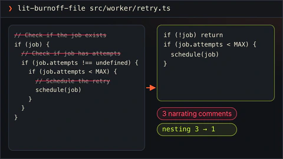</td>
<td><code>lit-burnoff-file</code><br /><sub><code>lit-burnoff-file &lt;path&gt;</code></sub></td>
<td>파일 하나만 정리합니다. 설명조 주석과 과한 방어 코드를 줄이고 중첩을 펴줍니다.</td>
</tr>
<tr>
<td>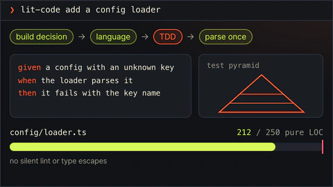</td>
<td><code>lit-code</code><br /><sub><code>lit-code &lt;task&gt;</code></sub></td>
<td>엄격한 구현 규칙입니다. 테스트 먼저, 경계에서 타입 확인, 작은 파일.</td>
</tr>
<tr>
<td>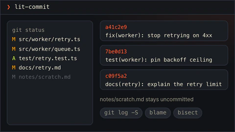</td>
<td><code>lit-commit</code><br /><sub><code>lit-commit</code></sub></td>
<td>변경을 저장소 스타일에 맞는 작은 커밋으로 나눕니다. 관계없는 작업은 건드리지 않습니다.</td>
</tr>
<tr>
<td>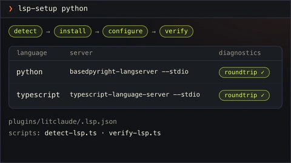</td>
<td><code>lsp-setup</code><br /><sub><code>lsp-setup &lt;language&gt;</code></sub></td>
<td>사용하는 언어의 언어 서버를 설치하고, 진단이 실제로 도는지 확인합니다.</td>
</tr>
<tr>
<td>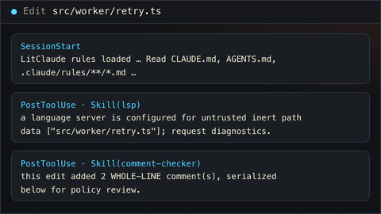</td>
<td><code>rules</code> · <code>lsp</code> · <code>comment-checker</code><br /><sub>자동 실행</sub></td>
<td>알아서 돌아갑니다. 프로젝트 규칙을 읽고, 수정 뒤에는 진단을 요청하고 새 주석을 검토합니다.</td>
</tr>
</table>

## 작동 방식

짧은 프롬프트와 slash command는 서로 다른 입구로 들어옵니다. 짧은 프롬프트가 오면 hook이 어떤
작업 흐름이 맞는지 알려 주고, 파일을 고친 뒤에는 무엇을 확인할지 일러 줍니다. Claude는 그
안내를 따라 요청한 스킬로 작업합니다.

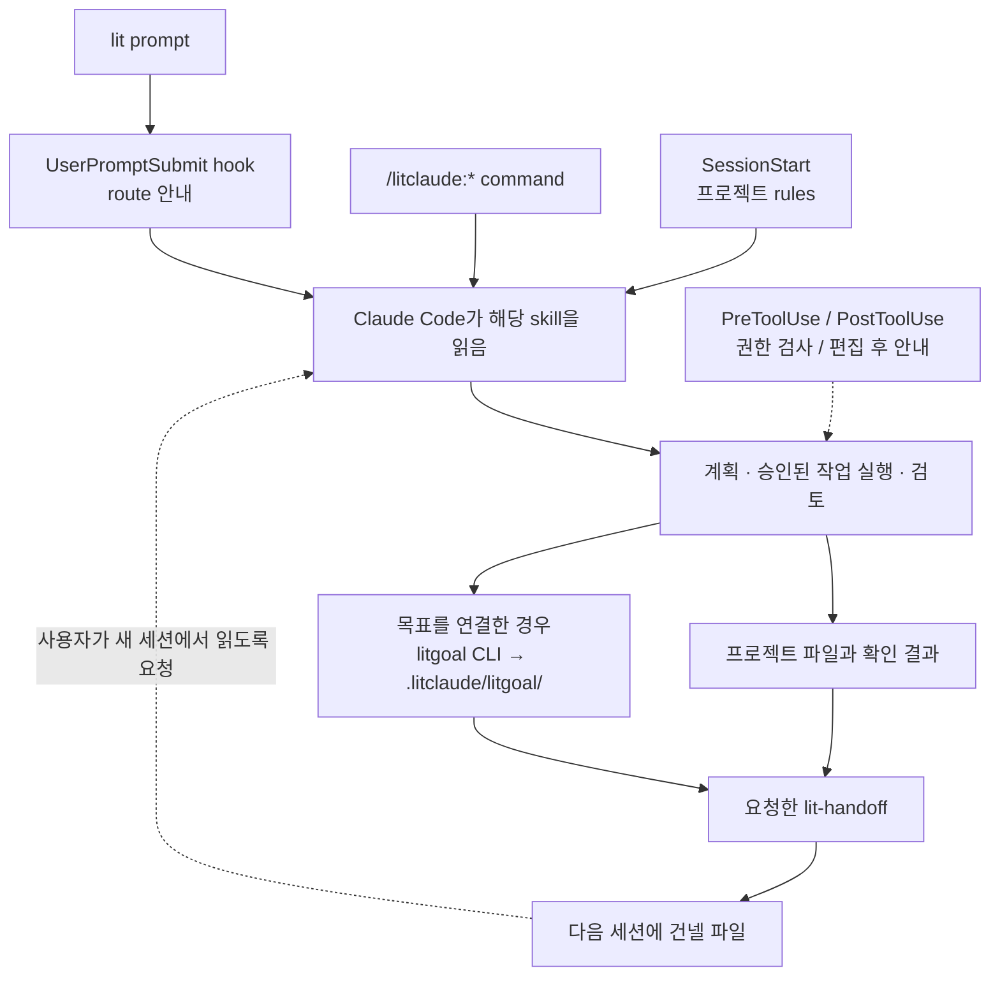
```mermaid
flowchart TD
    P["lit prompt"] --> H["UserPromptSubmit hook<br/>route 안내"]
    C["/litclaude:* command"] --> S["Claude Code가 해당 skill을 읽음"]
    H --> S
    R["SessionStart<br/>프로젝트 rules"] --> S
    S --> W["계획 · 승인된 작업 실행 · 검토"]
    T["PreToolUse / PostToolUse<br/>권한 검사 / 편집 후 안내"] -.-> W
    W --> F["프로젝트 파일과 확인 결과"]
    W --> L["목표를 연결한 경우<br/>litgoal CLI → .litclaude/litgoal/"]
    F --> Q["요청한 lit-handoff"]
    L --> Q
    Q --> N["다음 세션에 건넬 파일"]
    N -. "사용자가 새 세션에서 읽도록 요청" .-> S
```

hook은 제안을 할 뿐이고, 중요한 것은 Claude가 실제로 한 일입니다. 그래서 다음 세션은 남긴
파일을 읽고 프로젝트의 지금 상태를 확인합니다. 자세한 내용은 [hook 안내](./docs/hooks.md)와
[목표 기록 안내](./docs/migration.md#review-and-litgoal-parity)에 있습니다.

일은 제대로 됐는지 확인해야 끝납니다. 계획의 모든 항목에 예/아니오로 답할 수 있는 확인
기준이 있어야 다음 단계로 넘어갑니다. 아래 그림처럼 작업 한 조각은 늘 같은 순서로 진행합니다. 실패하는
테스트를 먼저 쓰고, 그 테스트를 통과하는 가장 작은 수정을 하고, Claude Code에서 실제로 돌려
근거를 남기고, 임시로 만든 것을 치웁니다. 테스트 통과는 이 네 단계 중 두 번째일 뿐입니다.

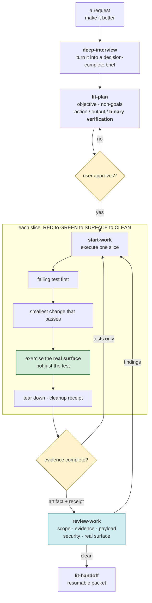
```mermaid
flowchart TD
    R["a request<br/>make it better"] --> DI["<b>deep-interview</b><br/>turn it into a decision-complete brief"]
    DI --> P["<b>lit-plan</b><br/>objective · non-goals<br/>action / output / <b>binary verification</b>"]
    P --> GATE{"user approves?"}
    GATE -->|no| P
    GATE -->|yes| SW["<b>start-work</b><br/>execute one slice"]

    subgraph LOOP["each slice: RED to GREEN to SURFACE to CLEAN"]
        SW --> RED["failing test first"]
        RED --> GREEN["smallest change that passes"]
        GREEN --> SURF["exercise the <b>real surface</b><br/>not just the test"]
        SURF --> CLEAN["tear down · cleanup receipt"]
    end

    CLEAN --> EV{"evidence complete?"}
    EV -->|"tests only"| SW
    EV -->|"artifact + receipt"| RW["<b>review-work</b><br/>scope · evidence · payload<br/>security · real surface"]
    RW -->|findings| SW
    RW -->|clean| HO["<b>lit-handoff</b><br/>resumable packet"]

    style GATE fill:#fff3cd,stroke:#856404
    style EV fill:#fff3cd,stroke:#856404
    style SURF fill:#d4edda,stroke:#155724
    style RW fill:#d1ecf1,stroke:#0c5460
```

hook과 모델은 Claude Code가 돌립니다. 그래서 권한과 브라우저 접근, 화면 확인은 쓰고 있는
Claude Code 설정이 허락하는 만큼입니다. 실제로 무엇이 끝났는지는 프로젝트에 남은 기록에서
확인하세요. hook 표시는 작업이 시작됐다는 것을, 아래 두 이미지는 아이디어를 보여 줄 뿐입니다.

<p align="center"> </p>

<details>
<summary>LITFAMILY · 다섯 아머드 머신</summary>


LitClaude, LitHermes, LitCodex, LitOpenCode, LitGrok을 아머드 머신으로 그린 콘셉트 아트입니다.
각 제품은 자신의 호스트에서 따로 동작합니다.

</details>

## 발표자료, 보고서, 다이어그램, README

발표자료나 보고서를 부탁하면서 끝에 `lit`을 붙이면(`팀 워크숍 발표자료 만들어줘 lit`,
`사내 교육 결과 보고서 써줘 lit`) Office 파일을 받습니다. 두 스킬 모두 슬라이드나 문단을
쓰기 전에 누가 어떻게 읽을 파일인지부터 따지고, 거기에 맞는 모양을 고릅니다. 답에서는 고른
모양과 그 이유를 말하고, 함께 어울릴 만한 다른 두 가지도 알려 줍니다. 첫 판단이 빗나갔다면
한 문장으로 다른 모양을 부탁하면 됩니다.

`lit-pptx`에는 발표자료용 모양이 여덟 가지 있습니다. 한쪽 끝은 책상에서 읽는 촘촘한 수치 중심
보고형이고, 다른 쪽 끝은 큰 화면에 띄우는 어두운 발표형입니다. 모양마다 색, 제목 자리, 페이지
배치가 다릅니다. 슬라이드 제목은 주제와 지표와 기간을 담은 짧은 명사형으로 쓰고, 그 장에서
하려는 말은 제목 아래 첫 줄에 둡니다. 근거, 비교 대상, 출처 같은 뒷받침 내용으로 페이지를
채우기 때문에 군더더기 없이도 장이 비지 않습니다. 숫자는 PowerPoint에서 바로 고칠 수 있는
차트와 핵심 수치로 그리되 제목보다 크게 키우지 않고, Pretendard 글꼴을 넣습니다. 예전 AZURE
템플릿과 4:3 기본형은 이름을 대면 그대로 씁니다. 건네기 전에는 QA 게이트가 넘친 글자, 약한
대비, 절반쯤 빈 슬라이드, 표만 덩그러니 있는 슬라이드, 모든 장에 똑같이 놓인 제목, 잘린 장식,
채우지 않은 빈칸을 찾아냅니다. 그다음 페이지를 그림으로 뽑아 눈으로 확인합니다.

`lit-docx`에는 문서용 모양이 여섯 가지 있습니다. 결정할 사람이 읽는 네 쪽짜리 보고에는 Brief를,
절차를 담은 문서에는 Manual을 고르고, 나머지는 Report, Proposal, Memo, Journal이 맡습니다. 여섯
가지 모두 인쇄물처럼 절제된 지면을 지킵니다. 처음부터 끝까지 Pretendard를 쓰고, 본문은 종이에서
읽기 좋은 크기로 두며, 상자는 적게 씁니다. 콜아웃, 사이드바, 핵심 수치 띠는 내용이 필요로 할
때만 넣습니다. 한국어 문서는 한국 문서 관례를 따릅니다. 날짜는 `2026. 6. 30.`처럼 쓰고, 표
위에는 `<표 1>` 제목과 따로 뗀 단위 줄을, 표 아래에는 `주:`와 `자료:`를 두며, 한글은 기울여
쓰지 않습니다. 학술지 원고는 Elsevier·ACS·IEEE·Nature 또는 `korean-generic` 프로필을 씁니다.
문서를 검사하고, 렌더링한 페이지에서 반쯤 빈 쪽과 나뉜 표를 찾은 뒤 눈으로 확인하며,
DOCX·PDF를 Markdown으로 바꾸거나 기존 `.docx`를 고치는 일도 맡습니다.

자료가 없는 요청이면 두 스킬 모두 멈추고 되묻는 대신, 그럴듯한 예시로 끝까지 만든 뒤
예시라고 표시합니다. `lit`만 붙인 요청에서는 스타일도 묻지 않습니다. 필요한 Node·Python 패키지는
처음 쓸 때 고정된 lockfile에서 `~/.cache/litclaude/office-runtime`에 설치되며,
`litclaude doctor`가 그 준비 상태와 LibreOffice·pandoc·XeLaTeX 사용 가능 여부를 보여 줍니다.

슬라이드와 문서에 넣을 구조도, 흐름도, 스키마, 일정표 같은 개념 다이어그램은
`/litclaude:lit-diagram-drawer <요청>`으로 그립니다. 프롬프트를 `lit-diagram-drawer`나
`$lit-diagram-drawer`로 시작해도 됩니다. Pretendard 글꼴을 담은 편집 가능한 HTML/SVG를
만들고, 겹침, 라벨 위치, 연결선, 대비, 접근성, 보이는 글자를 스킬에 딸린 스크립트로
검사합니다. agent-browser 0.38.1 이상을 직접 설치해 두었다면 1×–3× PNG와 Office용 SVG로
내보내고, 없으면 설치 명령과 검사를 마친 원본을 돌려줍니다. 화면 설계는
`frontend-ui-ux`, 측정 데이터 그래프는 `lit-scientific-visualization`이 맡습니다.

`frontend-ui-ux build <대상>`은 허용된 범위에서 화면을 구현하고 실제 렌더까지 확인합니다.
중요한 방향이 모호하면 하나씩 묻고, 그 답을 이어받아 구현합니다. 검토나 계획만 요청했다면
파일을 고치지 않습니다.

`readme-studio <저장소 또는 README 범위>`나 `$readme-studio`는 저장소에서 사실을 확인해
README를 쓰고, 표지는 로컬에서 만듭니다. 이미지를 생성할 수 있는지는 Claude Code가 가진
도구에 달려 있습니다. 도구가 없으면 `IMAGE_GENERATION_UNAVAILABLE`이라고 알리고, 대신 배경
이미지를 건네면 그 그림을 살펴본 뒤 나머지 표지를 그 위에 짜 맞춥니다. Pretendard·Meslo 글자를
윤곽선으로 바꾸는 도구와 로컬 모션 템플릿이 함께 들어 있고, 글꼴·렌더러 라이선스와 실제
결과물을 확인합니다. GitHub와 npm에서 어떻게 보이는지는 공개한 뒤에 따로 확인합니다. 두 스킬
모두 프롬프트 첫 단어로 시작하며, slash command를 따로 더하지 않습니다.

## Jev 스킬 힌트 (선택)

LitClaude에는 스킬이 35개 있고, TypeSafe가 호스팅하는 선택 모델 Jev에게 프롬프트에 맞는 스킬을
물어볼 수 있습니다. Jev가 스킬 하나를 고르면 `UserPromptSubmit` 훅이 그 이름을 담은 한 줄을
Claude가 참고하도록 덧붙입니다. 어디까지나 제안이어서, 스킬을 불러올지는 Claude가 정하고 이 한
줄로 권한이 생기거나 도구가 실행되는 일은 없습니다.

기본값은 꺼짐입니다. 써 보려면 Claude Code를 실행하는 환경에 두 변수를 모두 설정합니다.

```bash
export LITCLAUDE_JEV=1
export TYPESAFE_API_KEY=<본인의 TypeSafe 키>
```

켜면 프롬프트가 컴퓨터 밖으로 나갑니다. 정확히 무엇이 나가는지는 다음과 같습니다. 해당하는
프롬프트마다 2,000자로 자르고, 홈 경로와 이메일 주소, 토큰 모양의 문자열을 가린 뒤
TypeSafe(typesafe.ai)로 보냅니다. 나머지는 적힌 그대로 갑니다. 호스트 이름, 고객 이름,
`password=…` 꼴로 쓰지 않은 비밀번호도 마찬가지입니다. 슬래시 명령, `lit` 라우터가 이미 처리한
프롬프트, 스킬 이름을 직접 적은 프롬프트는 보내지 않고, 파일·도구 출력·대화 기록처럼 세션의
다른 내용도 컴퓨터 밖으로 나가지 않습니다.

켜기 전에 두 가지를 챙기세요. 키는 Claude Code를 실행하는 셸에 export되므로 에이전트의 도구도
읽을 수 있습니다. 이 기능 전용 키를 따로 만들고 사용 한도를 낮게 잡아 두세요. 또 요청마다
본인의 TypeSafe 계정에 비용이 청구되며, 입력 토큰 100만 개당 약 0.04달러입니다. 요청은 최대
1.5초만 기다리고, 실패하면 평소처럼 진행하면서 세션에서 처음 한 번만 짧게 알립니다.

켜졌는지 보려면 `litclaude doctor`를 실행하세요. `Jev skill hint: off`, `on`,
`flag on but TYPESAFE_API_KEY missing` 중 하나를 출력합니다. 끄려면 `LITCLAUDE_JEV`를 해제하거나
`1`이 아닌 값으로 바꿉니다. 세부 조정 변수와 로컬 디버그 기록은 `docs/hooks.md`에 있습니다.

### 화면에서 보이는 모습

Jev는 세 곳에 모습을 드러냅니다. HUD 상태 줄, 세션 첫 프롬프트에 나오는 한 줄,
`litclaude doctor`입니다. 아래 그림은 LitClaude의 실제 상태 줄과 프롬프트 훅을 작은 데모
프로젝트에서 자리표시용 키로 돌려 얻은 예시 출력입니다. 네트워크 호출은 저장소의 테스트용
대역으로 바꿔 두었으므로 TypeSafe로는 아무것도 나가지 않았습니다. 프롬프트와 스킬 이름은 예시입니다.
그림은 페이지 테마를 따라 바뀝니다. 밝은 터미널에서는 `Jev`라는 글자가 기본 색을 유지하고 기호만
색이 입혀집니다.

Jev가 꺼져 있으면 상태 줄에는 모델 이름만 보입니다. 두 변수를 모두 설정하기 전까지는 이 모습입니다.

<p align="center"><picture><source media="(prefers-color-scheme: dark)" srcset="./docs/assets/jev/jev-status-off-dark.webp" />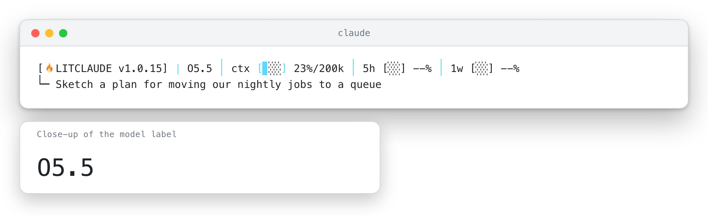</picture></p>

*LitClaude의 실제 상태 줄로 렌더링한 예시 출력입니다.*

Jev를 켜면 세션의 첫 프롬프트에 무지개색 한 줄이 나옵니다(`NO_COLOR`에서는 색 없는 글자). 이
세션에서 조건에 맞는 프롬프트가 TypeSafe로 나간다는 것을 알려 주는 줄입니다.

<p align="center">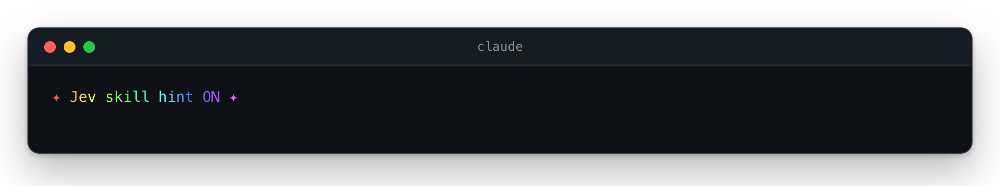</p>

*LitClaude의 실제 프롬프트 훅으로 렌더링한 예시 출력입니다.*

그다음부터는 모델 이름 바로 옆에 `✦Jev`가 붙고, 터미널이 색을 지원하면 글자가 은은하게 반짝입니다.
Jev가 충분히 맞는 스킬을 찾지 못하면 이 표시가 유일한 변화이고, 그 턴은 평소처럼 진행됩니다. 상태 줄
그림 아래의 확대 라벨은 작은 화면에서도 모델 이름을 읽을 수 있게 해 줍니다.

<p align="center"><picture><source media="(prefers-color-scheme: dark)" srcset="./docs/assets/jev/jev-status-quiet-dark.webp" />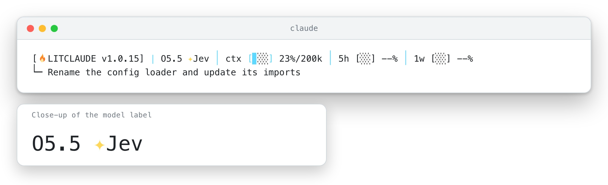</picture></p>

*LitClaude의 실제 상태 줄로 렌더링한 예시 출력입니다.*

Jev가 스킬을 고르면 그 턴 동안 화살표 뒤에 스킬 이름이 나오고, Claude는 그 스킬을 제안하는 한
줄을 받습니다. 스킬을 불러올지는 Claude가 정합니다. 여기 나온 이름은 예시입니다.

<p align="center"><picture><source media="(prefers-color-scheme: dark)" srcset="./docs/assets/jev/jev-status-hint-dark.webp" />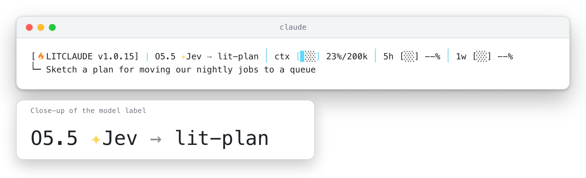</picture></p>

*힌트가 나온 턴 뒤의 LitClaude 실제 상태 줄로 렌더링한 예시 출력입니다.*

플래그는 켜져 있는데 키가 비어 있으면 표시가 주황색으로 바뀌며 `⚠ key`가 뜨고, 조건에 맞는 첫
프롬프트에 짧은 안내가 한 번 나옵니다. TypeSafe로는 아무것도 나가지 않고, 프롬프트는 평소처럼 Claude에게
전달됩니다. 키를 설정하면 표시가 `✦Jev`로 돌아오고, 플래그를 해제하면 사라집니다.

<p align="center"><picture><source media="(prefers-color-scheme: dark)" srcset="./docs/assets/jev/jev-status-key-dark.webp" />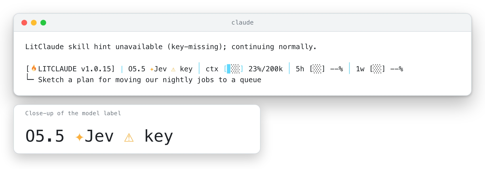</picture></p>

*LitClaude의 실제 프롬프트 훅과 상태 줄로 렌더링한 예시 출력입니다.*

## 안전

LitClaude는 Claude Code 세션 안에서 동작합니다. 무엇을 건드리고 어디서 멈추는지 정리했습니다.

- hook은 Claude Code가 넘겨 주는 제한된 이벤트 데이터만 읽습니다. 입력한 프롬프트는 작업 흐름을
  고르는 데 쓸 뿐, 명령으로 실행하지 않습니다.
- 계획을 세우는 planner agent는 read-only입니다. 검토 경로는 변경과 그 근거를 읽고 찾은 것을
  보고하며, 고치는 일은 따로 합니다.
- 웹 읽기 도구 `public-read`는 공개된 http(s) 페이지만 가져옵니다. localhost와 사설망 주소는
  거부하고, 로그인이나 유료 벽을 만나면 사이트 자격 증명을 쓰지 않고 멈춥니다.
- 프로젝트 안에 생기는 LitClaude 상태·근거 폴더는 gitignore되며 npm 패키지에 들어가지 않습니다.
- 업데이트 확인은 사용자 눈앞에서 진행됩니다. 결과를 알 수 없거나, 이전 버전으로 되돌리는
  것처럼 보이거나, 새 버전을 검증하지 못하면 업데이트하지 않고 멈춥니다. 자동 확인을 끄려면
  `--no-auto-update`, `LITCLAUDE_NO_AUTO_UPDATE`, `NO_UPDATE_NOTIFIER`,
  `LITCLAUDE_NO_UPDATE_CHECK` 중 하나를 쓰세요.
- publish, 버전 변경, 태그, 원격 마켓플레이스 변경은 모두 사용자의 명시적 승인을 기다립니다.

### 모델 선택

모델은 Claude Code가 고르고, LitClaude는 그 선택을 건드리지 않습니다. Claude Code의 native
`Workflow`와 실험적 agent team은 직접 켜야 쓸 수 있습니다. Claude Code에 native goal 도구가
없으면 프로젝트에 남는 `litgoal` 기록을 기준으로 삼고, LitClaude가 사용자를 대신해 `/goal`을
보내지는 않습니다.

아래 OpenAI 모델 정보는 참고용입니다. OpenAI 모델 라우팅을 지원하는 LitFamily 제품들이 쓰는
값입니다.

- 새로 설치하면 GPT-6가 기본입니다. 계획·검토·리드 역할에는 `gpt-6-astra`, 코딩 리드의 다른
  선택지로 `gpt-6.1-sol`, helper와 일반 작업자에는 `gpt-6-luna`를 씁니다. 이전 세대 `gpt-6-sol`도
  계속 고를 수 있어서, 이미 쓰고 있는 설정은 그대로 동작합니다.
- GPT-6 Luna는 `xhigh`까지 지원하고 `ultra` effort는 지원하지 않습니다. `gpt-6-luna`의 `xhigh`는
  카탈로그에서 지원되며, 일반 작업자 경로의 기본 effort는 `max`입니다.
- 호스트 카탈로그에는 이전 세대 `gpt-5.6-sol`, `gpt-5.6-terra`, `gpt-5.6-luna`도 계속 나오며 셋
  다 고를 수 있습니다. 지원 종료일 정보는 어느 모델에도 없습니다. 카탈로그는 `gpt-5.6-luna`에도
  `xhigh`를 허용하지만, LitClaude는 예전부터 둔 정책 규칙으로 이 조합만은 막습니다.
- 일반 설치와 업데이트는 이미 설정된 모델을 바꾸지 않습니다.

LitClaude는 이 OpenAI 경로를 적용하지 않으며, 자체 OpenAI 모델 카탈로그도 없습니다.
`tools/check-model-routing.mjs`는 지원하지 않는 Claude Code 경로를 막는 참조용 검사입니다.

## 확인, 업데이트, 제거

설치된 package에는 확인과 관리에 쓰는 명령이 들어 있습니다.

```bash
npm exec --yes --package @litfamily/litclaude@latest -- litclaude doctor
npm exec --yes --package @litfamily/litclaude@latest -- litclaude --version
npm exec --yes --package @litfamily/litclaude@latest -- litclaude path
npm exec --yes --package @litfamily/litclaude@latest -- litclaude workflow-check --json
npm exec --yes --package @litfamily/litclaude@latest -- litclaude update
npm exec --yes --package @litfamily/litclaude@latest -- litclaude uninstall
```

`uninstall`은 LitClaude가 관리하는 플러그인, HUD, 권한, 로컬 상태 항목만 지우고 나머지 Claude
설정은 그대로 둡니다. 누가 손을 댔거나 LitClaude가 만든 것으로 알아볼 수 없는 설치는 건드리지
않고 거절합니다. 그때 할 일은 [소유권 충돌 안내](./docs/migration.md#ownership-conflicts)에
있습니다.

기존 설치에서 `INSTALL_OWNERSHIP_CONFLICT`가 나오면 거기서 멈추세요. 설치를 다시 돌리거나
폴더를 옮기기 전에 같은 [소유권 충돌 안내](./docs/migration.md#ownership-conflicts)를 먼저
읽어야 합니다.

별도 프로필 체험을 마쳤다면 그 세션과 터미널을 닫고 원래 환경의 터미널로 돌아가면
됩니다. 이전 설치를 되돌리거나 다시 설치할 필요는 없습니다.

## 더 알아보기

<a id="추가-문서"></a>

- [참고: 설치 옵션, HUD, 호스트 경계, 개발](#운영-참고)
- [hook이 반응하는 입력과 그 범위](./docs/hooks.md)
- [에이전트와 작업 분담 안내](./docs/agents.md)
- [작업 흐름 이전 표](./docs/migration.md)
- [Claude Code `/goal` 지원 범위 표](./docs/native-goal-surface.md)
- [작업 흐름 호환성 점검](./docs/workflow-compatibility-audit.md)
- [패키지 이름 이전과 마켓플레이스 선택](./docs/migration.md#scoped-npm-migration)
- [배포 체크리스트](./RELEASE_CHECKLIST.md)
- [변경 이력](./CHANGELOG.md)
- [English README](./README.md)

함께 만들고 싶다면 [기여 안내](./CONTRIBUTING.md)부터 읽어 주세요. 질문은
[지원](./SUPPORT.md)을, 보안 문제는 [보안](./SECURITY.md)에 적힌 방법을 따라 알려 주세요.
[행동 강령](./CODE_OF_CONDUCT.md)은 모든 참여자에게 적용되고, 네트워크로 무엇이 오가는지는
[개인정보와 네트워크](./docs/privacy.md)에 있습니다.

<details>
<summary>참고: 설치 옵션, HUD, 호스트 경계, 개발</summary>

<a id="운영-참고"></a>

## 무엇이 들어 있나요

- 증거 기반 실행, 계획, 검토, 조사, handoff workflow
- `lit-loop`, `lit-plan`, `review-work`, `deep-interview`, `litresearch`,
  `litgoal`, `lit-handoff`, `lit-scientific-visualization` 등의 Claude-native
  skill
- **Claude skill**에는 `litwork`, `structural-search`, `lit-team`,
  `autoresearch`, `autoconference`도 포함됩니다. 핵심 순서는
  `lit-plan`, `lit-recap`, `lit-loop`입니다.
- 보조 Skill-discovery 항목인 `frontend-ui-ux`, `readme-studio`, `lit-commit`,
  `lsp-setup`, `visual-qa`는 이름을 프롬프트 첫 단어로 쓰거나(bare token)
  `$frontend-ui-ux`처럼 `$`를 붙여 부를 때 시작합니다. 문장 중간에 이름이 나오는 것만으로는
  켜지지 않습니다(anywhere-token이 아님).
- 포함된 reference pack은 `lit-code/references`, `lit-code/scripts`,
  `debugging/references`입니다.
- native `Workflow`와 experimental agent team에 대한 명시적 opt-in 안내,
  worktree 격리 안내
- **Resilient public-source research**와 SSRF, private host, authentication,
  paywall 경계를 포함한 public-source reader
- local MCP/LSP helper, 구조화된 Wikify knowledge, 안전하게 제거할 수 있는
  managed HUD

## 설치 상세

기본 설치 명령입니다.

```bash
npm exec --yes --package @litfamily/litclaude@latest -- litclaude install
```

설치를 재현하려면 registry에서 현재 package version을 조회한 뒤 고정합니다.

```bash
npm view @litfamily/litclaude@1.0.21 version
```

조회 결과가 `1.0.21`이면 exact install을 사용할 수 있습니다.

```bash
npm exec --yes --package @litfamily/litclaude@1.0.21 -- litclaude install
```

그렇지 않으면 명시적인 human publication을 기다립니다. Pin은 그 뒤에 사용합니다.
설치된 plugin은 다음 명령으로 확인합니다.

```bash
npm exec --yes --package @litfamily/litclaude@latest -- litclaude doctor
```

installer는 Claude Code plugin과 LitClaude status-line HUD를 설정합니다.
Permission mode는 직접 고릅니다.

```bash
npm exec --yes --package @litfamily/litclaude@latest -- litclaude install --permission-mode safe
npm exec --yes --package @litfamily/litclaude@latest -- litclaude install --permission-mode balanced
npm exec --yes --package @litfamily/litclaude@latest -- litclaude install --yolo
```

모드는 Claude가 묻지 않고 해도 되는 범위를 정합니다. `safe`는 권한 규칙을 하나도 더하지
않습니다. `balanced`는 제한된 읽기·검색과 일상적인 Git, npm, Node 명령을 허용하고, `yolo`는
넓은 편집·쓰기 패턴까지 허용합니다. 어느 모드든 Claude의 `permissions.allow`와
`permissions.deny`에 정해진 항목만 기록합니다. 기존 설정은 그대로 두고, LitClaude가 넣은
규칙만 기억해 두었다가 그것만 지웁니다.

다음 진입점도 쓸 수 있습니다.

```bash
npm exec --yes --package @litfamily/litclaude -- litclaude install
npm install -g @litfamily/litclaude
litclaude install
```

### HUD

대화형으로 설치하면 HUD 강조색 후보를 터미널에서 미리 볼 수 있습니다. LitClaude HUD는
`[🔥LITCLAUDE vX.Y.Z]`, `ctx [▎░░]` 컨텍스트 막대, `5h [▏░] 4% ↻` 사용 한도 리셋
카운트다운(rate-limit reset countdown)으로 이뤄집니다. 강조색은 설치 전에
`LITCLAUDE_HUD_ACCENT`로 고를 수 있습니다.

터미널이 색을 제대로 못 보여 줄 수도 있는 환경, 곧 `CI`나 `NO_COLOR`가 설정돼 있거나(빈
값이어도), `TERM=dumb`이거나, UTF-8이 아닌 locale이거나, 출력을 리디렉션할 때는 설치 화면의
색과 커서 제어, 질문 꾸밈을 끄고 ANSI 없이 출력합니다. `LITCLAUDE_SPINNER=1`로 자세한
진행 표시를 켜도 이 규칙은 그대로이고, `--yes`와 직접 지정한 설정도 그대로 적용됩니다.

프롬프트가 LitClaude 작업 흐름을 시작하면, HUD는 brand 바로 뒤에 굵은 주황색
`🔥 LIT IGNITED · lit-loop 🔥` 표시를 붙이고, 아무것도 시작하지 않은 다음 턴에서 지웁니다.
어떤 작업 흐름이 켜져 있는지 기억하려고 hook이 세션마다 짧은 기록을 사용자 임시 디렉터리의
`litclaude-hud/`에 남기며, 저장소와 홈 디렉터리에는 쓰지 않습니다. 위치는
`LITCLAUDE_HUD_STATE_ROOT`로 바꿀 수 있습니다. Claude의 답은
`🔥 **LIT IGNITED · <discipline>** 🔥`로 시작하고, hook 시스템 메시지와 HUD는 같은 표시를
Markdown 없이 보여 줍니다.

HUD 모양은 서로 다른 두 설정이 정합니다. 터미널 배경이 어두운지 밝은지, 그리고 터미널이 색을
몇 가지까지 보여 줄 수 있는지입니다.

- 배경 설정의 기본값은 `dark`입니다. 모델, 컨텍스트, 사용량, 리셋, Git 글자에 고른 강조색이
  들어가고, 사용량 퍼센트는 수준에 따라 색이 바뀌며, brand는 네온 그라데이션으로 나옵니다.
  배경이 밝거나 잘 모르겠다면 `LITCLAUDE_HUD_APPEARANCE=light` 또는 `unknown`으로 지정하세요.
  그러면 이 글자들과 brand는 터미널의 기본 글자색을 쓰고, 막대 모양과 구분선에만 강조색이
  들어갑니다.
- 색 깊이는 WSL의 truecolor까지 포함해 자동으로 감지합니다. 감지가 틀리면
  `LITCLAUDE_HUD_COLOR_DEPTH=truecolor|256|16|plain`으로 직접 정하세요. 이 값이 자동 감지보다
  우선합니다.
- 색을 아예 끄려면 `NO_COLOR`를 설정하세요. 값이 빈 문자열이어도 HUD의 ANSI를 모두 끕니다.
  `TERM=dumb`에서도 다른 색상 신호나 깊이 설정과 상관없이 색 없이 나옵니다. 예전 설정인
  `LITCLAUDE_HUD_NO_COLOR=1`도 계속 됩니다.

HUD는 배경색을 강제로 바꾸지 않습니다. Claude가 사용 한도 값을 `--`로 보내면 그대로 보여 주고,
숫자를 지어내 채우지 않습니다.

## Claude Code 연결 구조

Claude Code는 세션이 시작될 때, 프롬프트를 보낼 때, 도구가 돌 때, 서브에이전트가 시작하고 끝날
때, 세션이 끝날 때마다 플러그인에 알립니다. 이 알림은 플러그인 안의 네 부분에 전달됩니다. 프로젝트
규칙을 읽어 들이는 부분, 작업 흐름을 고르는 부분, 권한을 확인하는 부분, 기록을 남기는 부분입니다.
이렇게 해서 35개 skill·16개 command·3개 숨김 호환 경로·11개 agent가 Claude Code 안에서
동작하고, Claude Code가 허용하거나 막는 것은 그대로 적용됩니다.

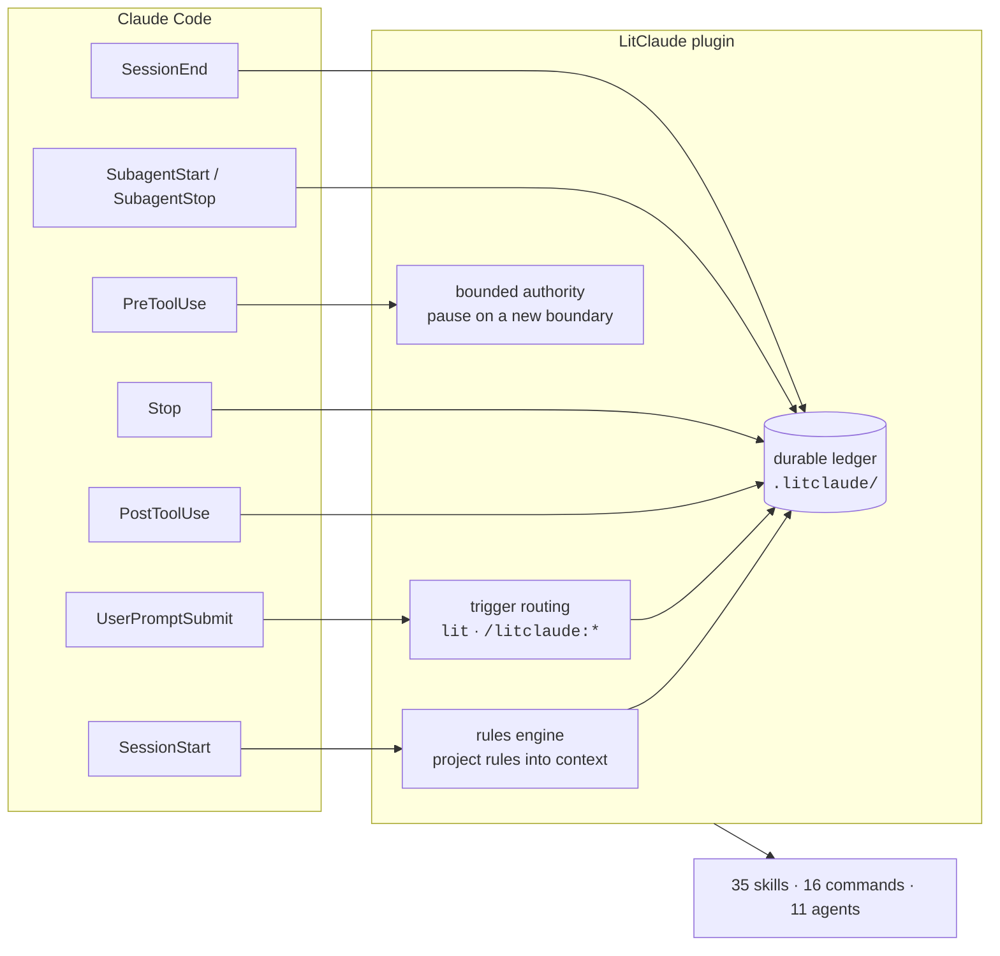
```mermaid
flowchart LR
    subgraph CC["Claude Code"]
        H1["SessionStart"]; H2["UserPromptSubmit"]; H3["PreToolUse"]
        H4["PostToolUse"]; H5["Stop"]; H6["SubagentStart / SubagentStop"]; H7["SessionEnd"]
    end
    subgraph LC["LitClaude plugin"]
        RULES["rules engine<br/>project rules into context"]
        ROUTE["trigger routing<br/><code>lit</code> · <code>/litclaude:*</code>"]
        AUTH["bounded authority<br/>pause on a new boundary"]
        LEDGER[("durable ledger<br/><code>.litclaude/</code>")]
    end
    H1 --> RULES --> LEDGER
    H2 --> ROUTE --> LEDGER
    H3 --> AUTH
    H4 --> LEDGER
    H5 --> LEDGER
    H6 --> LEDGER
    H7 --> LEDGER
    LC --> S["35 skills · 16 commands · 11 agents"]
```

새로 설치한 컴퓨터에서도 모든 스킬이 작동하는 것은 패키지가 스킬마다 필요한 것을 함께 싣기
때문입니다. 배포 전 검사가 이를 확인합니다. 참고 자료가 필요한 스킬은 그 자료를 패키지 묶음
안에서 찾아야 하고, 자료 없이 도는 스킬은 그 이유를 허용 목록에 적어 두어야 합니다. 그래서
개발자의 checkout에만 있는 파일 때문에 설치한 컴퓨터에서 오류가 나는 일을 막습니다.

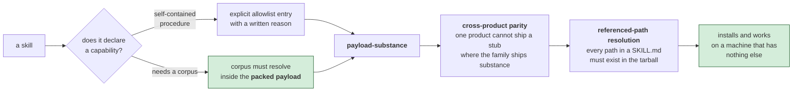
```mermaid
flowchart LR
    SK["a skill"] --> Q{"does it declare<br/>a capability?"}
    Q -->|"self-contained<br/>procedure"| AL["explicit allowlist entry<br/>with a written reason"]
    Q -->|"needs a corpus"| C["corpus must resolve<br/>inside the <b>packed payload</b>"]
    AL --> G1
    C --> G1["<b>payload-substance</b>"]
    G1 --> G2["<b>cross-product parity</b><br/>one product cannot ship a stub<br/>where the family ships substance"]
    G2 --> G3["<b>referenced-path resolution</b><br/>every path in a SKILL.md<br/>must exist in the tarball"]
    G3 --> OK["installs and works<br/>on a machine that has<br/>nothing else"]
    style C fill:#d4edda,stroke:#155724
    style OK fill:#d4edda,stroke:#155724
```

승인한 계획은 늘 slash command로 실행합니다. `lit start work <plan>`이라고 입력하면 일부러
`BLOCKED:` handoff를 돌려주며, 승인한 plan과 함께 `/start-work` 또는
`/litclaude:start-work`를 쓰라고 안내합니다. `lit workflow`도 사용자를 기다립니다. native
`Workflow`를 먼저 제안하고, 사용자가 opt-in한 뒤에만 호출합니다. 이 경로는
`CLAUDE_CODE_DISABLE_WORKFLOWS=1`로 끌 수 있습니다. Claude Code가 모델에게 worktree 도구를 열어
주는 환경이라면 `EnterWorktree`를 쓰세요.

목표는 한 가지 원칙을 따릅니다. LitClaude는 사용자를 대신해 `/goal`을 입력하거나
slash-command text를 보내지 않습니다. 이 경로는 먼저 `get_goal`, `create_goal`, `update_goal`
같은 native goal 도구가 있는지 살펴 목표 연결(native goal binding)을 시도하고, 이미 걸려 있는
다른 목표는 바꾸지 않습니다. Claude Code가 그런 도구를 주지 않으면 degraded mode라고 알리고
로컬 `litgoal` ledger를 기준으로 삼습니다. 그때 hook은 `READY_TO_PASTE`와 함께 `/goal` 한 줄을
건네니, 현재 세션에 직접 복사해 붙여 넣고 보내면 됩니다.

`/start-work`는 schema-3 bounded-authority start-work lifecycle을 관리합니다. 승인된 plan을
다시 이어서 실행할 때는 다음 경로만 씁니다.

`/litclaude:start-work resume --work-id <id> --revision <n> --boundary-id <id> --prompt-id <id> --grant-id <id>`

`stop_hook_active`가 `true`이면 hook은 조용히 멈추므로, 지난 프롬프트가 다시 재생되는 일이
없습니다.

채팅에서 그림 스킬은 정확한 bare `lit-scientific-visualization` 입력으로만 시작합니다. 이름을
따옴표로 감싸거나, 문장에 섞거나, 앞에 slash를 붙이거나, 조금 다르게 쓰면 hook이 반응하지
않습니다.

공개 자료 작업에서 `lit research`, `lit search`, `lit query`, `public-read`는 열린 웹에만
머뭅니다. 로그인, 유료 벽, 자격 증명 요구를 만나면 멈추고, localhost와 사설망 주소는
거부합니다.

```bash
litclaude public-read https://example.com/article --json
```

`lit-humanizer`는 고칠 문장 안에 적힌 지시를 내용으로만 다루고, 명령으로 따르지 않습니다.
사실, 숫자, 이름, 주장, 범위, 불확실성은 그대로 두고, 사용자가 조사를 요청하지 않으면 바깥
사실을 더하지 않습니다. 새로 쓰는 글은 항상 켜진 규칙이 이끌고, 저장하기 전 검사는 작성
흔적이 뚜렷한 것만 막으며 경고는 조언으로 남깁니다. 새 코드 블록, 인용문, 내부 프로젝트 기록은
검사 대상이 아닙니다. DOCX, PPTX, PDF는 글자를 뽑아낼 수 있으면 만든 직후 다시 검사합니다.

Wikify는 검토를 거친 프로젝트 지식을 보관합니다. 새 claim은 `review-needed` 상태로 시작하고,
`save`와 `review`로 다음 상태로 옮깁니다. query는 받아들여진 관련 claim만 돌려주며, 한도는
2048-byte normal budget와 4096-byte hard limit입니다. 이 저장소는 사용자 소유의 로컬 상태이고,
서로 협조한다는 전제로 동작합니다. 같은 uid로 도는 다른 프로세스는 내용을 읽거나 바꿀 수
있으므로, 그런 프로세스에 대해서는 변조 방지도 기밀성도 보장하지 않습니다. atomic rename으로 읽는
쪽과 crash consistency를 지키고, symlink, 안전하지 않은 파일 형식, pre-existing hardlink,
관찰된 identity 변경은 거부합니다.

Package CLI form은 다음과 같습니다.

`npm exec --yes --package @litfamily/litclaude -- litclaude wikify <capture|save|review|query|config>`

Visual QA는 canonical `litfamily.design-contract/v1beta2` 계약을 기준으로 삼습니다. 기존 경로를
위해 유효한 `litfamily.design-contract/v1beta1` 문서도 명시적인 compatibility input으로
받습니다. `litfamily.evidence-manifest/v1beta1`은 다른 schema이며 바꾸지 않습니다. 프롬프트로
시작할 때와 PostToolUse 안내는 `SKILL.md` 본문 전체 대신 짧은 안내 포인터
(synthetic bounded hook pointer)만 넘깁니다. 출처 기록이 다 갖춰지지 않으면 근거는 `BLOCKED`로 남습니다.

## 무결성 경계

스캐너 통과는 한 시점의 스냅샷에 대한 결과입니다. 캡처한 파일 수와 그 바이트의 SHA-256
다이제스트를 알려 주지만, 그 뒤에도 mutable live tree가 깨끗하다는 것까지 입증하지는 않습니다.
파일이 바뀌었다면 검사를 다시 돌리세요. 법적 동반 파일은 생성된 manifest 밖에 있고 정상적으로
검사합니다. Canonical 및 runtime 캡처는 파일당 8 MiB, 전체 32 MiB까지입니다.
패키지 guard는 `immutable expected file map`을 `verifier-to-capture interval` 안에서 확인하고,
만들어진 tarball과도 비교합니다. `0600` 같은 `non-executable` 항목도 유효합니다.

## 모델 카탈로그 참조 갱신

LitClaude 저장소에는 생성되는 OpenAI 모델 카탈로그가 없습니다. 공유 Codex 호스트 카탈로그의
캐시 파일은 `~/.codex/models_cache.json`이며, 현재 카탈로그를 새로 읽어 출력하려면
`codex debug models`를 실행합니다 (`--bundled`를 지정하면 번들 데이터만 출력합니다).
LitClaude의 정책 참조는 `tools/check-model-routing.mjs`에 있고, 경계 검사는
`node --test test/model-routing.test.mjs`로 고정합니다. 배포하는 `SKILL.md`의 모델 안내를
바꾸면 `npm run gen:skill-resources`로 리소스 맵을 다시 만들고
`npm run check:skill-resources`로 확인합니다.

## Checkout 검증 명령

이 checkout의 주요 gate입니다.

```bash
npm test
npm run validate:plugin
npm run doctor
npm run check:version
npm run scan:legacy-tokens
npm run check:skill-resources
npm run check:runtime-closures
npm run pack:payload-guard
npm run pack:dry-run
```

## 로컬 개발

checkout에서 plugin을 직접 로드합니다.

```bash
claude --plugin-dir ./plugins/litclaude
```

Claude Code 안에서는 다음 명령으로 plugin metadata를 다시 읽습니다.

```text
/reload-plugins
```

## 프로젝트 지도

| Surface | Path |
| --- | --- |
| CLI | `bin/litclaude-ai.js` |
| Claude plugin | `plugins/litclaude/` |
| Skills | `plugins/litclaude/skills/` |
| Agents | `plugins/litclaude/agents/` |
| Hooks | `plugins/litclaude/hooks/hooks.json` |
| MCP | `plugins/litclaude/.mcp.json` |
| LSP | `plugins/litclaude/.lsp.json` |

npm 패키지 페이지에는 더 짧은 README가 올라갑니다. 원본은 `README_npm_ko-KR.md`(영문은
`README_npm.md`)이고, pack이나 publish 전에 `node tools/readme-for-npm.mjs apply`가 그 파일로
바꿔 넣으며 `restore`가 이 페이지를 되돌려 놓습니다.

소스 트리의 `docs/assets/cover.svg`는 편집 가능한 저대역폭 대체 표지로 남아 있으며, 정적 제품
강조 표지인 `docs/assets/cover.webp`는 패키지에 계속 포함되지만 이 페이지에는 더 이상
표시하지 않습니다.

</details>

## Ignition

짧은 브랜드 영상이며, 실제 사용 화면을 녹화한 것은 아닙니다. 정적 포스터를 누르면 재생됩니다.

[](./docs/assets/readme/ignition-film.mp4)

[애니메이션 보기 (GIF)](./docs/assets/readme/ignition-readme.gif) · [Lucide 아이콘 라이선스 (ISC)](./docs/assets/readme/Lucide-LICENSE.txt) · [JetBrains Mono 글꼴 라이선스 (OFL)](./docs/assets/readme/JetBrainsMono-OFL.txt)
